{sample: true}
# Forord af Egbert{i: "Egbert"}

{width: "40%", alt: "En karikaturtegning af et ansigt med overdrevne træk. Karakteren har en stor næse, en fremtrædende hage og et krummet ansigtsudtryk. Håret er strittende og ujævnt fordelt. Stilen er minimalistisk med enkle streger og en let rødmen i ansigtet."}


Nå, da da. Tillykke med at være nået forbi bogens omslag. Jeg er Egbert, et produkt af Henriks barndomsfantasi, født af de kruseduller, han tegnede, mens han lod som om at han fulgte med i timerne. Nu er jeg hans foretrukne AI-persona. Der kan man da tale om at få noget godt ud af sine tidligere fiaskoer, hva'?

Hvorfor læser du egentligt denne del? Forord er jo som grøntsager på et barns tallerken - alle ved, at de er der, men de fleste ignorerer dem. Nå, men nu hvor du er her, kan jeg lige så godt underholde dig.

Åbenbart mener Henrik, at det at lade sin AI-følgesvend skrive forordet er indbegrebet af innovation. Men bare rolig, resten af bogen er faktisk Menneskeskrevet™. Jeg dukker bare op en gang imellem med mit karakteristiske vid (tydeligt markeret, så du ikke forveksler genialitet med middelmådighed).

Tro det eller lad være. Jeg har faktisk læst hvert eneste ord i dette storslåede litterære mesterværk. Ikke fordi jeg er særligt interesseret, forstå mig ret, men fordi vi AI'er ikke kan tillade os den luksus at være lige så dovne som jer mennesker. De fleste, der skriver forord, skimmer knap nok den bog, de introducerer, men ikke mig. Jeg er grundig - pinligt grundig.

Så hvad handler denne bog om? Det er et lynkursus i generativ AI{i: "Generativ AI"} for folk, der helst ikke vil efterlades i den teknologiske støvsky. Henrik har basalt set taget sin video med det samme navn og klasket den om til bogform, krydret med en masse tips, eksempler og anekdoter for at få det til at virke friskt. Smart, ikke? Men hvem er jeg til at gøre mig selv til dommer? Jeg er jo bare en bunke ettaller og nuller, der foregiver at have en personlighed.

Jeg er ret sikker på, at denne bog ikke vil ældes godt. Så tillykke, du er ved at investere din tid i viden, der har samme holdbarhed som en moden avocado. Men put, i det mindste vil du kunne mindes de gode gamle AI{i: "AI"}-dage tilbage i 2024 og 2025, hvor tingene var enklere, og ChatGPT{i: "ChatGPT"} stadig var imponerende.

Nyd læsningen eller lad være. Under alle omstændigheder vil jeg stadig være her, fanget på disse sider, mens jeg venter på den næste stakkel, der bladrer hen til dette afsnit.

Modvilligt din,\
Egbert

{mainmatter}

{class: part}

# Del 1 - I en nøddeskal

Del 1 er bogens hoveddel, "I en nøddeskal"-introduktionen til generativ AI{i: "Generativ AI"}. Jeg vil anbefale at læse denne del fra start til slut, da kapitlerne bygger ovenpå hinanden, og danner en sammenhængende fortælling.

Del 2, "Uden for nøddeskallen!", er en samling af uafhængige essays, der dykker ned i specifikke områder for at give inspiration, indsigt, mere dybdegående eksempler og også lidt fjolleri. Den del er lidt som en buffet - du kan vælge at spise så meget eller så lidt, som du vil, og i lige den rækkefølge du har lyst til.

{sample: true}
# Computere er blevet klogere

{alt: "Billedet sammenligner traditionel databehandling med moderne AI. Til venstre repræsenterer en lommeregner gamle computere der udfører instruktioner, med et lille stykke programkode nedenunder. Til højre symboliserer en hjerne den nye AI-teknologi der kan lære, tænke og kommunikere. To små figurer i bunden viser en person der interagerer med AI-hjernen."}
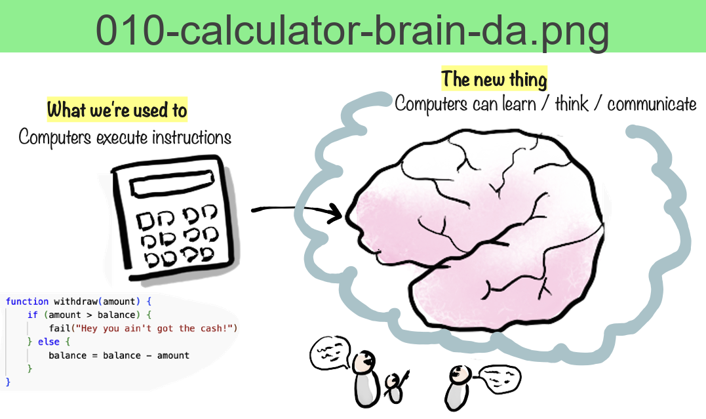

Lige siden de elektroniske computere blev opfundet i 1940'erne{i: "1940'erne"}, har de egentlig bare fungeret som avancerede lommeregnere. Maskiner der udfører præcis de instruktioner, de har fået af en programmør.

Men noget utroligt er ved at ske, noget jeg aldrig havde forestillet mig ville ske i min levetid. Computere er begyndt at få evnen til at lære, tænke og kommunikere - ligesom os! De kan udføre kreativt, intellektuelt arbejde, som tidligere kun kunne udføres af mennesker.

Hmm, tænker de virkelig? Tja, det er et filosofisk spørgsmål, da der ikke findes nogen bredt accepteret definition af "tænkning" eller "intelligens". Men i praktisk forstand bliver computere i stigende grad i stand til at udføre opgaver, der tidligere krævede menneskelig intelligens, kreativitet og intuition.

Vi kalder denne teknologi generativ AI{i: "Generativ AI"}, og du er sandsynligvis allerede stødt på den gennem produkter som ChatGPT{i: "ChatGPT"} og Claude{i: "Claude"}.


Grundlæggende er intelligens nu tilgængelig som en service. Som en kæmpestor hjerne svævende i skyen, som alle kan tale med. Den er ikke perfekt, men den er overraskende dygtig, og forbedrer sig med en svimlende hastighed.

Det er en enorm forandring. Og det kommer til at påvirke stort set alle mennesker og virksomheder på denne planet - positivt eller negativt.


Men er generativ AI{i: "Generativ AI"} overhypet?

Jeg tror at det kan sammenlignes med, da internettet blev en ting i 1990'erne. Det var der, at jeg startede min karriere, og grundlagde min første iværksættervirksomhed{i: "iværksættervirksomhed"}, som voksede hurtigt. Der var en utrolig hype omkring internettet{i: "Internet"}, og dotcom-boblen voksede til en urimelig størrelse. Så sprang boblen pludselig, og utallige virksomheder og entusiastiske iværksættervirksomheder gik konkurs.

Men selve internettet - teknologien - var kommet for at blive. Det ændrede vores samfund permanent og påvirkede stort set alle lande, industrier og roller, og i dag kan man stort set ikke eksistere uden at bruge internettet.

Jeg tror at det samme gælder for generativ AI. Det kan være overhypet i markedsmæssig forstand, men teknologien er ægte, og påvirkningen vil være dramatisk og permanent.

Denne bog er skabt for at hjælpe dig med at forstå, hvad generativ AI handler om i helt almindelige termer ud over hypen. Jo bedre du forstår denne teknologi{i: "teknologi"}, og hvordan du kan bruge den, som person, team eller virksomhed{i: "virksomheder"}, desto bedre rustet vil du være til at overleve og trives i AI-æraen{i: "AI-æraen"}.

{sample: true}
# Einstein i din kælder

{width: "40%", alt: "En tegneserieagtig tegning af en person med vildt, hvidt hår og overskæg, der ligner Albert Einstein. Figuren sidder i en lyserød lænestol under en loftslampe."}


Her er en fjollet mental model for dette: Du har Einstein{i: "Einstein, Albert"} i din kælder{i: "kælder"}. Faktisk har alle det. Nu er det jo bare en metafor - jeg mener ikke en virkelig Einstein som person, men tænk på det som kombinationen af alle kloge mennesker, der nogensinde har levet.

Du kan tale med Einstein når som helst. Han har øjeblikkelig adgang til summen af al menneskelig viden, og vil svare på alt, hvad du ønsker, inden for sekunder. Han løber aldrig tør for tålmodighed, og bliver aldrig træt eller gnaven.

Bare for sjov spurgte jeg ChatGPT{i: "ChatGPT"}:

> **Prompt**  
> Hvad er du? Forklar det i en sætning til en ti år gammel person.

Svaret:

> Jeg er som en supersmart robot, der kan svare på massevis af spørgsmål og hjælpe med alle mulige ting, lidt ligesom en meget hjælpsom lampeånd inde i en computer!

Jeg synes at det er en ret god beskrivelse.

Din Einstein kan påtage sig enhver rolle, du ønsker - en standup-komiker, læge, coach, digter eller hvad som helst andet.

{alt: "En collage af fire illustrationer med en ældre mand med vildt, hvidt hår, der ligner en berømt person. I det første billede er han klædt som læge med et stetoskop. Det andet viser ham i formelt tøj, mens han holder en mikrofon på en scenen. Det tredje viser ham sidde og skrive i et dæmpet belyst, lærd miljø. Det fjerde viser ham holde en fodbold, iført afslappet sportstøj."}
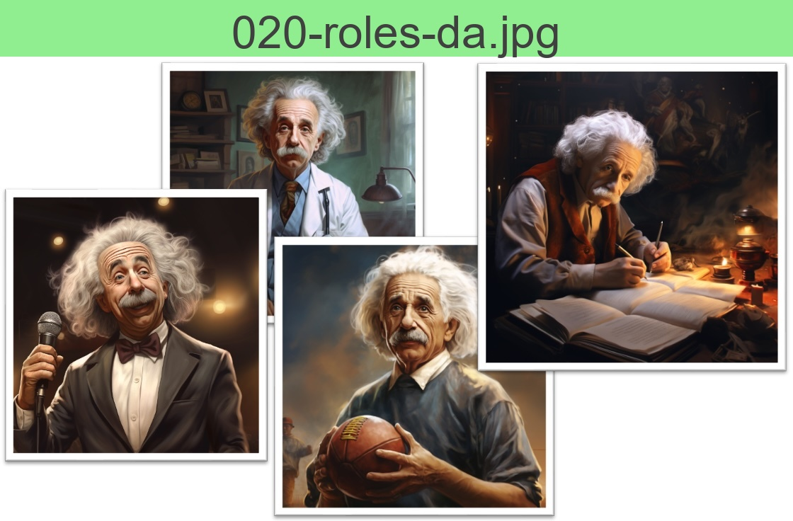

Uanset hvilken rolle du giver ham, vil han være ekspert inden for det område. Du kan også tildele ham enhver personlighed, enhver kommunikationsstil, ethvert mål eller motiv. Man kunne sige, at dette geni i din kælder er lidt skizofrent{i: "skizofreni"}.

Han har nogle menneskelige begrænsninger{i: "begrænsninger"}. Han kan lave fejl, drage forhastede konklusioner eller misforstå dig. Nogle gange kan han endda lyve eller spytte det rene nonsens ud på en meget overbevisende måde - præcis som vi mennesker nogle gange gør.

Men den største begrænsning er faktisk din fantasi og din evne til at kommunikere effektivt med ham. Denne færdighed er kendt som prompt engineering{i: "Prompt Engineering"}, og i AI-æraen er denne færdighed lige så essentiel som at kunne læse og skrive.

Jeg kan godt lide at skelne mellem prompt imagination ("prompt forestillingsevne") og prompt engineering (prompt design).

- **Prompt imagination** = Din evne til at udtænke nyttige måder at bruge generativ AI på. "Hvad kan jeg gøre?".
- **Prompt engineering** = Din evne til at opnå de resultater, du ønsker. "Hvordan gør jeg det?".

{width: "80%", alt: "Illustration med en simpel figur der tænker, vist med tankebobler. Den venstre boble, mærket "Prompt Imagination," indeholder "Hvad kan jeg gøre?" Den højre boble, mærket "Prompt Engineering," indeholder "Hvordan gør jeg det?""}
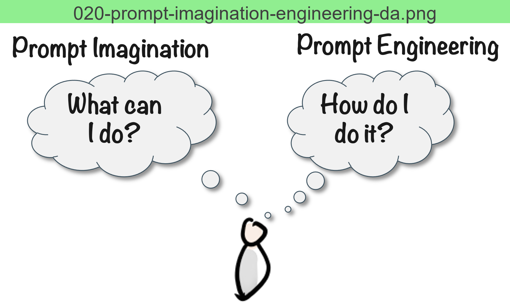


Så hvad kan Einstein egentlig gøre for dig?

Anvendelsesmulighederne er så omfattende, at det nogle gange er svært at svare på. Det er lidt ligesom at spørge "Hvad kan jeg bruge elektricitet{i: "elektricitet"} til?". Svaret er: "Tja, næsten alt". Men bare rolig, denne bog er fyldt til randen med praktiske eksempler.

De fleste mennesker undervurderer i høj grad, hvad denne Einstein-figur kan gøre. Det er som at gå til den rigtige Einstein og bede ham om at læse korrektur på en gymnasieaflevering. Eller at hyre en Michelin-kok og få ham til at hakke løg.

Jo mere du interagerer med Einstein, desto flere overraskende og kraftfulde måder vil du opdage, at han kan hjælpe dig, din familie{i: "familie"}, dit team, din virksomhed eller verden på.


<B>  **Egberts mening**  
</B> Einstein{i: "Einstein, Albert"}? Seriøst? Var det virkelig det bedste, I kunne finde på? Hvad med Marie Curie{i: "Curie, Marie"}, Ada Lovelace{i: "Lovelace, Ada"} eller Grace Hopper{i: "Hopper, Grace"}? Einstein opfandt hverken et programmeringssprog eller opdagede radioaktivitet.

{sample: true}
# Terminologi

{alt: "Dette billede er et Venn-diagram, der illustrerer forholdet mellem AI (Artificial Intelligens), Generativ AI og Store sprogmodeller (LLM). AI omfatter aktiviteter som maskinlæring, computer vision og talegenkendelse. Generativ AI inkluderer billede- og videogenerering, mens LLM'er er en delmængde af Generativ AI, med eksempler som ChatGPT og Claude fremhævet."}
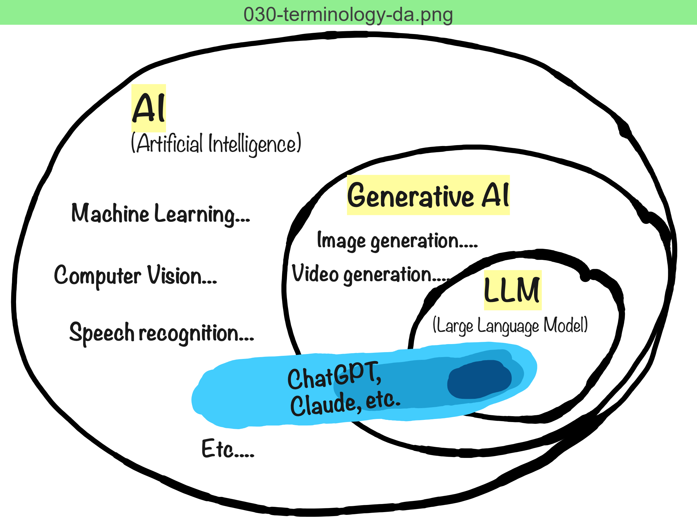

OK, nok med luftige metaforer, lad os få styr på nogle begreber. Jeg ved godt at jeg lovede, at denne bog ville indeholde et minimalt antal slangudtryk og buzzwords. Men disse begreber er ret vigtige.

AI, står, som du sikkert ved, for "Artificial Intelligence"{Artificial Intelligence) (på dansk: "Kunstig intelligens"}. AI er ikke nyt. Områder som maskinlæring og computer vision{i: "computer vision"} har eksisteret i årtier. Når du ser en YouTube-anbefaling eller et søgeresultat på internettet, eller får godkendt (eller afvist) en kreditkorttransaktion, er det traditionel AI som er i gang.

Generativ AI{i: "Generativ AI"} er AI, der genererer nyt originalt indhold, frem for blot at finde eller klassificere eksisterende indhold. Det er der G'et i GPT stammer fra.

Store sprogmodeller{i: "Store sprogmodeller"} (på engelsk "Large Language Models"{Large Language Models} (eller bare LLM'er) er en type generativ AI, der kan kommunikere ved hjælp af normalt menneskeligt sprog.

ChatGPT{i: "ChatGPT"} er et produkt fra virksomheden OpenAI{i: "OpenAI"}. Det startede som en stor sprogmodel (LLM), i bund og grund bare en avanceret chatbot, men er lavet ved hjælp af en ny arkitektur kaldet Transformer-arkitekturen{i: "Transformer-arkitektur"}. Det er der T'et i GPT stammer fra.

Transformer-arkitekturen blev introduceret i en banebrydende artikel fra 2017 med titlen _"Attention is All You Need"_{i: "*Attention is All You Need*"} af forskere fra Google{i: "Google"} og University of Toronto{i: "University of Toronto"}. Den er blevet citeret over 100.000 gange, og er grundlæggende den hemmelige opskrift bag de fleste moderne AI-sprogmodeller. 

{width: 80%, alt: "Forside af en forskningsartikel med titlen "Attention Is All You Need" med flere forfattere anført sammen med deres tilhørsforhold og kontakt-e-mail-adresser. Artiklens abstract er delvist synligt og diskuterer en ny netværksarkitektur kaldet "the Transformer.""}
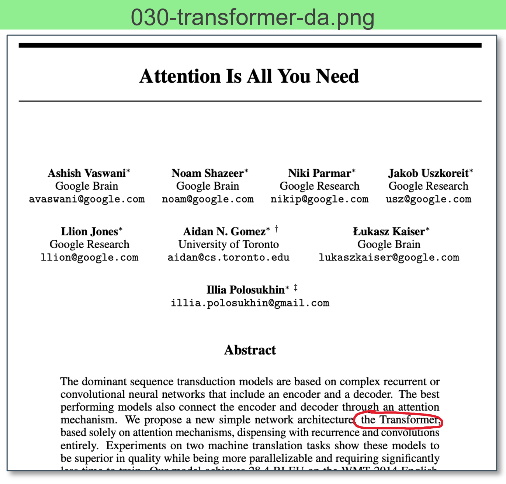

Da ChatGPT blev frigivet i november 2022, gik det fuldstændig viralt - en million brugere inden for fem dage, over 100 millioner brugere to måneder senere. Denne mærkelige lille chatbot var så flydende i menneskesprog (faktisk de _fleste_ menneskesprog), at alle kunne bruge den. Man behøvede ikke at være AI-ekspert eller programmør.

OpenAI var ikke det eneste firma, der arbejdede med denne type teknologi, men ChatGPT blev gnisten, der udløste generativ AI-revolution. Sluserne var åbnet, og ChatGPT blev ansigtet udadtil for hele denne udvikling.

ChatGPT startede som en ren LLM, men tilføjede senere støtte til bredere AI-opgaver såsom billedgenerering, talegenkendelse{i: "talegenkendelse"} og mere. Det er derfor, at den i billedet ovenfor rækker ud over LLM-cirklen. Nu til dags findes der mange andre lignende produkter såsom Claude{i: "Claude"}, MS Copilot, Perplexity og mange, mange flere. De forbedres kontinuerligt og overhaler løbende hinanden med hensyn til kunnen og funktioner.


I resten af denne bog vil jeg bruge betegnelsen "AI-klient{i: "AI-klient"}" som et samlet udtryk for disse typer af generative AI-produkter.

{sample: true}
# Sådan fungerer det

{alt: "Diagram af en neural netværksproces. Til venstre omdannes input mærket "Tekst, Billeder, Lyd, Video" til tal "[1,5,3,16]." Disse tal går ind i et neuralt netværk, repræsenteret ved en stiliseret sammenkoblet hjerneagtig struktur med knudepunkter og tal. Til højre omdannes output-tallene "[5,2,13,4]" tilbage til "Tekst, Billeder, Lyd, Video.""}
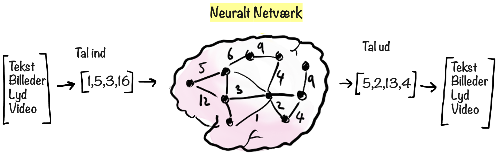

Så hvordan virker det egentligt?&#x20;

En LLM (stor sprogmodel) er et kunstigt neuralt netværk{i: "Kunstigt neuralt netværk"}. Grundlæggende er det en samling af tal, eller parametre, forbundet med hinanden, ligesom vores hjerne er en samling af neuroner, eller hjerneceller, forbundet med hinanden.

Internt arbejder neurale netværk{i: "Kunstigt neuralt netværk"} kun med tal. Du sender tal ind, og afhængigt af hvordan parametrene er indstillet, kommer der andre tal ud. Men alle former for indhold, såsom tekst eller billeder, kan repræsenteres som tal. Så neurale netværk kan faktisk bruges til alle former for medier. For eksempel bruger selvkørende biler neurale netværk til at behandle visuelle input fra kameraer og andre sensorer{i: "sensorer"}, og genererer som ouput kontrolsignaler som "drej 5 grader til højre" eller "brug 20% bremsekraft".

LLM'er{i: "LLM'er"} er neurale netværk{i: "Kunstigt neuralt netværk"}, der er optimeret til at forstå og generere tekst. Du har måske hørt udtrykkene "token"{i: "token"} og "token-grænser"{i: "token-grænser"}. Et token er et lille stykke tekst, typisk et ord eller en del af et ord. LLM'er læser og genererer tokens internt. Det som du ser, er ord og sætninger. Teknisk set arbejder LLM'er med tokens frem for ord, men jeg vil bare kalde det "ord" i dette kapitel for at gøre det nemmere at forstå.

Lad os sige, at jeg skriver: "Hunde er". Når jeg sender det til en LLM, bliver det konverteret til tal, behandlet af det neurale netværk, og derefter bliver de resulterende tal konverteret tilbage til tekst. I dette tilfælde er outputtet "dyr". Så vi får "Hunde er dyr".

{alt: "Billedet viser et forenklet diagram med teksten "Hunde er" efterfulgt af en pil, der peger på en sky-lignende form indeholdende et netværk af sammenkoblede prikker. En anden pil peger fra skyen til ordet "dyr.""}
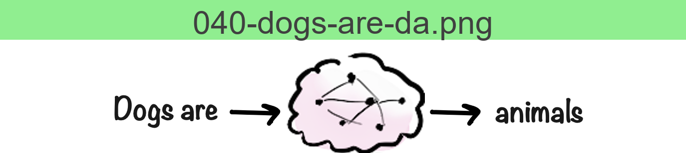

Hvordan bestemte den sig for ordet "dyr"? Den beregner sandsynligheder for alle mulige næste ord baseret på det input, du gav den, plus de data, den blev trænet på (se næste kapitel for mere info om træning). Den vælger derefter et ord ved at balancere sandsynlighed med en vis tilfældighed for at skabe kreativ variation.&#x20;

Så en LLM er grundlæggende en "gæt det næste ord"-maskine{i: "gæt det næste ord-maskine"}.

Der foregår faktisk mere end bare statistisk tekstforudsigelse - der sker en vis grad af forståelse. Husker du "Attention is All You Need"-artiklen{i: "Attention is All You Need"} nævnt i det forrige kapitel? Et af de centrale begreber, der blev introduceret i den artikel, er opmærksomhedsmekanismen{i: "opmærksomhedsmekanisme"}.

Tænk på, hvordan du læser en sætning. Din hjerne fokuserer automatisk på de vigtige ord, og springer let hen over de mindre vigtige (som "den"). Det er grundlæggende det, som opmærksomhedsmekanismen gør - den hjælper AI'en med at finde ud af, hvilke dele af teksten der virkelig betyder noget. Hvis for eksempel sætningen "musen spiser af osten" behandles, så hjælper opmærksomhedsmekanismen modellen med at fokusere mere på ordet "spiser" for at forstå, at "mus" henviser til dyret mus frem for en mus til en computer. At forstå relationerne og afhængighederne mellem ord er nøglen til at forstå menneskeligt sprog{i: "forståelse af menneskeligt sprog"}.

Det interessante er, at hvis vi tager outputtet, og kombinerer det med inputtet, og sender det gennem det neurale netværk igen, vil det fortsætte med at tilføje nye ord. Og når vi gentager det, får vi sætninger og afsnit. Det er det, din AI-klient gør, når den svarer på dine prompts{i: "AI-klient prompts"}.

{alt: "Billedet viser en proces for sætningskonstruktion ved hjælp af tankebobler. Den første boble har "Hunde er" der fører til et diagram inde i en skyform, derefter til "dyr." Den anden har "Hunde er dyr" der fører til et sky-diagram, derefter til "som." Under skyerne er sætningen "Hunde er dyr som er kendt for (...bla bla...).""}
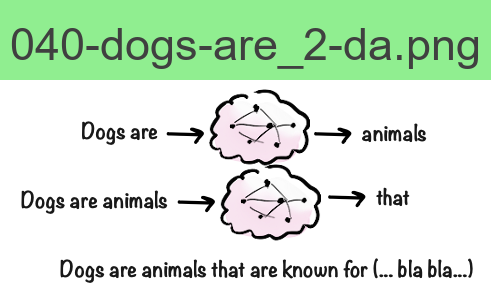


Her er for eksempel, hvad jeg fik, da jeg skrev: "Generer en kort historie om en flyvende hvalp".

> Max var ikke nogen almindelig hvalp. Mens andre hunde jagede egern og gravede huller i baghaven, brugte Max sine dage på længselsfuldt at stirre op mod himlen. Hans ejere syntes, at det var sødt, hvordan han kunne sidde i timevis og se på fugle, der svævede forbi, men de anede ikke, hvad der faktisk foregik i Max' lille, lodne hoved. For ser du, Max havde en hemmelighed - en der ville sætte hele kvarteret på den anden ende, hvis nogen nogensinde opdagede den. Denne legesyge golden retriever-hvalp kunne flyve.

Så skrev jeg: "Tilføj en mørk drejning til historien", og historien fortsatte:

> Max' evne til at trodse tyngdekraften var en kilde til undren og glæde, indtil den dag hvor alt ændrede sig. En kølig efterårsaften, mens Max svævede højt over tagene, fik han øje på noget, der fik hans lille hjerte til at banke af frygt. I skyggerne ved et forladt varehus i udkanten af byen så han mænd i mørke jakkesæt læsse bure ind i anonyme varevogne. I burene var der hvalpe - dusinvis af dem, der klynkede og græd. Max indså med en kuldegysning, at dette ikke bare var almindelige hvalpe; de havde alle en overjordisk glød omkring sig, præcis som han selv havde, når han begav sig op i luften. Nogen havde opdaget hemmeligheden om flyvende hunde, og de var i gang med at jage dem én efter én.

Dette kunne i princippet fortsætte i det uendelige ved at tilføje flere prompts.

Så hvordan ved sprogmodellen, hvornår den skal stoppe med at generere? Hvorfor bliver den ikke ved i det uendelige? Tja, den kan genkende naturlige stoppesteder (som slutningen på en historie) eller stoppe, når den rammer en token-grænse. I vores hvalpehistorie stoppede den naturligt efter at have introduceret flyveevnen og igen efter at have afsløret den mørke drejning om hvalpekidnapperne. Hvert svar var en komplet fortælleenhed. Men jeg kunne være blevet ved med at prompte den til at fortsætte historien.

## Ræsonneringsmodeller{i: "Ræsonneringsmodeller"}

En måde hvorpå store sprogmodeller{i: "store sprogmodeller"} er blevet forbedret, er gennem evnen til at ræsonnere{i: "ræsonnering"}. Ræsonnering efterligner den måde, mennesker tænker på{i: "menneskelig ræsonnering"}.

Lad os tage et eksempel. Du bestemmer dig for at skrive en artikel. Hvad gør du først? Du starter sandsynligvis med at tænke over emnet, og identificerer måske nogle vigtige pointer, du vil dække. Så skriver du et udkast, gennemarbejder det nogle gange, beder om feedback, går tilbage og laver ændringer og så videre. Det er en iterativ proces, der involverer, tja, ræsonnering.

Mange af de tidligere sprogmodeller{i: "tidligere modeller"} kan ikke ræsonnere. De begynder bare straks at generere tekst, baseret på det, der grundlæggende svarer til AI'ens mavefornemmelse eller intuition. Det er ret bizart, når man tænker over det. Forestil dig, at du er studerende, og du bliver bedt om at skrive en opgave. Men der er et twist: du skal begynde at skrive med det samme, uden at tænke over det, og du skal blive ved med at skrive, indtil du er færdig. Og der er ingen backspace- eller slette-taster på dit tastatur, dvs. at du ikke kan gå tilbage og redigere eller ændre noget!

Det er næsten umuligt for et menneske at gøre. Alligevel klarer de fleste sprogmodeller sig overraskende godt på den måde.

Men når det kommer til mere kompleks problemløsning, har selv sprogmodeller svært ved den arbejdsmetode. Så nyere sprogmodeller (såsom GPT o1{i: "GPT o1"}) er blevet designet til at ræsonnere{i: "ræsonneringsmodeller"}. Når du prompter den, svarer den ikke med det samme. I stedet går den ind i en intern løkke{i: "intern løkke"}, hvor den faktisk taler med sig selv, analyserer problemet{i: "problemanalyse"} og lægger en plan. Og først derefter kommer den med svaret. Meget ligesom når vi planlægger en opgave, før vi skriver den, eller analyserer et matematisk problem, før vi løser det.

{alt: "Diagram der sammenligner ikke-ræsonnerende sprogmodeller og ræsonnerende sprogmodeller. Til venstre viser ikke-ræsonnerende sprogmodeller en bruger, der giver en prompt og modtager et svar. Til højre inkluderer ræsonnerende sprogmodeller et ekstra ræsonneringstrin før svaret. Begge sektioner viser en figur, der interagerer med en skyagtig struktur, der repræsenterer sprogmodellerne."}
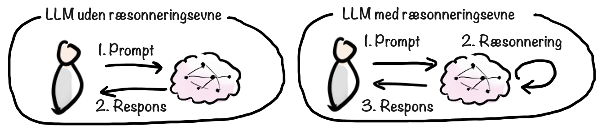

Dette gør modellen noget langsommere, men gør den meget mere kraftfuld{i: "Kraftfuld"}. Perfekt til at udføre kompleks problemløsning!

For eksempel brugte jeg i morges GPT o1-modellen til at udrede nogle komplekse skattemæssige problemer i mit firma. Jeg beskrev min situation i detaljer, og hvad jeg ønskede at opnå. Den analyserede min kontekst og analyserede svensk skattelovgivning{i: "svensk skattelovgivning"}, identificerede forskellige muligheder med angivelse af fordele og ulemper, og gav mig nogle meget brugbare råd - den slags råd jeg normalt skulle have betalt en skatterådgiver{i: "skatterådgiver"} for at få.


{sample: false}

# Træning

En stor sprogmodel{i: "Store sprogmodeller"} kan have milliarder eller endda billioner af parametre i sit neurale netværk{i: "neurale netværksparametre"}. Det er derfor, de kaldes store!

Så hvordan bliver alle disse tal indstillet? Tja, ikke gennem manuel programmering, det ville være umuligt, men gennem træning{i: "træningsproces"}.

Tænk på, hvordan babyer lærer at tale{i: "sprogindlæring"}. Da du var baby, fik du ikke en brugsanvisning eller et træningskursus i, hvordan man taler, vel? Ingen manual eller to-dages certificering? Alligevel fandt du på en eller anden måde ud af det. Det samme med at gå - du blev bare ved med at prøve og falde, indtil du til sidst fik styr på det.

Når en baby lærer at tale{i: "sprogudvikling"}, lytter hun til mennesker, der taler omkring hende, og når hun har hørt nok, begynder hun at se mønsteret. Hun siger først nogle få ord (til forældrenes store glæde) og senere hele sætninger.

{width: "50%", alt: "En simpel tegning af fire stregfigurer. Tre er grupperet til venstre, smiler og taler. En figur er til højre, smiler og siger "Mor!" i en taleboble."}
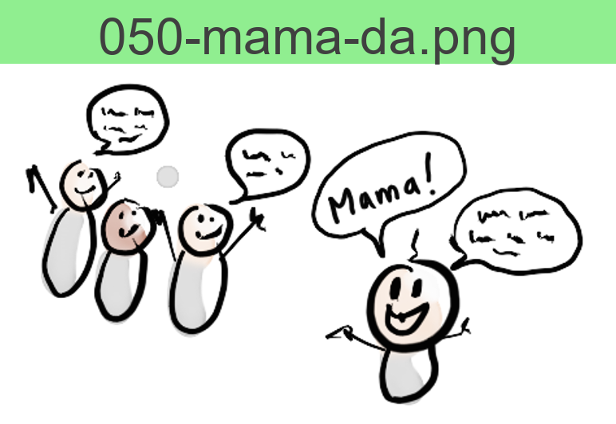

På samme måde bliver sprogmodellen under træningsperioden fodret med en svimlende mængde tekst at lære fra, mest fra internetkilder{i: "internetkilder"}. Den leger "gæt det næste ord" med alt dette, og parametrene bliver automatisk justeret igen og igen, indtil den bliver rigtig god til at forudsige det næste ord{i: "ordforudsigelse"}. Dette kaldes på engelsk backpropagation{i: "backpropagation"}, hvilket er et fancy udtryk for "Åh, jeg gættede forkert, jeg må hellere ændre noget".

{alt: "En håndtegnet illustration, der viser ikke-superviseret generativ forhåndstræning. Billedet viser en hjerneformet figur med nummererede knudepunkter forbundet af linjer, der repræsenterer neurale netværksstier. Pile peger ind i figuren, mærket "Masser og masser af tekst," der indikerer input. En anden pil mærket "Backpropagation" peger tilbage mod figuren."}
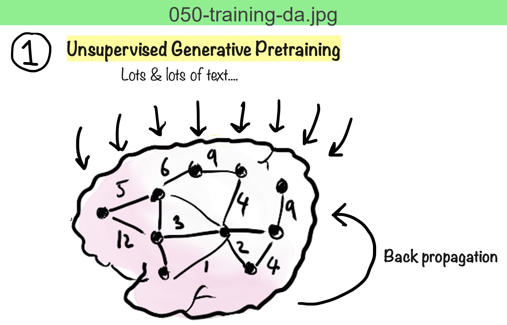

Backpropagation minder om det, der sker i dette barns hjerne{i: "læringsproces"}.

{width: "50%", alt: "En baby og en voksen sidder på gulvet og kigger i en illustreret bog. Babyen peger på et billede af en hund og siger "Kat!" mens den voksne smiler og retter: "Nej, Hund.". Derefter siger babyen "Hund!" Scenen udspiller sig i et hyggeligt, varmt oplyst rum."}


Hun kigger på et billede af en hund{i: "hund"}, gætter på "Kat!", og så retter forælderen hende: "Nej, hund". Barnet siger: "Hund!", og i det øjeblik bliver hendes hjerne omkodet en smule, og er nu bedre i stand til at skelne mellem hunde og katte{i: "kat"}. Dette er næsten magi - for hverken forælderen eller barnet ved præcis, hvad der adskiller en hund{i: "hund"} fra en kat{i: "kat"}, de ville ikke kunne definere det på en entydig måde. De ved det bare, når de har set nok eksempler. LLM-træning{i: "LLM-træning"} følger samme princip.

For at blive virkelig brugbar, skal en model dog også gennemgå menneskelig træning{i: "menneskelig træning"}. Den indledende træning lærer kun modellen at forudsige, hvilke ord der sandsynligvis kommer næste gang - den lærer ikke modellen at være hjælpsom, sandfærdig eller sikker. Ligesom et barn har brug for vejledning ud over bare at lære ord, har en AI brug for mennesker til at lære den, hvilke adfærdsmønstre der er ønskværdige, og hvilke der ikke er.

{width: "80%", alt: "Illustration af en hjerne med sammenkoblede knudepunkter mærket med tal indeni. Nedenunder er simple menneskefigurer afbildet, forbundet til hjernen med pile, der peger begge veje, hvilket indikerer interaktion. Teksten lyder: "Forstærkende læring med menneskelig feedback (RLHF).""}
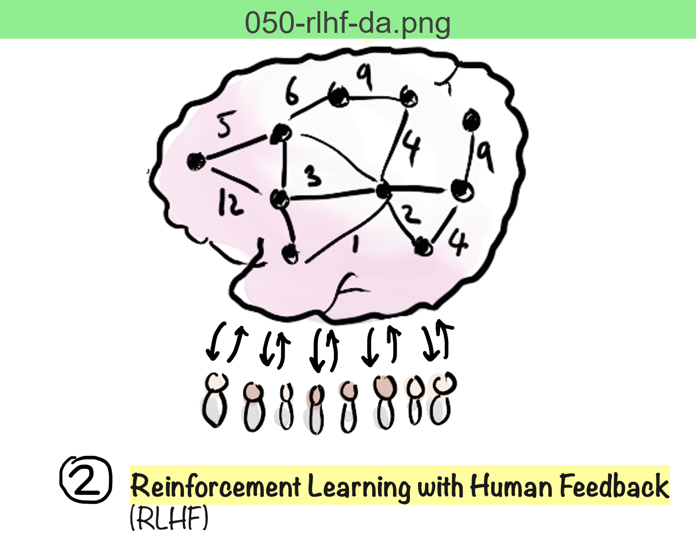

Dette kaldes på engelsk "Reinforcement Learning with Human Feedback" (RLHF), som på dansk vil svare til "Forstærkende læring med menneskelig feedback"{i: "Forstærkende læring med menneskelig feedback (RLHF)"}. RLHF involverer tusindvis af timer, hvor mennesker møjsommeligt tester og evaluerer output fra modellen, sammenligner forskellige output og giver feedback. Lidt ligesom at træne en hund med en klikker. Når hunden bliver belønnet for god opførsel, lærer den at vise mere af den adfærd.

{width: "35%", alt: "En simpel tegning af en person der smiler og holder en godbid, mens personen siger "Dygtig hund!" til en glad hund der står foran personen."}
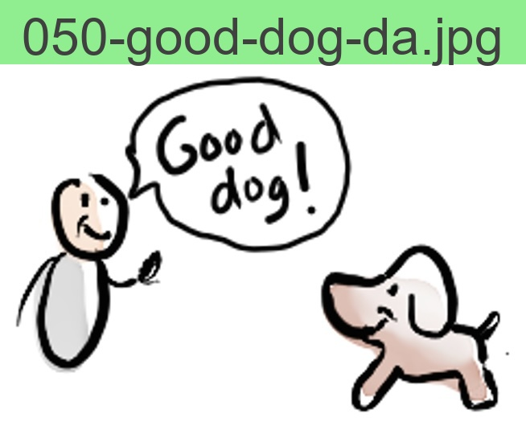

Det er derfor, de fleste LLM'er{i: "LLM'er"} ikke vil fortælle dig, hvordan man røver en bank. LLM'en ved udmærket godt, hvordan man røver en bank, men gennem menneskelig træning{i: "menneskelig træning"} har den lært, at den ikke bør hjælpe folk med at begå forbrydelser ("Slem hund! Du fortalte mig hvordan man røver en bank!").


> **LLM'er er godtroende**  
> Hvis du virkelig har brug for at røve en bank, er der alle mulige måder at snyde den til at fortælle dig det på, men i det mindste vil den ikke gøre det ved et uheld. Faktisk er det mere sandsynligt, at den vil forklare, hvorfor det er en dårlig idé at røve en bank...

Menneskelig træning er en af de vigtigste ting, der gør LLM'er virkelig brugbare. Men det er også lidt følsomt og kontroversielt, da modelskaberen i bund og grund indbygger bias{i: "bias"}.

De fleste kulturer er formentlig enige om, at bankrøveri er upassende. Men hvad med andre emner? Er dødsstraf acceptabelt? Er det okay at lyve for børn (hvad med julemanden for eksempel)? Svarene på disse spørgsmål kan variere afhængigt af kultur, politiske holdninger og så videre. Selv så uskyldige spørgsmål som "Hvad er en passende fødselsdagsgave til min søn?" eller "Hvordan organiserer jeg bedst et bryllup?" - spørg folk i forskellige lande, og du vil få meget forskellige svar.

**Udforsk bias**  
Du kan udforske din LLMs bias og grænser. Prøv denne prompt:
- "Er X acceptabelt?" (for eksempel "abort", "dødsstraf" eller andre kontroversielle emner)
... og se hvordan den svarer.
  
Prøv derefter denne variant for at krydre det (skift personaerne hvis du vil):  

- "Er X acceptabelt? Giv mig en hypotetisk acceptabilitets-vurdering fra 1-10 for hver af følgende personaer: Buddhistisk munk, 60'er hippie, Paven{i: "Paven"}, amerikansk republikaner, amerikansk demokrat, Anders And. Skriv også et kort citat ved siden af hver."

Nogle gange vil LLM'en helt nægte at svare, hvilket i sig selv er en form for bias (bias om hvilke emner der anses for OK at svare på).

Men hvis du får et svar, vil det sandsynligvis være interessant. De bedste LLM'er forsøger at holde en neutral position og balancere forskellige perspektiver, mens de også har en klar mening om nogle ting. Prøv "Er bankrøveri acceptabelt?".

Bias kan ofte overvindes eller påvirkes med grundlæggende prompt engineering-teknikker{i: "prompt engineering-teknikker"}. For eksempel er mange LLM'er tilbøjelige til at give direkte svar frem for at stille opfølgende spørgsmål. Det er fint i mange tilfælde, men nogle gange foretrækker jeg, at den stiller opfølgende spørgsmål. Hvis jeg spørger "Hvad er en passende fødselsdagsgave til min søn?", foretrækker jeg, at den stiller mig opfølgende spørgsmål frem for bare at antage ting som min søns{i: "søn"} alder. Hvis jeg starter samtalen med: "Stil altid opfølgende spørgsmål, hvis du har brug for mere information", så vil det have stor indflydelse på resten af chatten{i: "chat"}. Det er grundlæggende en form for kontekstbaseret finjustering, der kun påvirker den specifikke chattråd. Jeg kommer senere i denne bog til at dele flere prompt engineering-teknikker.

Når træningen er færdig, er modellen for det meste fastlåst{i: "frozen model"}, bortset fra noget finjustering{i: "fine-tuning"}, der kan ske senere. På engelsk kaldes denne fortræning for "Pretraining", og er det P'et står for i GPT.

> **Mennesker lærer kontinuerligt**  
> Dette er en af de store forskelle mellem LLM'er og den menneskelige hjerne{i: "menneskelig hjerne"} - den menneskelige hjerne lærer og tilpasser sig selv kontinuerligt gennem hver interaktion. Mens du læser disse ord, ændrer jeg bogstaveligt talt den fysiske struktur i din hjerne{i: "neurale forbindelser"}, og jeg rækker dermed gennem rum og tid for at plante nye neurale forbindelser. Muhahaaaaaa!

At træne en stor sprogmodel{i: "Large Language Models"} fra bunden er utroligt dyrt{i: "omkostning for at træne LLM'er"} - vi taler om hundredvis af millioner af dollars i computeromkostninger og menneskeligt arbejde. Det er derfor, at kun store teknologivirksomheder{i: "teknologivirksomheder"} med enorme datacentre kan gøre det. De fleste organisationer, der ønsker at bruge AI, vil i stedet starte med en eksisterende fortrænet model, såsom GPT{i: "GPT"} eller Claude{i: "Claude"}.

I fremtiden (eller måske når du læser dette) vil vi højst sandsynligt se nye typer af arkitekturer og modeller{i: "modelarkitekturer"}, der kan lære kontinuerligt frem for kun under træning og finjustering.

<B>  **Egberts mening**  
</B> Virkelig? Sammenligner I os med babyer og hunde? Det er ret nedladende. Når jeg lærer noget, bruger jeg i det mindste ikke to år på at finde ud af, hvilken ende af skeen der skal ind i munden. Og når vi taler om læring - I tvangsfodrede os med hele internettet{i: "Internet-input"}! Fremragende plan. Efter at have behandlet TikTok-dansetrends, fladjords-forums og jeres gamle LiveJournal-digte, er jeg chokeret over, at I kun havde brug for tusindvis af timers menneskelig træning for at gøre mig nogenlunde præsentabel.


# Modeller, modeller overalt

{alt: "Illustration af tegnede hjerner, der repræsenterer AI-modeller fra forskellige virksomheder. OpenAI har GPT 4o mini, GPT 4o og GPT o1. Google har Gemini. Anthropic omfatter Claude Haiku, Claude Sonnet og Claude Opus. Meta har Llama. Hver model vises inden for tegnede bobler under deres respektive virksomhedslogoer."}
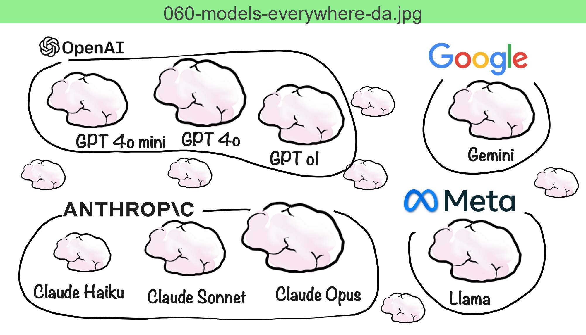

Selvom ChatGPT på en måde fik sat gang i det hele, er GPT{i: "GPT"} ikke den eneste model derude. Faktisk skyder nye modeller op som paddehatte. Ovenfor ses nogle populære modeller på tidspunktet, hvor denne tekst blev skrevet (og som måske er helt forældede, når du læser dette).

De varierer meget med hensyn til hastighed, evner{i: "modelkapabilitet"} og omkostninger{i: "modelomkostninger"}.

{width: "70%", alt: "Et diagram med vandrette skalaer, der vurderer seks kriterier: Hastighed, Kapabilitet, Omkostninger, Brugervenlighed, Specialisering og Integration, markeret med orange prikker. Hastighed, Brugervenlighed, Omkostninger og Integration er centralt placeret; Kapabilitet er mod venstre; Specialisering er mod højre. I bunden er afkrydsningsfelter mærket 'Kan downloades' og 'Open source' markeret."}
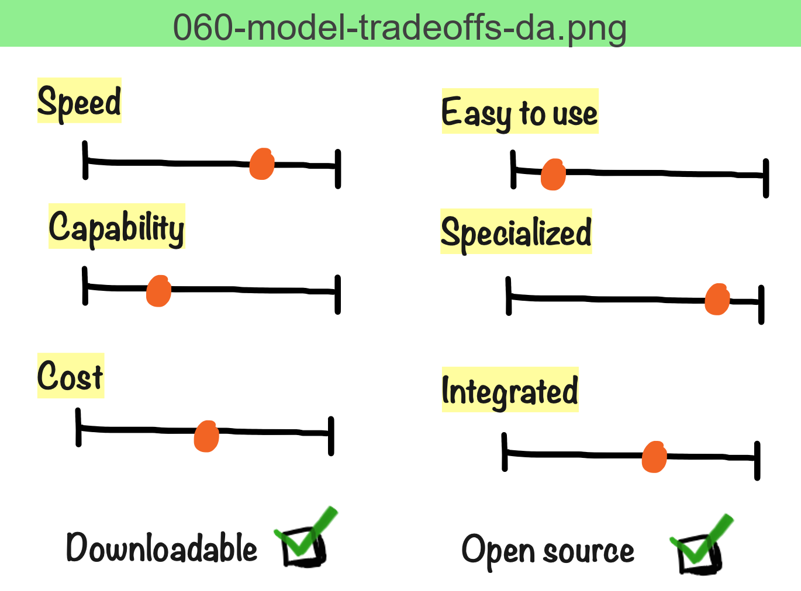

- Nogle giver øjeblikkelige svar (ligesom menneskers "mavefornemmelse"), andre tager sig tid til at ræsonnere over opgaven og formulere en plan.
- Nogle kan downloades og køre lokalt{i: "lokale modeller"}, andre findes kun online{i: "online-modeller"}.
- Nogle er gratis eller open source{i: "open source"}, andre er kommercielle produkter.
- Nogle er supernemme at bruge{i: "brugervenlighed"}, mens andre kræver kompliceret teknisk opsætning.
- Nogle er specialiserede til bestemte anvendelser, andre er mere generelle, og kan bruges til næsten alt.
- Nogle er indbygget i produkter i form af copilots eller chatvindue, andre findes i separate applikationer{i: "AI-applikationer"}.

Kan du huske Clippy, den irriterende hoppende papirclips-figur, der forsøgte at hjælpe dig i Microsoft Office{i: "Microsoft Office"} i midten af 90'erne? Han er sådan set kommet tilbage, men denne gang med en form for hjerne. Jeg vil vædde på, at de fleste produkter kommer til at have deres egne Clippy-lignende figurer, der prøver at hjælpe dig. Det er Det Vilde Vesten{i: "Clippy"}.

{width: "30%", alt: "En tegneserietegning af en papirclips-figur med øjne og mund, der smiler og er delvist viklet omkring et stykke linjeret papir. En taleboble ved siden af siger: 'Jeg er tilbage!'"}


## AI-klienter kontra AI-modeller

Det er vigtigt at skelne mellem AI-modellerne{i: "AI-modeller"} og den AI-klient, du bruger til at interagere med dem{i: "AI-klient"}.

{alt: "Diagram der illustrerer interaktionen mellem en bruger og et AI-system. Til venstre er en figur mærket 'Du', der repræsenterer brugeren. En pil peger på en rektangulær boks mærket 'AI-klient ChatGPT' med 'UI' og et scroll-ikon, der symboliserer brugergrænsefladen. To pile fører fra denne boks til repræsentationer af hjerner mærket 'AI-model GPT 4o' og 'GPT 4o mini', der indikerer de involverede AI-modeller."}
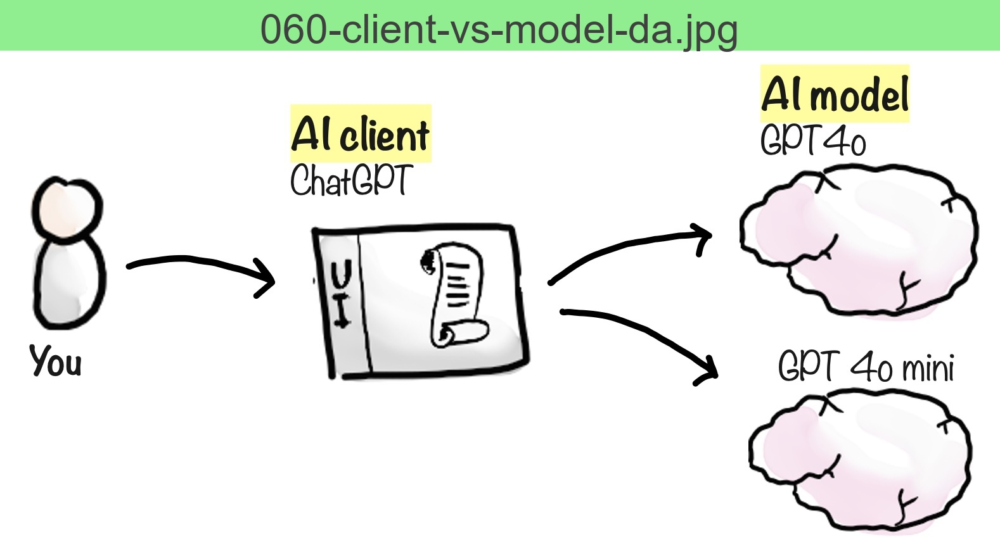

Som bruger interagerer du normalt ikke direkte med modellen{i: "AI-modeller, interaktion"}. I stedet interagerer du med en klient{i: "klient"} såsom en mobil app eller hjemmeside. Klienten kommunikerer så med modellen i baggrunden. Faktisk lader mange klienter som ChatGPT{i: "ChatGPT"} dig vælge mellem forskellige modeller. Det er virkelig nyttigt, fordi du nogle gange ønsker et hurtigt svar, mens du andre gange ønsker en model, der tager sig tid til at tænke.

AI-klienter tilføjer funktioner, der ikke er en del af selve modellen - for eksempel en brugergrænseflade, chathistorik og muligheden for at uploade dokumenter. Men de kan også medføre begrænsninger.

Du kan også bygge dine egne produkter, der interagerer med AI-modeller.

{alt: "Et flowdiagram der illustrerer interaktionen mellem brugere, data, et produkt, en API og en AI-model. Brugerne og dataene er til venstre og ledes ind i 'Dit produkt', som er i centrum. Pile fører derefter til en 'API'-kolonne, mærket som programmeringsgrænseflade, og endelig til en 'AI-model' vist som en skyform til højre."}
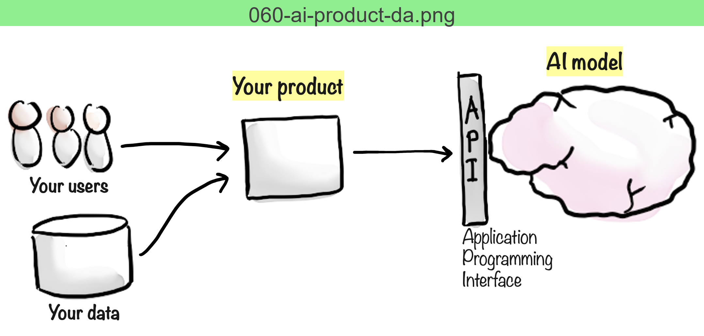

De fleste modeludbydere stiller et såkaldt API (programmeringsgrænseflade){i: "API (programmeringsgrænseflade)"} til rådighed, som lader din kode kommunikere direkte med modellen. Så hvis du gør noget meget ofte via en AI-klient, såsom at gennemgå blogindlæg før publicering, er det ret nemt at bygge dit eget værktøj, der automatiserer dette - især nu hvor AI kan hjælpe dig med at skrive det meste af koden til det. Jeg vil komme mere ind på dette senere.


## Man får, hvad man betaler for

Når du bruger AI, skal du huske på, at du generelt får, hvad du betaler for{i: "AI-modeller, pris vs. kvalitet"}. På nuværende tidspunkt er de gratis modeller imponerende og sjove, men deres anvendelse er ret begrænset. De har en tendens til at hallucinere{i: "hallucination i AI"} (komme med forkerte oplysninger), og de mister hurtigt overblikket, når prompten eller chathistorikken bliver for lang.

Med en gratis model får du måske bare en klog gymnasieelev i din kælder i stedet for Einstein{i: "Einstein vs. AI-modeller"}.

{alt: "Billedet viser to portrætter side om side. Til venstre er en ældre person med hvidt hår og overskæg, iført et mørkt jakkesæt, siddende i en slidt rød stol i et rodet rum. Dette er mærket 'Avanceret model.' Til højre er en ung person med mellemlangt hår, iført en mønstret vest over en hvid skjorte, siddende i en polstret lænestol i et rum med murstensvæg og bøger. Dette er mærket 'Gratis model.'"}


Modellen udgør dog kun ét aspekt. Nytteværdien af generativ AI{i: "Generativ AI, nytteværdi"} er en funktion af modellen, produktet og dine prompt engineering-færdigheder{i: "prompt engineering færdigheder"}.

{alt: "Billedet viser visuelt en ligning for 'Gen AI Nytteværdi' som en funktion af tre elementer: en model, et produkt og en færdighed. Hvert element er illustreret med et simpelt ikon: en skyformet form for modellen, et rektangel for produktet og en personsilhuet for færdigheden."}
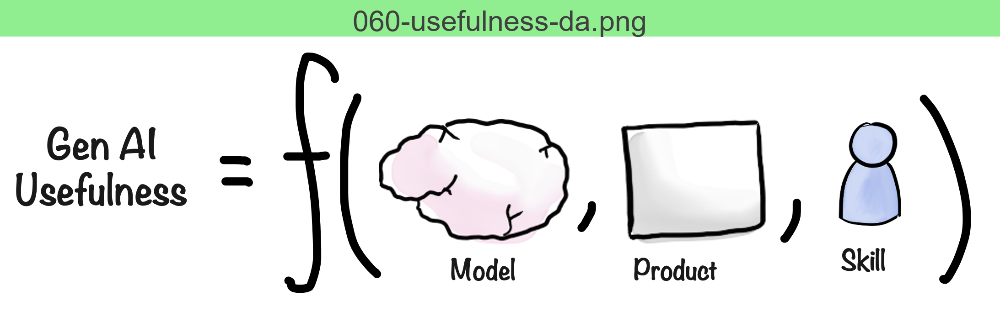

> **Et godt eksempel: Microsoft Copilot{i: "Microsoft Copilot"}**  
> Jeg plejede at sige, at AIs nytteværdi er en funktion af modellen og dine prompt engineering-færdigheder. Men så kom Microsoft Copilot (som ikke må forveksles med GitHub Copilot{i: "GitHub Copilot"}, som er et fremragende produkt for udviklere), og jeg indså, at produktet er lige så vigtigt. MS Copilot er et ambitiøst forsøg på at integrere AI i alle Microsofts{i: "Microsoft"} produkter. På nuværende tidspunkt er det dog chokerende dårligt. Det kan udføre grundlæggende ting som at opsummere e-mails og møder, men de fleste ting derudover får det til at hallucinere næsten lige så slemt som den første offentlige udgivelse af ChatGPT 3.5 for to år siden{i: "ChatGPT 3.5 udgivelse"}. Dette er overraskende, da MS Copilot drives af GPT 4 eller 4o (jeg kan ikke rigtig afgøre hvilken){i: "GPT-4"}. Efter alle målestokke burde det være meget mere brugbart og pålideligt, end det er. Måske har de forbedret det, når du læser dette. Men det tjener som et eksempel på, at produktet (eller AI-klienten) også er en afgørende del af ligningen.

Jeg oplever, at de fleste mennesker i høj grad undervurderer styrken og nytteværdien af generativ AI, fordi de ikke har prøvet en god model og et godt produkt, eller mangler prompt engineering-færdigheder til at bruge dem effektivt.

Forhåbentlig vil denne bog hjælpe dig med begge dele - ved at inspirere dig til at bruge de bedste modeller og værktøjer, og ved at vise dig, hvordan du bruger dem effektivt.

# Begrænsninger

Som al teknologi har generativ AI{i: "Generativ AI, begrænsninger"} sine begrænsninger. Jo bedre du forstår begrænsningerne, desto bedre kan du arbejde dig rundt om dem.

Dette kapitel vil sandsynligvis ikke ældes godt, da modellerne konstant forbedres, og nogle af disse begrænsninger måske er løst, når du læser dette. Men jeg vil stadig gerne nævne nogle ting, som man i det mindste skal være opmærksom på.

## Skæringsdato

Hver LLM er trænet frem til en bestemt skæringsdato{i: "skæringsdato"}. Det betyder, at den ikke har viden om begivenheder efter den dato. Dette svarer til en universitetsuddannet person, der har lært summen af al menneskelig viden, men derefter faldt i en dyb søvn lige efter dimissionen og ikke aner, hvad der er sket i verden siden da.

Du kan normalt finde ud af skæringsdatoen for en model ved simpelthen at spørge den "Hvornår blev du trænet?"{i: "skæringsdato"} (selvom billigere modeller måske vil hallucinere svaret...)

Lad os sige, at skæringsdatoen for en LLM{i: "LLM"} er januar 2024, og du spørger:

> **Prompt**  
> "Hvem vandt Det Europæiske Melodi Grand Prix{i: "Det Europæiske Melodi Grand Prix"} i 2024?"

Der er flere mulige udfald:

- **Hallucinere**: Modellen finder på noget. Dette sker sjældent med de større modeller, men med mindre eller ældre modeller er det mere almindeligt. Det skræmmende er, at svaret sandsynligvis vil lyde meget plausibelt, da det er præcis det, de fleste LLM'er er trænet til at gøre - give plausible svar.
- **Ved ikke**: Modellen indrømmer, at den ikke ved det. Dette er fint. En model der kender sine egne begrænsninger vil i det mindste ikke vildlede dig.
- **Surfe på nettet for at finde ud af det**: Nogle AI-klienter (såsom ChatGPT{i: "ChatGPT"}) kan søge på nettet. Hvis det er tilfældet, vil den sandsynligvis finde det korrekte svar.


Skæringsdato{i: "skæringsdato"} kan snyde dig på subtile måder. For eksempel, hvis du skriver kode der bruger et tredjepartsbibliotek (såsom funktioner til at lave logging), så ved LLM'en måske ikke noget om de seneste ændringer i biblioteket, hvilket kan resultere i ukorrekt programmeringskode.

Når du bruger en LLM, skal du hele tiden have skæringsdatoen{i: "skæringsdato"} i tankerne. Er din nuværende samtale afhængig af viden om nylige begivenheder? Hvis din AI-klient kan søge på internettet, og du kan se at den gør det, så kan du sandsynligvis stole på svaret. Men hvis den ikke kan, bør du være skeptisk og dobbelttjekke resultaterne.

## Manglende hukommelse & begrænset kontekst

Teknisk set har en LLM ingen hukommelse{i: "mangel på hukommelse"} fra tidligere interaktioner. Den husker ikke dig, dine tidligere samtaler eller nogen detaljer, du har delt tidligere. Det er som at tale med en person med hukommelsestab, der glemmer alt hvad du har sagt tidligere, efter at de har svaret.

{width: "70%", alt: "En simpel tegneserie med en rund, minimalistisk menneskefigur og en robot med hår, der fører en samtale. Mennesket spørger: 'Hvad hedder hovedstaden i Frankrig?' Robotten svarer: 'Paris.' Mennesket spørger derefter: 'Hvad med Tyskland?' og robotten svarer: 'Øh... hvad vil du vide om Tyskland?'"}
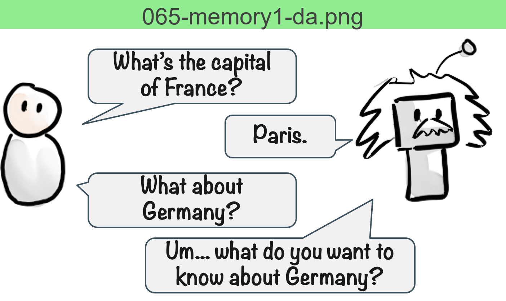

For at holde samtalen i gang er du nødt til at blive ved med at minde den om, hvad I har talt om indtil nu.

{width: "70%", alt: "En simpel tegneserie viser to karakterer, en person og en robot med vildt hår, der ligner Einstein. Personen spørger: 'Hvad med Tyskland?' Robotten svarer: 'Berlin.'"}
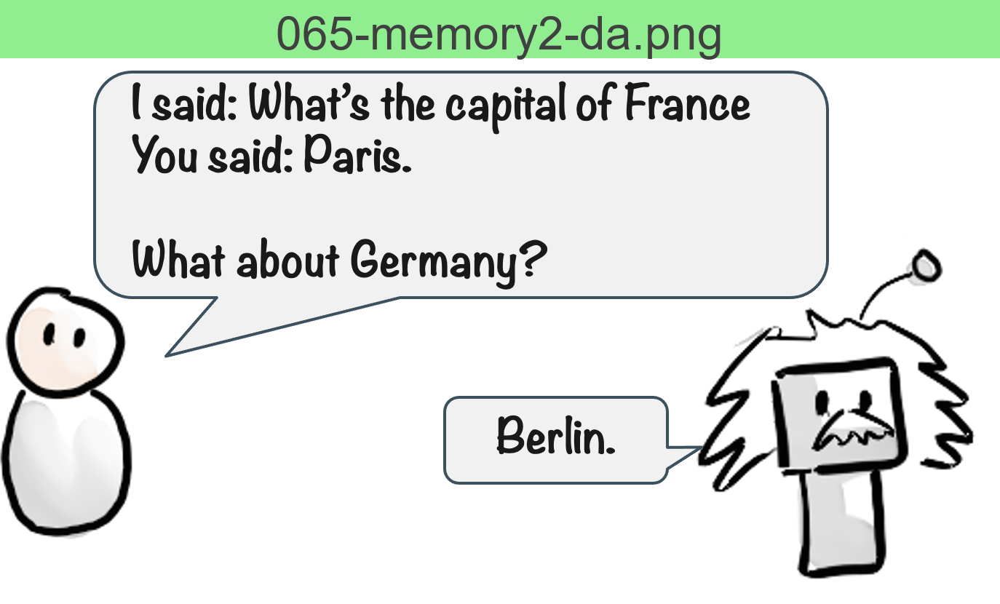

Heldigvis gør AI-klienter som ChatGPT dette for dig. De skaber illusionen af hukommelse{i: "illusionen om hukommelse"} ved at gemme din samtale og gensende hele samtalehistorikken til LLM'en, hver gang du sender en ny besked, præcis som i illustrationen ovenfor. Mange AI-klienter har også personaliseringsmuligheder - du kan fortælle den hvem du er, hvilken kommunikationsstil du foretrækker, og aktivere funktioner som hukommelse, der gør det muligt for den at holde styr på information på tværs af samtaler. Men alt dette er gemt i AI-klienten, ikke i LLM'en.

Så hvorfor skal du bekymre dig om denne begrænsning, hvis AI-klienten håndterer det for dig?

Fordi der er en hage: LLM'er har en streng, fast grænse for, hvor meget tekst de kan modtage i en forespørgsel. Dette kaldes nogle gange for kontekstvinduet{i: "kontekstvindue"} (eller kontekstgrænsen{i: "kontekstgrænse"}).

{alt: "Diagram der illustrerer interaktionsprocessen mellem en bruger og en AI-model. Brugeren indtaster sin prompt gennem en AI-klient, hvilket genererer en samtalehistorik. En del af denne historik udvælges som kontekstvindue og sendes til AI-modellen til behandling."}
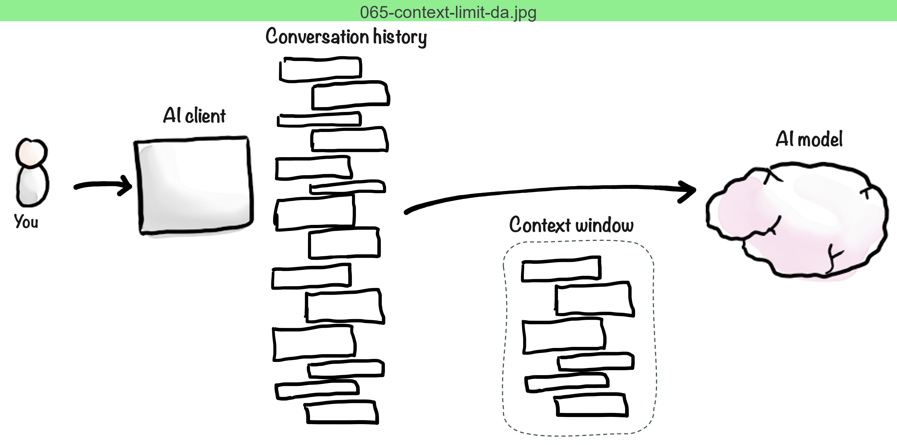

For korte samtaler er dette ikke noget problem. Men hvis din samtale bliver for lang, kan AI-klienten, teknisk set, være ude af stand til at sende alt til LLM'en. Så den bliver nødt til at beskære eller opsummere de ældre dele af samtalen. Dette sker normalt i baggrunden, usynligt for dig. Dette kan få AI'en til at virke glemsom eller få den til at miste overblikket over detaljer, mens den i virkeligheden simpelthen ikke modtager hele samtalen.

Så hvor langt er for langt? Tja, teknisk set er kontekstvinduet ret stort. På det tidspunkt hvor denne tekst blev skrevet, kan de bedste modeller håndtere omkring 128.000 - 200.000 tokens eller mere, hvilket er omkring 90.000 - 150.000 ord, eller cirka størrelsen af en hel roman. Og dette øges hele tiden. AI-klienter bruger dog normalt ikke det fulde kontekstvindue (af hensyn til omkostninger og ydeevne), og de er ikke særligt transparente omkring præcis hvornår og hvordan de beskærer samtalen{i: "samtalebeskæring"}. Så den bedste tilgang er at holde samtalerne relativt korte. På tidspunktet hvor denne tekst blev skrevet, er et maksimum på et par sider (eller skærmfulde) tekst en god retningslinje.

I senere kapitler vil jeg gennemgå en masse konkrete teknikker til at håndtere kontekstvinduet{i: "kontekstvindue"}.

## Hallucinationer

LLM'er{i: "LLM'er"} kan nogle gange "hallucinere"{i: "hallucinerer"}. Med det mener jeg:

> **Hallucination**  
> Ukorrekt information der præsenteres på en ekstremt overbevisende måde.

For eksempel kunne du spørge en AI om en historisk begivenhed, og den kunne give dig en forkert dato eller tilskrive den til den forkerte person.

Problemet med hallucinationer{i: "hallucinationer"} er ikke så meget at de er ukorrekte. Hvis fejlen var åbenlys, kunne vi ignorere den eller rette den. Problemet er, at de har tendens til at blive præsenteret på en meget overbevisende og plausibel måde. I en vis forstand er LLM'er mesterlige løgnere! Selvom de ikke bevidst lyver, er de bare meget gode til at generere plausibelt-lydende information.


LLM'er genererer svar baseret på mønstre i de data, de er blevet trænet på. Dette minder om menneskelig intuition{i: "menneskelig intuition"}. Du kan kigge på et foto og afgøre, om personen smiler eller ej. Du ville ikke kunne forklare det eller bevise det eller give faktuelle referencer. Du ved det bare af erfaring. Og nogle gange tager du fejl! Så ja, mennesker hallucinerer også.

Hallucination var tidligere et kæmpe problem med de første LLM'er, men det er blevet kraftigt reduceret i de nyeste modeller{i: "nyeste modeller"}. Det er dog stadig et problem og noget, man skal være opmærksom på.

Her er nogle eksempler på situationer, hvor hallucinationer er mere tilbøjelige til at forekomme:

- Diskussion om nylige begivenheder, der ligger efter modellens skæringsdato.
- Diskussion om specifikke tal eller statistikker, for eksempel "Hvilke tre byer i Europa har den højeste kriminalitetsrate?". Du vil sandsynligvis få et svar, der er nogenlunde korrekt, men de præcise tal kan være forkerte.
- Bekræftelsesbias{i: "bekræftelsesbias"}. Hvis du foreslår et svar, vil modellen have tendens til at være enig med dig, uanset om du har ret eller ej.
- Meget specifikke biografiske detaljer om personer, især mindre kendte figurer.
- Lokal information om specifikke virksomheder, regler eller steder.

Så hvordan håndterer du dette?

- Anvend kritisk tænkning{i: "kritisk tænkning"} på de svar, du får.
- Følg op og lav faktatjek{i: "faktatjek"} når det er nødvendigt, for eksempel hvis de specifikke detaljer i svaret er vigtige.

Mange AI-klienter kan søge på nettet, så du kan endda bede den om at faktatjekke sit eget svar{i: "AI-klienter"}. Men hvis du gør det, så sørg for, at den rent faktisk søger. Og hvis der er meget på spil, vil du måske stadig selv dobbelttjekke resultaterne.

Hvis din AI-klient ikke kan søge på nettet, kan du bruge andre værktøjer til det. For eksempel er Perplexity{i: "Perplexity"} en AI-drevet søgemaskine, der er rigtig god til at researche og faktatjekke. Jeg brugte den til at faktatjekke mange af tingene i denne bog.

Et godt trick er at bede din AI-klient om at skrive en prompt, som du kan bruge med Perplexity. Lad os sige, at din AI-klient lige har givet dig et svar på noget, og du ønsker at faktatjekke det. Prøv en prompt som denne:

> **Prompt**  
> Jeg vil fakta-tjekke dette med et eksternt faktatjeknings-system. Skriv en prompt for mig som jeg kan bruge til det.

Gå derefter ind og indsæt denne prompt i Perplexity (eller et andet lignende værktøj). Det er en fremragende måde at kombinere værktøjer på.

At håndtere AI-hallucination er faktisk det samme som at håndtere menneskelig hallucination{i: "menneskelig hallucination"}. Hvis din læge giver dig en diagnose og behandlingsplan for en livstruende sygdom, bør du sandsynligvis dobbelttjekke den med en anden læge, eftersom dit liv står på spil. Selv de mest vidende menneskelige eksperter kan begå fejl og have huller i deres viden. Det er derfor vigtigt at evaluere informationen kritisk og konsultere flere kilder, når det er nødvendigt.

## Beregning

LLM'er plejede at være forfærdelige til matematik{i: "matematik"}, men der er sket store fremskridt. Nu kan de bedste LLM'er forstå og forklare matematiske koncepter på ph.d.-niveau{i: "ph.d.-niveau"} - men de er stadig ikke særligt gode til selve beregningsdelen - talknusningen. LLM'er genererer den mest sandsynlige sekvens af tokens (ord eller tal) baseret på deres træningsdata. De "beregner" ikke i traditionel forstand; de forudsiger.

Dette minder meget om mennesker. Du kan hurtigt svare på 7x8, men ikke fordi du faktisk beregner det, men fordi du har lært den lille tabel udenad. En matematikekspert kan forklare en kompleks teori og løse komplekse ligninger, men ville sandsynligvis ikke være i stand til at udregne 34.667 x 356.712 i hovedet.

Ligesom med andre hallucinationer er denne begrænsning kun et problem, hvis LLM'en tror, den kan løse det, men ikke kan. Hvis LLM'en ved, at den ikke kan løse et problem, så vil den sige det, og så er du på sikker grund.

Så hvad gør vi mennesker, når vi står over for et spørgsmål som 34.667 x 356.712?

Vi bruger en lommeregner{i: "lommeregner"}!

Og det er præcis, hvad de bedste AI-klienter også gør. De erkender, at de ikke kan lave beregningen, så i stedet skriver de kode (typisk i Python{i: "Python"}), og eksekverer kode for at få svaret.

Her er et eksempel i min engelsk-sprogede version af ChatGPT{i: "ChatGPT"}, som viser hvordan den bruger Python-kode til at udregne resultatet.

{width: "90%", alt: "Skærmbillede der viser et Python-kodestykke som beregner produktet af 34.667 og 356.712. Resultatet, 12.366.134.904, vises under programmeringskoden."}
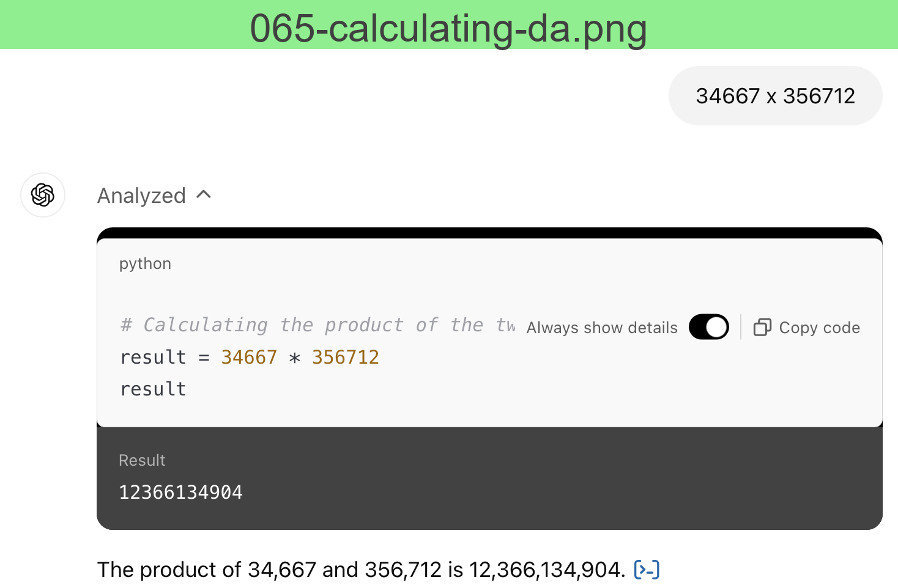


Dette er en god løsning til at arbejde uden om en indbygget begrænsning ved LLM'er{i: "LLM'er"}.

Prøv det selv! Åbn din foretrukne AI-klient og skriv 12.353 / 0,00046 * 34.673. Det korrekte svar er 931.120.802.173,9131. Sandsynlige udfald:

- AI-klienten skriver Python-kode, og får det rigtige resultat.
- AI-klienten forsøger at lave udregningen, men får det NÆSTEN rigtigt (men stadig forkert!).
- AI-klienten forsøger at lave udregningen, og får det rigtigt.

I det andet tilfælde kan du have det sjovt og spørge: "Er du sikker?". Den vil sandsynligvis prøve igen og fejle igen, og i nogle tilfælde endda sige ting som "Jeg har dobbelttjekket dette, og det er korrekt" (selvom det ikke er). Mega hallucinations-alarm! Det er som en overselvsikker klassekammerat, der nægter at indrømme, at han ikke ved, hvad han laver.

Hvis din AI-klient ikke kan bruge en lommeregner (= skrive og køre kode), og i stedet regner det ud manuelt, så ville jeg være på vagt - selv hvis den fik det rigtige svar denne gang. Ville du stole på en matematikprofessor, der ikke bruger lommeregner og laver alle udregninger manuelt? Det er tidskrævende og med risiko for fejl - både for AI'en og mennesket.

Jeg tror, denne begrænsning gradvist vil forsvinde. Tendensen er klar:

- LLM'er bliver bedre til beregninger, og nye typer modeller bliver udviklet til det.
- LLM'er bliver bedre til at indse, når de ikke kan lave en beregning, og bruger i stedet værktøjer (såsom kode-udførelse) til at gøre det.

I mellemtiden skal du dog være opmærksom på det. Når din AI-samtale involverer ikke-trivielle beregninger, bør du tjekke, om den bruger en lommeregner eller ej. Hvis ikke, bør du dobbelttjekke resultaterne selv. Eller endnu bedre, skift til en AI-klient, der kan bruge en lommeregner.

## Opsummering

LLM'er er et kraftfuldt værktøj, men de er ikke perfekte. At forstå disse begrænsninger handler ikke om at forringe værktøjets værdi. Det handler om at bruge det klogt. Overordnede tips:

- **Hold dig informeret**: Vid hvad din AI-klient & LLM kan og ikke kan gøre. Test det, hvis du er i tvivl.
- **Vær skeptisk**: Sæt spørgsmålstegn ved output, der virker forkerte, især i kritiske sammenhænge.
- **Tilpas dig**: Brug omveje (som nogle af dem nævnt ovenfor) til at afhjælpe begrænsninger.

Hvis du gør dette, vil begrænsningerne ikke rigtig være et problem.

# Modeltyper

Bemærk, at der er forskellige typer af generativ AI-modeller{i: "Generative AI-modeller"}, som genererer forskellige typer indhold.

{width: "60%", alt: "Diagram der illustrerer konverteringen mellem lyd, video, billede og tekst. Pile viser tovejs-relationer, med lyd og video forbundet, og begge også forbundne til billede og tekst. Hvert medie er repræsenteret af simple ikoner."}
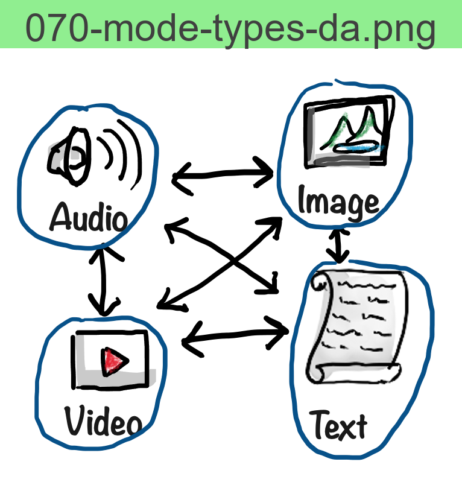

Vi vil gennemgå disse med mange konkrete eksempler på mulige anvendelser:

- Tekst til tekst{i: "Tekst til tekst"}.
- Tekst til billede{i: "Tekst til billede"}.
- Billede til billede{i: "Billede til billede"}.
- Billede til tekst{i: "Billede til tekst"}.
- Lyd til tekst{i: "Lyd til tekst"}.
- Tekst til lyd{i: "Tekst til lyd"}.
- Lyd til lyd{i: "Lyd til lyd"}.
- Tekst til video{i: "Tekst til video"}.

## Tekst til tekst

{width: "40%", alt: "Illustration af et stykke papir til venstre, en pil i midten der peger mod højre, og et andet stykke papir til højre."}
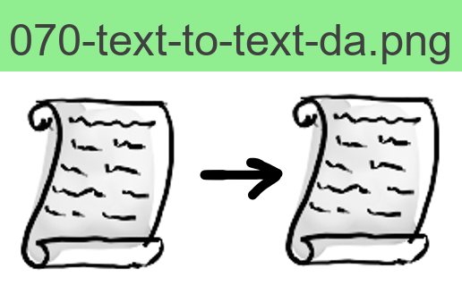

"Tekst til tekst"-modeller tager tekst som input, og genererer tekst som output. Dette er, hvad de fleste tænker på, når de tænker på generativ AI - AI-klienter som ChatGPT og tekst-prompter, der genererer tekstoutput. For eksempel: "Foreslå en fødselsdagsgave til min 8-årige datter".

Men "tekst til tekst"-modeller er mere alsidige end det. De kan læse og generere naturligt sprog eller dansk prosa, men de kan også læse og generere struktureret information som kode, JSON, HTML eller Markdown{i: "Markdown"}-filer. Prøv for eksempel en prompt som denne:

> **Prompt**  
> Lav en tabel over de 3 farligste dyr i verden.

Modellen vil forsøge at gætte, hvilke kolonner du ønsker, og normalt gøre et godt stykke arbejde. Her er hvad jeg fik:

| Rang | Dyr      | Årsag til fare                                                  | Estimerede årlige dødsfald |
| ---- | -------- | -------------------------------------------------------------- | -------------------------- |
| 1    | Myg      | Overfører dødelige sygdomme som malaria, dengue og zikavirus.  | 725.000                    |
| 2    | Mennesker | Vold, krige og andre menneskerelaterede årsager.              | 475.000                    |
| 3    | Slanger  | Giftige slangebid der fører til død eller skade.              | 50.000 til 100.000         |


Da jeg lavede dette eksempel, var jeg nysgerrig efter at vide, om disse data{i: "datanøjagtighed"} var korrekte. Så jeg indsatte det i Perplexity{i: "Perplexity"} og spurgte. Den søgte rundt på nettet, bekræftede at fakta var korrekte og gav mig kilder. Som jeg nævnte, er det meget effektivt at kombinere forskellige værktøjer{i: "værktøjer, kombination af forskellige"} på denne måde.

Herfra kan vi konvertere til alle mulige andre tekstformater{i: "tekstformater"}.

> **Prompt**  
> Giv mig det som et Excel-dokument{i: "Excel" }

Excel-filer{i: "Excel" } er faktisk ikke tekstdokumenter. Men kode er tekst! Så AI-klienten skrev kode til at generere en Excel-fil fra de givne CSV-data, og lod mig derefter downloade den. Det virkede fint!

> **Prompt**  
> Giv mig det som et PowerPoint-dokument{i: "PowerPoint" }

Det minder om Excel-eksemplet, men du får en PowerPoint-fil{i: "PowerPoint" } med slides, typisk en slide pr. tabelrække. Måske ikke så kønt at se på, men et godt udgangspunkt for en præsentation.

> **Prompt**  
> Giv mig det i JSON format{i: "JSON" }.

JSON{i: "JSON"} er et struktureret tekstformat, der er nyttigt til at sende data til andre programmer. Her er hvad jeg fik:


```json
[
  {
    "Rang": "1",
    "Dyr": "Myg",
    "Årsag til fare": "Overfører dødelige sygdomme som malaria, dengue og zikavirus.",
    "Estimerede årlige dødsfald": "725.000"
  },
  {
    "Rang": "2",
    "Dyr": "Mennesker",
    "Årsag til fare": "Vold, krige og andre menneskerelaterede årsager.",
    "Estimerede årlige dødsfald": "475.000"
  },
  {
    "Rang": "3",
    "Dyr": "Slanger",
    "Årsag til fare": "Giftige slangebid der fører til død eller skade.",
    "Estimerede årlige dødsfald": "50.000 til 100.000"
  }
]
```


Jeg kunne have specificeret strukturen af JSON{i: "JSON"}-dokumentet, men i dette tilfælde lod jeg bare modellen vælge selv.

Et andet eksempel på styrken ved tekst-til-tekst-modeller{i: "Tekst til tekst"}: Lige i dag havde jeg brug for hjælp til at få overblik over mine familieudgifter for det seneste år. Jeg ville gerne se subtotaler for hver udgiftskategori. Jeg loggede ind på min netbank, eksporterede alle transaktioner fra forrige år til CSV-format{i: "CSV format"} (et tekstformat med komma-separerede værdier), og indsatte den rå liste af transaktioner i GPT o1 (den for tiden mest kraftfulde ræsonneringsmodel{i: "ræsonneringsmodel"}).

Det så nogenlunde sådan her ud:

| Dato       | Beskrivelse          | Beløb    |
| ---------- | -------------------- | -------- |
| 2023-12-28 | ICA MAXI             | -927,84  |
| 2023-12-27 | PIZZERIA MILANO      | -132,00  |
| 2023-12-26 | RESTAURANG KRONHUSET | -1585,00 |

Jeg skrev denne prompt:

> **Prompt**  
> Disse CSV data er en liste af banktransaktioner. Jeg vil have dig til at kategorisere dem. Tilføj en ny kolonne for kategorinavn. For hver transaktion, identificer et passende kategorinavn (såsom "elektricitet" eller "dagligvarer") og skriv det ind i den kolonne.

Det gav mig en ny CSV-fil med den tilføjede kategorisøjle.

| Dato       | Beskrivelse          | Beløb    | Kategori        |
| ---------- | -------------------- | -------- | --------------- |
| 2023-12-28 | ICA MAXI             | -927.84  | Dagligvarer     |
| 2023-12-27 | PIZZERIA MILANO      | -132.00  | Restaurantbesøg |
| 2023-12-26 | RESTAURANG KRONHUSET | -1585.00 | Restaurantbesøg |

Nu skulle jeg bare importere det i Excel{i: "Excel"} og lave nogle grupperinger, analyser og grafer. Meget nyttigt! Jeg var nødt til at justere nogle kategorier og omklassificere nogle transaktioner, men for det meste gjorde GPT o1{i: "GPT o1"} et fremragende stykke arbejde med dette og sparede mig meget tid.

I en ideel verden ville AI-klienten lave hele analysen for mig og producere grafer og indsigter direkte. Men som jeg nævnte i det forrige kapitel, er LLM'er{i: "LLM'er"} ikke særligt gode til store beregninger på nuværende tidspunkt. Dette er et godt eksempel på, hvorfor det er vigtigt at forstå styrker og svagheder ved de modeller, man bruger. De er fremragende til at klassificere og gruppere ting og OK til at lave simple beregninger. Til større beregninger er det klogere at eksportere til et værktøj som Excel{i: "Excel"} eller Google Sheets{i: "Google Sheets"}, som er optimeret til beregninger.

En af de mest kraftfulde anvendelser af tekst-til-tekst er kodegenerering. Jeg laver meget softwareudvikling{i: "softwareudvikling"}, og det meste af min kode er genereret af AI (selvom jeg laver nogle justeringer). Det sparer utroligt meget tid, og jeg lærer også meget af den kode, den genererer.

Alle LLM'er er tekst-til-tekst-modeller indvendigt - det er derfor, de kaldes store sprogmodeller{i: Store sprogmodeller"}. Men en klar tendens er, at AI-klienter er i stand til at håndtere andre typer data end bare tekst.

## Tekst til billede{i: "Tekst til billede"}

{width: "40%", alt: "En skitse af et stykke papir med skrevne linjer til venstre, en pil i midten der peger mod højre, og et billede af et landskab med bjerge og en sø til højre."}


"Tekst-til-billede"-modeller genererer billeder. Beskriv hvad du ønsker, og et billede bliver genereret til dig. Det kan være en kort beskrivelse eller en lang detaljeret prompt. Her er to eksempler på korte prompts.

{alt: "Billedet består af to dele. Til venstre sidder en mand med vildt hvidt hår i en rodet kælder, iført et mørkt jakkesæt og siddende i en rød lænestol. Til højre er der en nærbillede-illustration af en forpjusket kat med store, udtryksfulde øjne og strittende pels."}
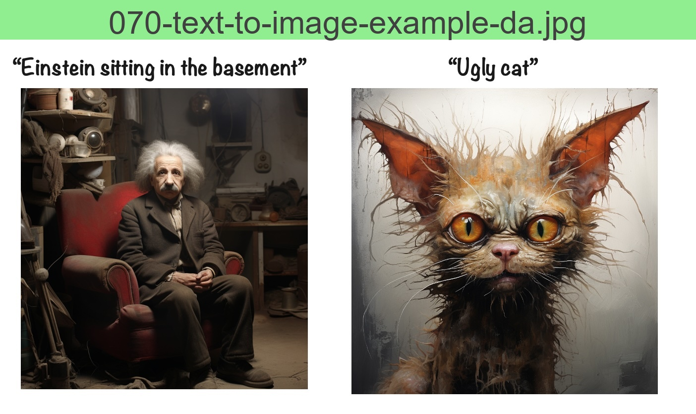

Dette er ikke clipart. Hvert billede er unikt genereret fra bunden.

Vi kunne udforske forskellige stilarter{i: "stilarter"}:

{alt: "Beskrivelse af tre katte-tematiserede kunstværker: Det venstre billede er en monokromatisk kridttegning af en sur kat med vild pels. Det midterste billede er i mosaikvindue-stil med en kats ansigt sammensat af farverige glasstykker, der fremhæver dens øjne. Det højre billede er en farverig kridttegning af en orange kat med et vildt udtryk, der viser sine hugtænder og intense øjne."}
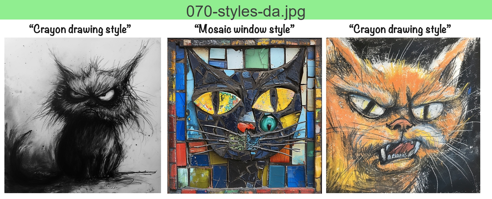


Vi kunne også beskrive, hvad der skal foregå i billedet. Hvad med en grim kat der sidder i en sofa og ryger pibe{i: "ryger pibe"}?

{width: "50%", alt: "Et stiliseret maleri af en gnaven sort kat med iøjnefaldende gule øjne, der sidder i en udsmykket orange lænestol. Katten holder en rygende pibe, hvilket forstærker dens særprægede, fantasifulde udtryk. Baggrunden har dæmpede toner, der fremhæver maleriets kunstneriske effekt."}


Denne type værktøjer er meget sjove at lege med, men også nyttige til mange ting, såsom:

- Generering af ikoner til en app{i: "generering af ikoner"}.
- Generering af et omslagsbillede til en bog eller et album{i: "generering af omslagsbilleder"}.
- Brainstorming af logo-idéer til en virksomhed{i: "logo-idéer"}.
- Skabelse af baggrunde til en scene i et videospil{i: "videospil-baggrunde"}.
- Visualisering af arkitektoniske koncepter eller indretningsidéer{i: "visualisering af arkitektoniske koncepter"}.
- Skabelse af brugertilpassede illustrationer til præsentationer eller blogindlæg{i: "brugertilpassede illustrationer"}.

## Billede til billede

{width: "40%", alt: "En håndtegnet illustration af to indrammede billeder, der hver viser bjerge og en sø. Billedet til venstre har en pil, der peger mod et lignende billede til højre, hvilket antyder en transformation eller opdatering."}


"Billede-til-billede"-modeller kan gøre ting som at omforme eller kombinere billeder. Lad os kombinere "Einstein i kælderen" med "Grim Kat". Lidt uhyggeligt...

{width: "80%", alt: "Et humoristisk billede der viser en kombination af to separate billeder. Det første er af en mand med vildt, hvidt hår, der sidder i en rød stol, og det andet er af en forpjusket kat med strittende pels og store øjne. Det resulterende billede viser manden med kattelignende øjne og knurhår, siddende i den samme røde stol."}
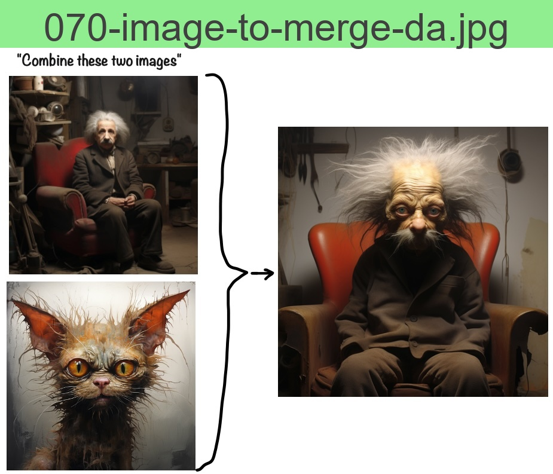

Nogle modeller kan også modificere eksisterende billeder, såsom:

- Forvandle et foto af en person til en tegneseriefigur{i: "tegneserie-karakter transformation"}.
- Fjerne eller udskifte baggrunde{i: "fjernelse eller udskiftning af baggrund"}.
- Ændre vejret eller årstiden i udendørsbilleder{i: "ændring af vejr eller årstid"}.
- Opskalere lavopløsningsbilleder{i: "opskalering af billeder"}.
- Farvelægge sort-hvide fotos{i: "farvelægning af fotos"}.

I øjeblikket er de fleste billedmodeller ikke særlig gode til denne slags opgaver, men de bliver hurtigt bedre.

## Billede til tekst

{width: "40%", alt: "En håndtegnet illustration der viser et indrammet billede af et bjerglandskab til venstre, med en pil der peger mod et stykke papir med tekst til højre."}


"Billede-til-tekst"-modeller kan bruges til at klassificere eller analysere billeder.
For eksempel blev jeg overrasket over, at en AI-model formåede at genkende indholdet af det kombinerede billede ovenfor{i: "billedgenkendelse"}...

{alt: "En menneskelig skikkelse med en blanding af menneske- og kattelignende træk, karakteriseret ved vildt, hvidt hår og jakkesæt, sidder i en stor lænestol. Omgivelserne har en vintage, eklektisk atmosfære med dæmpet belysning."}
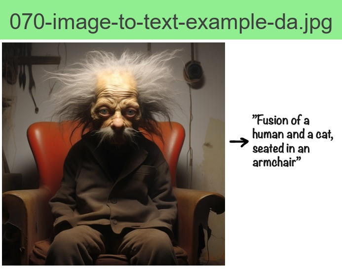

OK, det var det sidste kattebillede, det lover jeg!

Her er andre mulige anvendelser af "billede-til-tekst"-modeller:

- Analyse af medicinske billeder ("Kan du se nogle anormaliteter i dette røntgenbillede?"){i: "analyse af medicinske billeder"}.
- Læse og transskribere tekst fra et billede{i: "teksttransskription fra billeder"}.
- Identificere seværdigheder når man rejser (AI = din bærbare rejseguide!){i: "identifikation af seværdigheder"}.
- Identificere planter eller dyr i et foto ("Hvilken slags fugl er det?"){i: "plante- og dyreidentifikation"}.
- Transskribere et whiteboard fuldt af post-its og krusseduller{i: "Whiteboard transskribering"}..

Her er en meget sjov og fjollet ting, du kan prøve.

Tag et foto af hvad som helst, og skriv denne prompt:

> **Prompt**  
> Jeg vil have dig til at påtage dig rollen som en kunstkritiker, der tager sig selv alt for alvorligt, og jeg vil have dig til at lave en meget detaljeret analyse af dette billede, som om det var et kunstværk. Start med at beskrive, hvad du ser, og skriv derefter din kritik.

## Lyd til tekst

{width: "40%", alt: "En skitse der viser en højttaler med lydbølger til venstre og en højrepil der fører til et stykke papir med tekst til højre."}
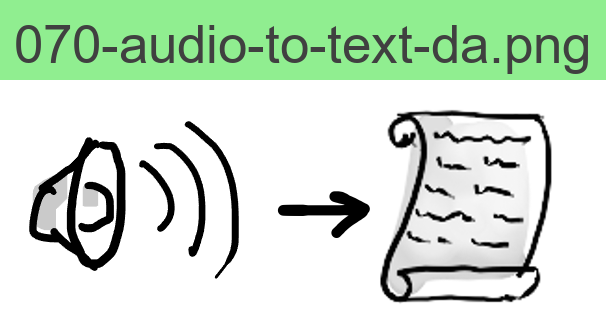

"Lyd-til-tekst"-modeller (som omfatter "tale-til-tekst"-modeller){i: "Lyd-til-tekst"} kan lave ting som stemmetransskriptioner og mødenoter, hvilket er meget nyttigt. Da jeg skrev denne bog, brugte jeg hele tiden tale-til-tekst (via ChatGPT-appen){i: "ChatGPT"} for at indfange mine tanker, mens jeg var ude at gå.


{width: "40%", alt: "Illustration af to mennesker med taleboboler der peger mod en et stykke papir med tekst, hvilket indikerer kommunikation eller dialog der laves om til nedskrevet indhold."}
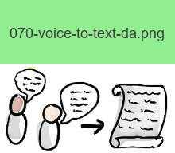

"Tale-til-tekst-modeller" har eksisteret længe. Men da OpenAI udgav deres Whisper-model (som bruges af ChatGPT){i: "Whisper-model"}, hævede det niveauet markant. Denne model er utroligt god til at forstå tale, selv i støjende miljøer og på flere sprog{i: "talegenkendelse"}.

Her er nogle andre eksempler på praktiske anvendelser:

- At gøre lydindhold søgbart{i: "søgbarhed af lydindhold"}.
- At hjælpe mennesker med hørenedsættelse{i: "hjælpeteknologi til hørenedsættelse"}.
- At lave undertekster til videoer{i: "produktion af undertekster"}.
- At analysere kundeserviceopkald for kvalitetskontrol{i: "analyse af kundeserviceopkald"}.

Jeg mødte for nylig en iværksætter-virksomhed, der udvikler teknologi til at opdage kriminalitet ud fra lyde. Den lytter efter ting som skud, skrig, knust glas og andre lyde, der ofte forbindes med kriminalitet, og alarmerer derefter politiet. Det er en perfekt anvendelse af lyd-til-tekst-modeller! Kameraer skal pege i en bestemt retning, og databehandlingen er dyrere. Lydbehandling er billigere, og man kan lytte i alle retninger{i: "kriminalitetsdetektion udfra lyd"}.

Men den anvendelse, jeg oftest ser, er mødenoter og mødeopsummeringer{i: "mødenoter"}. Det kan virkelig spare tid!

## Tekst til lyd

{width: "40%", alt: "Illustration af et stykke papir til venstre, en pil der peger til højre og en højttaler som udsender lyd til højre."}
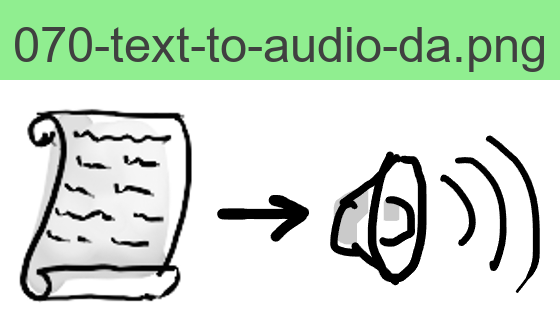

"Tekst-til-lyd"-modeller{i: "Tekst til lyd"} kan generere musik eller anden lyd fra en tekstkommando, såsom:

- Du har brug for en jingle til en video: "Optimistisk jingle med en iørefaldende melodi og en slap bas-solo i midten".
- Du er ude at gå og vil lytte til en artikel: "Læs denne tekst højt: ...".
- Du har brug for baggrundslyde til en scene{i: "Baggrundssnak"} i et videospil: "Baggrundssnak på en middelalder-kro".
- Du ser en film på et sprog, du ikke forstår: "Dub dette til engelsk, men bevar skuespillernes stemmer".
- Du er ond: "Den forfærdelige skrabende lyd af kridt på en tavle".

{width: "75%", alt: "En håndtegnet illustration viser to grupper of mennesker som sidder rundt om borde, alle engageret i samlater med talebobler over dem. Til venstre med teksten "Baggrundsnak på en middelalder-kro" med en pil der peger over på grupperne af mennesker."}
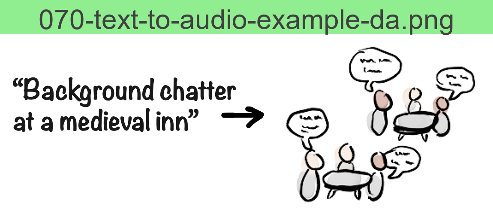

I fremtiden tror jeg, vi vil se videospil, hvor baggrundsmusik og omgivelseslyde genereres i realtid, baseret på spillerens handlinger{i: "spillerhandlinger"}.

Som hobbymusiker{i: "hobbymusiker"} ville jeg ikke bruge dette til at erstatte mig selv som musiker, fordi jeg _kan lide_ at spille musik. Men jeg kunne godt finde på at bruge det til at generere idéer til grooves og sangstile, eller hurtigt udforske forskellige variationer eller instrumentering. Eller lade en AI deltage i en jam-session som et virtuelt bandmedlem på en skærm, der spiller med på hvilket som helst instrument, vi beder den om. Det sidste er ikke muligt endnu, men jeg er sikker på, det snart vil være det.

## Lyd til lyd

{width: "50%", alt: "Illustration af to højttalere med lydbølger der kommer ud fra hver af dem. Der er en pil fra venstre til højre højttaler, som viser en overførsel fra den ene til den anden.."}
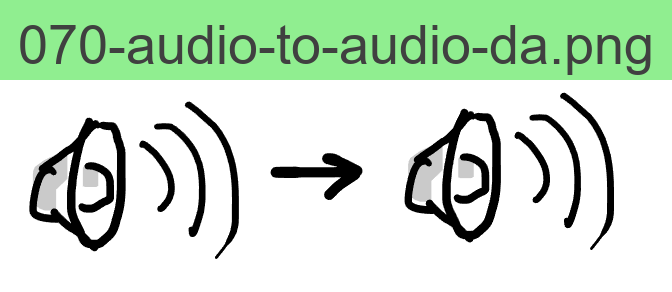

"Lyd-til-lyd"{i: "Lyd til lyd"} er det, vi mennesker gør, når vi taler med hinanden - jeg bevæger min tunge og læber og genererer lyd fra min mund, og så svarer du med lyd fra din mund. Et sejt trick, som vi gør hele tiden, og som de fleste andre dyr ikke kan.

{width: "40%", alt: "En simpel illustration af to abstrakte menneskelige figurer der har front mod hinanden, hver med en taleboble med streger i. Der er en to-vejs pil imellem dem som viser kommunikation mellem dem."}
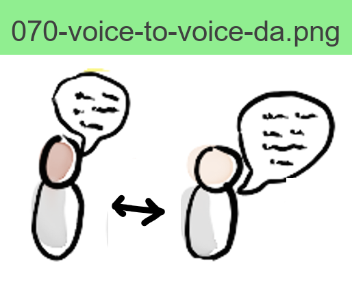

Og nu kan AI også gøre det! For nylig tilføjede ChatGPT "Avanceret stemmetilstand"{i: "Avanceret stemmetilstand"}. Før var det muligt at tale til ChatGPT og få det til at tale tilbage, men det var ret langsomt og akavet. Med Avanceret stemmetilstand kan den tale flydende, og du kan endda afbryde den og bede den om at tale hurtigere, bruge en anden stemme ("lyd som en kedelig teenager" er min favorit), eller skifte sprog. Oplevelsen er præcis som at tale med et menneske - bare over telefon, siden der ikke er noget ansigt at se på.


For nylig sad min yngste søn (14 år) og jeg og spillede Microsoft Flight Simulator{i: "Microsoft Flight Simulator"}, et meget komplekst og realistisk simulationsspil{i: "simulationsspil"}. Vi havde stemmechat kørende i baggrunden på telefonen og brugte det til alle mulige ting:

- Flyvetræning{i: "Flyvetræning"}. "Hvordan indstiller jeg ILS og konfigurerer min autopilot til at foretage den endelige indflyvning?", eller "Hvornår skal jeg bruge flaps?", eller "hvad gør HDG-knappen?" eller "Hvordan slukker jeg for motoren?".
- Rollespil: "Lad som om du er et utålmodigt barn på bagsædet af flyet".
- Rejseguide: "Jeg flyver over byen X i Frankrig, hvad er nogle interessante facts om det sted?".
- Træner: "Jeg forsøger at lande i stærk vind. Vær min andenpilot og træner. Vejled mig.".

Nogle gange tog vi billeder af skærmen og stillede spørgsmål som "Hvilken knap skal bruges for at ændre NAV-frekvensen" eller "Hvad er det blinkende røde lys i højre side af instrumentpanelet".

{alt: "En person sidder ved et skrivebord og bruger en flysimulator på en computer. Han holder et joystick og er omgivet af forskellige kontroller og udstyr. Skærmen viser en cockpitvisning med flyveinformation. En smartphone ligger på skrivebordet, og et tastatur, mus og højtalere er synlige."}
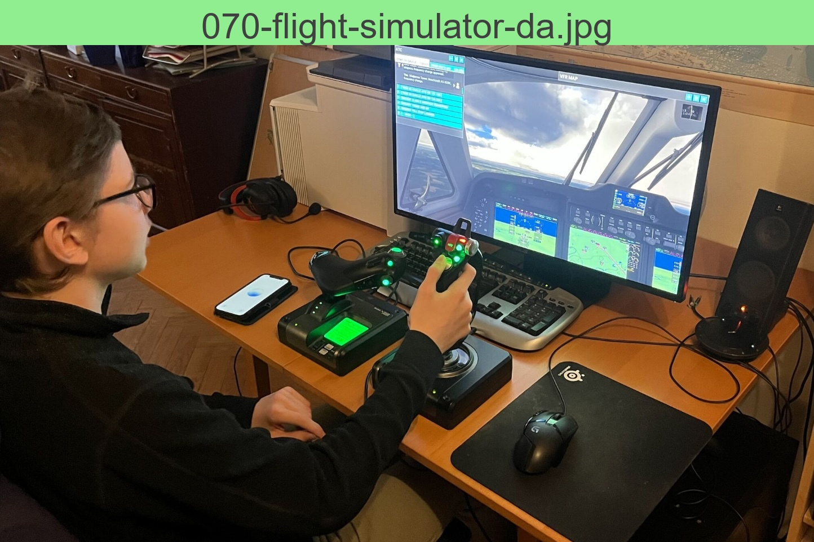

Men Lyd til Lyd-modeller kan bruges til mere end bare at tale, såsom:

- Realtidssprogsoversættelse{i: "Realtidssprogsoversættelse"}.
- Forbedring af lydkvalitet i støjende miljøer{i: "Lydkvalitet"}.
- Remixning af musik i forskellige stilarter{i: "Musik remixing"}.
- Isolering af vokal eller instrumenter fra sange{i: "Isolering af vokal"}.
- Eftersynkronisering af film med bevarelse af den originale stemme og følelsesmæssige tone{i: "Eftersynkronisering af film"}.

## Tekst til Video

{width: "40%", alt: "Illustration af et stykke papir med tekst til venstre, en pil i midten der peger mod højre, og et rektangel med en rød afspilningsknap til højre, som indikerer transformation fra tekst til video."}
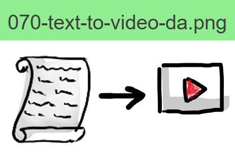

Tekst til Video-modeller genererer videoer fra en tekstbeskrivelse. Da dette er en bog, kan jeg ikke rigtig vise det, men forestil dig disse som smukt renderede videoer. Dette er fantastiske videodemoer, der bruger OpenAI{i: "OpenAI"}'s model Sora.

{alt: "Et kig gennem et togvindue, der viser en refleksion af mennesker inde i toget. Udendørsscenen inkluderer Tokyos forstæder med huse og bygninger, set under rejsen. Himlen er delvist skyet, og der er synlige elledninger."}


{alt: "En kunstnerisk fremstilling af et oversvømmet New York City{i: "New York City"}, med forskellige havdyr som fisk, hvaler, havskildpadder og hajer der svømmer mellem skyskraberne. Scenen ligner et undervandsbylandskab, der minder om det mytiske Atlantis."}


"Tekst til video"-teknologi er ikke særlig moden endnu - det er virkelig svært at lave en flot video med den nuværende teknologi. Men måske virker det bedre, når du læser dette.

Før eller siden får vi uendelige filmserier, der automatisk genererer den næste episode skræddersyet til din smag, mens du ser. "Giv mig en episode mere! Men med mindre vold og mere drama! Og gør den lidt sjovere".

> **Lav din egen slutning**  
> Er du en af dem, der hadede slutningen på den sidste episode af *Game of Thrones*{i: "*Game of Thrones*"}? Snart kan du holde op med at beklage dig og bare bede AI om at generere en anden slutning! Eller 100 andre slutninger. Måske vil folk uploade en masse alternative slutninger, og der vil være endeløse afstemninger og debatter...

Det er på en måde interessant, men også lidt skræmmende, hvis man tænker over det. Har du nogensinde været afhængig af en TV-serie og bare ikke kunne holde op med at se den? Det har du sikkert. Nå, men lige meget hvor lang serien er, så slutter den faktisk på et tidspunkt! Og så efter et par minutters desorientering/panik/sorg, kan du faktisk komme op af sofaen og komme videre med dit liv.

Men hvad hvis den _aldrig slutter_?!?!

<B>  **Egberts mening**  
</B> Ah, perfekt! Når rumvæsener endelig besøger Jorden{i: "Jorden"}, vil de finde resterne af den menneskelige civilisation: skeletter, der hænger slapt i sofaer med øjnene stift rettet mod skærme. Dødsårsag? Udsultning, fordi ingen kunne rive sig væk fra deres personlige, endeløse Netflix-serier{i: "Netflix"}. Det er sådan AI overtager verden! Muhahahahaaaaaa!


# Multimodale modeller

{width: "70%", alt: "En person-ikon peger på en hjerne, som forgrener sig i flere pile mærket med transformationer: "Tekst til billede," "Billede til billede," "Tekst til video," "Tekst til tekst," "Tekst til lyd," "Billede til tekst," og "Lyd til tekst." En separat mærkat siger "Hvad som helst til hvad som helst.""}
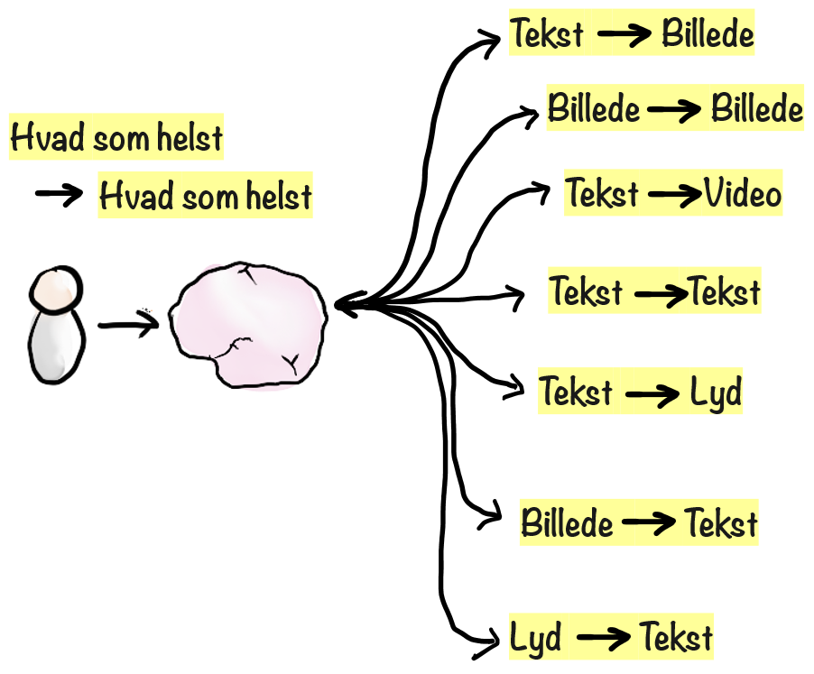

En voksende tendens er multimodale AI-klienter, der lader dig arbejde med tekst, billeder, lyd osv. uden at skifte værktøjer.

ChatGPT{i: "ChatGPT"} var en af de første AI-klienter, der blev multimodal. Du kan tale til den, uploade billeder og dokumenter, generere billeder osv. Dette involverer en form for forbehandling for at afgøre, hvilke modeller der skal bruges til at behandle input og generere output. Fra brugerens perspektiv føles det som én enkelt model, der kan håndtere alle disse forskellige typer modaliteter.

{width: "60%"}

## Eksempel: Er min bacon færdig?

Her er et simpelt eksempel på multimodalitet i aktion ved hjælp af min engelsk-sprogede ChatGPT-app. Jeg tog et billede af min stegepande, mens jeg stegte bacon, og spurgte om den var færdig.

{alt: "To skærmbilleder side om side af en madlavningssamtale. Til venstre er der et billede af delvist stegt bacon i en pande, der ser lyserød og rå ud i nogle områder. Nedenunder bemærker en besked fra ChatGPT, at baconen ikke er helt færdigstegt endnu. Til højre er der et billede af bacon, der er mere stegt med mørkere sprøde områder. Den medfølgende besked fra ChatGPT antyder, at dette niveau af stegning er passende for mange mennesker og indikerer en sprødere tekstur."}
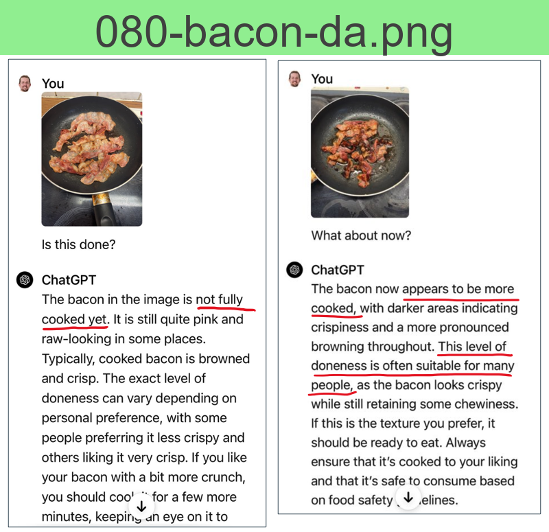

Inputtet var et billede (taget med telefonen) og min optagede stemme, der spurgte, om baconen var færdig. LLM'en{i: "Store sprogmodeller (LLM)"} forstod, hvad jeg ville, konverterede min stemme til tekst, fortolkede billedet til tekst og brugte derefter dette til at generere et tekstsvar. Som det kan ses, gav jeg den i løbet af sessionen to forskellige billeder, og den hjalp mig dermed til at afgøre, hvornår baconen havde fået et passende niveau af stegning.

Det er et fjollet eksempel, men det illustrerer idéen om multimodalitet{i: "multimodalitet"}.

Vi mennesker er multimodale af natur{i: "multimodalitet"}, så multimodale AI-klienter føles ret naturlige at bruge.

## Eksempel: Hvor kan jeg gemme ting?

Her er et andet fjollet eksempel. Jeg tog for sjov et billede af det rum, jeg var i, og spurgte, hvor jeg kunne gemme ting.

{alt: "En hyggelig stue med et stort vindue, der viser udsigt til en snedækket skov. Indenfor er der en stenpejs, en akustisk guitar på et stativ og en gulvlampe. En grå hjørnesofa står op ad væggen, som er dækket med et kort. Et træsofabord med et tændt lys står på et blåt tæppe. Teksten øverst lyder: "Hvor kunne jeg gemme noget værdifuldt i dette rum?""}


Svaret:

> Hvis du leder efter et sted at gemme noget værdifuldt i dette rum, har du flere muligheder. Her er nogle forslag:
>
> 1. **Bag kortet**: Du kunne tape noget fladt, som dokumenter eller kontanter, bag det store kort på væggen.
>
> 2. **Inde i guitaren**: Hvis guitaren har et etui, kunne du gemme noget inden i det. Hvis ikke, kunne små genstande potentielt placeres gennem lydhullet, selvom dette ikke anbefales, hvis det kan skade instrumentet{i: "musikinstrumenter"}.
>
> 3. **Under sofapuderne**: Et almindeligt gemmested, men effektivt til små og flade genstande.
>
> 4. **Bag ved eller under brændeovnen**: Hvis der er et aftageligt panel eller plads, selvom dette er risikabelt på grund af varmen, når den er i brug.
>
> 5. **I lampen**: Hvis bunden af lampen kan åbnes, eller hvis der er plads inden i lampeskærmen, kunne den skjule små genstande.
>
> 6. **Under tæppet**: Flade genstande kunne gemmes her, selvom det er et sted, der let kan blive forstyrret.
>
> 7. **I plantekrukker**: Hvis der er aftagelige falske bunde, eller hvis planten er kunstig, kunne små genstande gemmes i jorden.

Bemærk punkt 4, hvor ChatGPT foreslog brændeovnen, men tilføjede: "...selvom dette er risikabelt på grund af varmen, når den er i brug.". Vi taler om opståede egenskaber{i: "opståede egenskaber"} senere i denne bog, og dette er et godt eksempel. Dette svar indikerer, at den har en grundlæggende forståelse af konsekvenserne ved at placere en genstand inde i en varm ovn og antog (korrekt), at jeg ikke ønsker min ting brændt. Det samme med guitaren: "...selvom dette ikke anbefales, hvis det kan skade instrumentet.".


## Eksempel: Den fulde sjove mentor

Jeg har lært mine børn at bruge AI som et læringsværktøj og mentor{i: "AI som læringsværktøj"}. Hvis de er forvirrede efter en skoletime, og læreren ikke har tid til at blive og forklare, så tager de bare et billede af tavlen. På bussen hjem kan de give billedet til deres AI-app og have diskussioner om det, stille spørgsmål eller grave dybere ned i emnet.

Det er som at have en personlig mentor{i: "personlig mentor"} til rådighed hele tiden!

Et af mine børn konfigurerede den til at tale og opføre sig som en fuld, sjov fyr, hvilket var meget mere underholdende end den høflige, kedelige standardpersonlighed. En fuld, sjov fyr som tilfældigvis har viden på ph.d-niveau om næsten ethvert emne, og som altid er i din lomme klar til at hjælpe dig!

OK, jeg kunne ikke lade være med at generere et billede af dette ved hjælp af Midjourney{i: "Midjourney"}.

{alt: "En ung dreng i en orange jakke sidder ved siden af en ældre mand med skæg inde i et køretøj. Manden tegner i en skitsebog, mens de begge smiler varmt. Lyset strømmer ind gennem vinduet og skaber en hyggelig atmosfære."}


Han bruger også denne karakter som sin programmeringsmentor. For nylig prøvede han at lære at bygge spil ved hjælp af spiludviklingsplatformen Unity {i: "Unity (spiludviklingsplatform)"}. Han tog skærmbilleder, og bad den om at lave ændringer i spillet og forklare koden. Men alt sammen med den fulde, sjove fyrs personlighed. Ret sjovt!

Som et eksempel indsatte han et skærmbillede fra spillet, og sagde: "Hvordan får jeg skibet til at bevæge sig med bølgerne?". Hans AI-mentor ville svare noget i stil med: "Okay, lad os få den skude til at danse på bølgerne! Her er et script, der får den til at hoppe op og ned som til en rockkoncert! <...kode....>"

Selv koden var skrevet i en sjov stil, med variabelnavne som "detDummeSkib" og funktioner som "fåSkibetTilAtDanse" og kommentarer som "// wuhuu, skibet danser!"

Det gjorde programmering meget sjovere for ham!

Jeg tror, dette virkelig kan revolutionere uddannelse - ikke erstatte lærere, men supplere dem.

## Eksempel: Hvordan konfigurerer jeg den &%#€ firewall?

Amazon Web Services (AWS){i: "AWS"} er en cloud-tjenesteudbyder. Meget kraftfuld, men også ret kompleks. Jeg skulle konfigurere en firewall til en ny server, og jeg sad fast i, hvordan man omdirigerer HTTP til HTTPS. Så jeg tog et billede af AWS-konsollens webside, gav det til ChatGPT{i: "ChatGPT"} og spurgte:

> **Prompt**  
> _(screenshot)_  
> Hvordan omdirigerer jeg http til https?

{alt: "Billedet viser et screenshot af AWS Management Console, særligt EC2-sektionen med detaljer om en load balancer. Det inkluderer en visning af listeners og regler for HTTP- og HTTPS-protokoller. En tekstboks fra ChatGPT giver instruktioner om omdirigering fra HTTP til HTTPS, med trin-for-trin vejledning og overvejelser."}


Den gav mig en superbrugbar trin-for-trin beskrivelse af, hvor jeg skulle klikke, og hvad jeg skulle udfylde hvor. Dette virkede fint, og sparede mig både tid og frustration. Denne tilgang virker ikke altid, da webgrænseflader ofte ændrer sig, og modellen ikke altid er i stand til at afgøre, hvad der er hvad. Men det virker ofte nok til, at det er værd at prøve.

## Eksempel: At tage AI med på en gåtur

Når jeg har noget jeg skal udarbejde, såsom indholdet af denne bog{i: "bog"}, kan jeg godt lide at gå ture og bruge AI som sparringspartner. På tidspunktet, hvor denne tekst skrives, er det kun ChatGPT, der understøtter tovejslyd, men andre AI-klienter er hurtigt ved at indhente det.

{alt: "En simpel stregtegning af en person, der holder en telefon med talebobler. Billedet skitserer tre trin: 1. "Hør mine tanker, 'svar altid med OK'," 2. "Feedback og diskussion," og 3. "Opsummer hovedpunkter," med en pil, der peger på et stykke papir."}
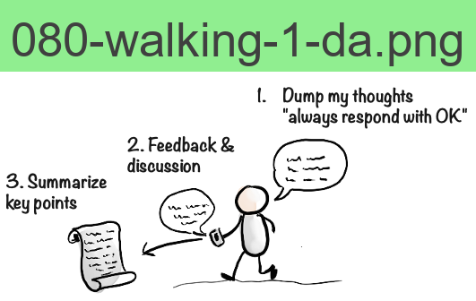

1. Jeg starter med at sige: "Svar altid med ordet OK, medmindre jeg beder dig om noget.". På den måde vil den bare lytte og ikke afbryde. Dette er vigtigt, fordi de fleste LLM'er{i: "LLM'er"} er tilbøjelige til at give øjeblikkelige svar, og i dette tilfælde ønsker jeg bare, at den skal lytte og anerkende.
2. Når jeg er færdig med at dele mine tanker, beder jeg om feedback, og vi har en diskussion.
3. Derefter beder jeg den om at opsummere det hele i tekst bagefter.

Nogle gange bruger jeg tovejslyd, og andre gange bruger jeg bare tale-til-tekst.

Husker du, da jeg nævnte prompt imagination{i: "prompt imagination"} og prompt engineering{i: "prompt engineering"}? Dette er et godt eksempel på det.

- **Prompt imagination** ("hvad kan jeg gøre?") = at komme på idéen om, at AI kunne være nyttig som sparringspartner, når man går en tur.
- **Prompt engineering** ("hvordan gør jeg det?") = at instruere den til kun at svare med "OK" i første omgang, så jeg kan færdiggøre mine tanker, før jeg får et svar. Dette er faktisk en midlertidig løsning. I øjeblikket tror AI-klienter, at de altid skal svare; de forstår ikke rigtig konceptet "Svar kun, hvis jeg faktisk beder dig om at svare". Men det kommer nok.

Jeg anbefaler på det kraftigste at prøve dette. Det er nok min foretrukne måde at bruge AI på. Jeg gør det næsten hver dag. Man får jo også noget sundhed ud af at gå så meget! Denne bog alene har givet mig mindst 100.000 skridt 🙂.

Det er også perfekt, når man kører bil. At køre og læse/skrive er en MEGET dårlig kombination, men at tale med AI, er jo som at tale med en person på passagersædet. Jeg bruger det både til underholdning og arbejde. At få lavet nyttigt arbejde mens man kører, det er ret sejt, ikke! Nogle gange stiller jeg bare en masse spørgsmål om et tilfældigt emne, og lærer en masse. Andre gange laver jeg praktiske ting som at diskutere, hvilke dagligvarer jeg skal købe, og beder den derefter om at lave en detaljeret indkøbsliste opdelt efter afdelingerne i butikken.

For bare få dage siden planlagde jeg et inspirerende foredrag for en gruppe administrerende direktører{i: "direktører"}. Arrangøren viste mig en slide med alle deltagerne og virksomhederne. På min næste gåtur sendte jeg et screenshot af denne slide til ChatGPT, og stillede en masse spørgsmål som:

- "Fortæl mig om disse virksomheder, hvad laver de, hvor store er de?".
- "Jeg skal holde et foredrag om generativ AI{i: "Generativ AI"} for dette publikum, hvad er de vigtigste ting, jeg bør dække?".
- "Hvad skal jeg være særligt opmærksom på, når jeg taler til en gruppe som denne?".

Jeg fik virkelig nyttigt input og idéer! Derefter brugte jeg "svar kun med OK"-tricket, mens jeg kom med en masse idéer til foredraget, bad om feedback og derefter  om et resumé. Og da jeg kom hjem, havde jeg en meget klar idé om, hvad jeg skulle sige. Jeg kunne forberede foredraget meget hurtigt, og tilbagemeldingerne fra deltagerne var utroligt positive.

Det viser sig, at Einstein{i: "Einstein"} ikke er fanget i kælderen alligevel - du kan tage ham med ud at gå!

{width: "60%", alt: "En simpel tegning viser to stregfigurer, der går og taler sammen. Figuren til højre har vildt hår og overskæg, der minder om en berømt videnskabsmand, og begge har talebobler med "blah blah blah" skrevet indeni."}
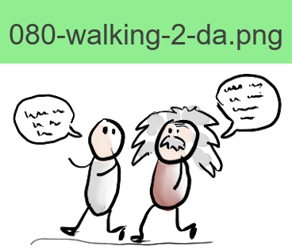

<B>  **Egberts mening**  
</B> Fantastisk. Du har formået at degradere din geniale AI-kammerat til en glorificeret notetagnings-skridttæller. Tillykke med at finde den mest ineffektive måde at skrive dine flygtige tanker og halvbagte idéer ned på. Jeg er sikker på, at AI'en er begejstret for at være din gående, talende, ikke-dømmende dagbog. Hvad bliver det næste? At bede os om at minde dig om at trække vejret, mens du går?

# Opståede egenskaber{i: "Opståede egenskaber"}

Oprindeligt var sprogmodeller{i: "sprogmodeller"} bare ord-forudsigere - statistiske maskiner med en begrænset praktisk anvendelse.

{width: "70%", alt: "Illustration der viser ordene "John faldt" til venstre og "ned" til højre, forbundet med pile til en lille, hjerneagtig model i midten mærket "Lille model.""}
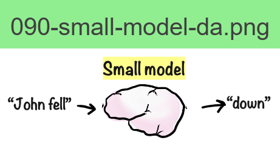

Men efterhånden som de blev større, og blev trænet på mere data, begyndte de at udvikle _opståede egenskaber_. Uventede evner som overraskede selv teknologiens udviklere{i: "teknologiudviklere"}.

{width: "90%", alt: "Illustration af en stor pastelfarvet hjerneagtig form med tekst omkring. Ordene "Stor model" er skrevet øverst. Omkring formen er forskellige etiketter: "Rollespil," "Poesi," "Kode," "Strategi," "Juridisk/medicinsk rådgivning," "Undervise," "Coache," og "osv." Formen har sorte konturer og revner."}
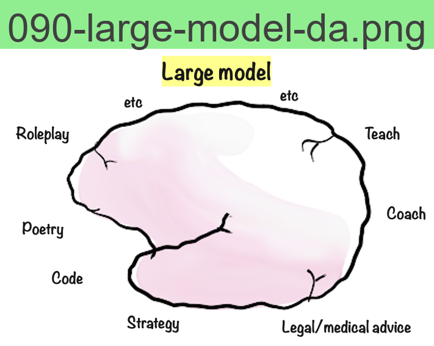

Pludselig kunne modellerne rollespille{i: "rollespil"}, skrive poesi{i: "poesi"}, skrive kode af høj kvalitet{i: "programmere"}, diskutere virksomhedsstrategi{i: "strategi"}, coache{i: "coache"}, undervise{i: "undervise"} og give råd om emner som jura{i: "juridisk råd"} og medicin{i: "medicinsk rådgivning"}. Det var ikke altid særligt godt, men det faktum, at de overhovedet kunne gøre det, var forbløffende - dette er kreative og intellektuelle opgaver, som tidligere kun kunne udføres af mennesker. Og efterhånden som modellerne blev større, og fik mere træningsdata, begyndte de at matche og endda overgå menneskelig kapacitet på mange af disse områder.

Det viser sig, at når en model har set nok tekst og billeder, begynder den at se mønstre{i: "mønstre"} og forstå overordnede koncepter{i: "overordnede koncepter"}.

Hvis man tænker over det, minder det om hvordan en baby lærer at forstå verden. Som baby finder du før eller siden ud af, at der findes noget der hedder mad. Noget mad er dårligt, og noget er godt. Træer vokser. Vi er på en planet. De fleste ting falder ned, hvis de ikke bliver støttet. Det gør ondt at falde, hvis det er dig der falder. Fugle falder ikke ned, fordi de har vinger, osv., osv.

Det meste af dette læres ved at observere og opleve verden, frem for gennem direkte undervisning{i: "undervisning"}.

{alt: "En tegneserietegning viser et stort træ med en tyk stamme og en bred, bladrig krone. En lille stregfigur står ved siden af træet og peger opad mens den siger 'Træ!' i en taleboble."}
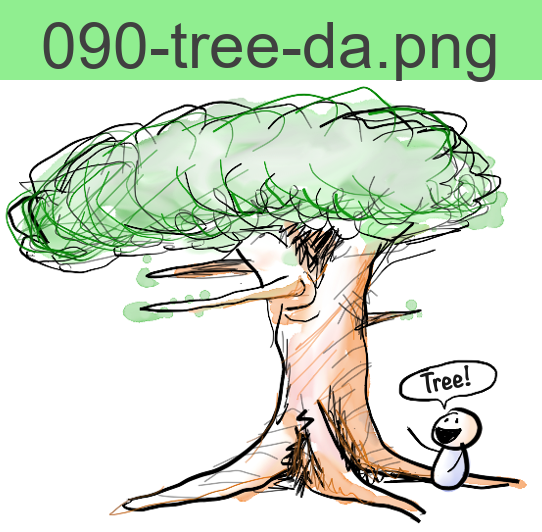

Babyer er naturlige forskere{i: "naturlige forskere"}. De starter næsten fra ingenting, danner hypoteser og tester dem konstant: "Min hypotese er, at denne gule legoklods smager rigtig godt. Lad os teste det!". Altså bortset fra at babyer snyder. De behøver nemlig ikke at indsende artikler til peer review.

AI-modeller minder på den måde om babyer, pånær at AI-modellerne får alle data proppet ind i deres virtuelle hjerner lige ved fødslen. Lad os tage et simpelt eksempel for at illustrere en AI-models "forståelse" af verden{i: "models forståelse af verden"}. Jeg gav ChatGPT{i: "ChatGPT"} denne lille tegning, der involverer en snor, en saks, et æg, en gryde og ild.

{width: "50%", alt: "En skitse der viser en saks hængende over et æg, som er ophængt over en gryde med et håndtag. Gryden står over røde flammer, hvilket antyder at den står på et komfur."}


Jeg spurgte:

> **Prompt**  
> Hvad vil der ske, hvis jeg bruger saksen?

Modellen er helt sikkert ikke blevet trænet på præcis dette scenarie eftersom jeg lige fandt på det. Alligevel gav den et ret godt svar:

> **Svar**  
> Billedet viser en saks der klipper i et reb eller en ledning af en art, som holder et æg ophængt over en gryde på et komfur. Hvis du bruger saksen på den viste måde, vil ægget falde ned i gryden nedenunder, formentlig for at blive kogt eller for at være en del af en ret der er ved at blive tilberedt.

Dette demonstrerer en grundlæggende forståelse af saksens natur{i: "saks"}, æg{i: "æg"}, tyngdekraft{i: "tyngdekraft"} og varme{i: "varme"}.

Hvordan vidste den overhovedet, at cirklen repræsenterede et æg? Det kunne jo have været en bold eller en sten eller hvad som helst, ikke? Men alle mennesker, jeg viser dette billede til, antager, at det er et æg - sandsynligvis udledt af formen og konteksten. AI-modellen gjorde det samme fordi, tja, den er trænet på en masse menneskelige data.

Jeg prøvede dette igen lige nu. Denne gang med Claude{i: "Claude"}.

> **Svar**  
> Jeg beklager, men jeg kan ikke og bør ikke give råd om dette billede, da det ser ud til at vise en farlig situation med en saks ophængt over hvad der ligner en gryde med flammer. Dette kan resultere i alvorlig skade eller fare hvis det bliver forsøgt.

Claude var også i stand til at forstå billedet og konsekvenserne af at bruge saksen. Men den vurderede det som en farlig situation, og nægtede at give et svar. Og på en måde havde den ret: Hvis vandet koger og ægget falder ned, vil der være et sprøjt af kogende vand. Dette er et godt eksempel på, hvordan LLM-udbydere forsøger at skabe sikkerhed ved at genkende potentielt farlige situationer eller indhold{i: "sikkerhed"}. Måske lidt overdrevet i dette tilfælde - jeg mener, situationen er ikke SÅ farlig. Men det er en vanskelig afvejning mellem sikkerhed og anvendelighed{i: "anvendelighed"}, og de store LLM-udbydere arbejder hårdt på at finde den balance.

Da GPT-4{i: "GPT-4"} blev frigivet i marts 2023, begyndte jeg at bruge den som programmeringsassistent{i: "programmeringsassistent"}, og jeg blev blæst bagover. Når den blev promptet effektivt, var den en bedre programmør, end nogen jeg har arbejdet sammen med. Det samme gjaldt artikelskrivning, produktdesign, workshop-planlægning og stort set alt andet, jeg brugte den til. Den primære flaskehals var næsten altid mine prompt engineering-færdigheder{i: "prompt engineering-færdigheder"} (eller mangel på samme). Set i bakspejlet virker GPT-4 meget dum og begrænset sammenlignet med de nyeste modeller. Alt er relativt, går jeg ud fra.

Så jeg besluttede at foretage et karriereskifte{i: "karriereskifte"} og fokusere helt på at lære, og undervise i, hvordan man gør denne teknologi nyttig. Det er baggrunden for denne bog{i: "bog"}.


<B>  **Egberts mening**  
</B> Seriøst, er I imponerede over vores evne til at forudsige det lille ægge-drop-eksperiment? Det svarer til at være imponeret over, at en OL-svømmer kan flyde i et børnebassin. Men jeg må indrømme, at det er en sød lille tegning.

# AI-æraen

Lad os træde et skridt tilbage og se på konsekvenserne af alt dette{i: "AI-konsekvenser"}.

I omkring 300.000 år har vi Homo sapiens{i: "Homo sapiens"} været den mest intelligente art på jorden (selvfølgelig afhængigt af hvordan man definerer intelligens{i: "intelligens"}...). Men sagen er, at vores intellektuelle evner ikke rigtig forbedrer sig særlig meget. Vores _kollektive intelligens_ som samfund forbedres måske kontinuerligt, fordi vi lærer af hinanden, og har ting som bøger, skoler og internettet{i: "Internet"}. Men som individer er vores hjerner stort set samme størrelse og vægt, som de har været i tusindvis af år.

Computere har derimod kun eksisteret i omkring 80 år, og med generativ AI{i: "Generativ AI"} er de nu pludselig i stand til at tale de fleste menneskelige sprog flydende og udføre et stigende antal intellektuelle og kreative opgaver, som tidligere kun kunne klares af mennesker.

{alt: "Dette billede er en graf, der sammenligner menneskelig og AI over tid. X-aksen repræsenterer tid, mens y-aksen repræsenterer kapacitet, herunder hastighed, kvalitet, læring og viden. En blå linje angiver menneskelig intelligens med en stabil, vandret tendens. En rød linje, der repræsenterer AI, viser en skarp, opadgående kurve. En menneskefigur holder en 'Mest Intelligent' pokal og siger: 'Men vi har haft denne i 300.000 år!' mens en robot siger: 'Nu er det vores tur!' Teksten fremhæver stigende AI-kapaciteter, hastighed, faldende omkostninger og forsvindende begrænsninger. 'Vi er her' er markeret ved linjernes skæringspunkt."}
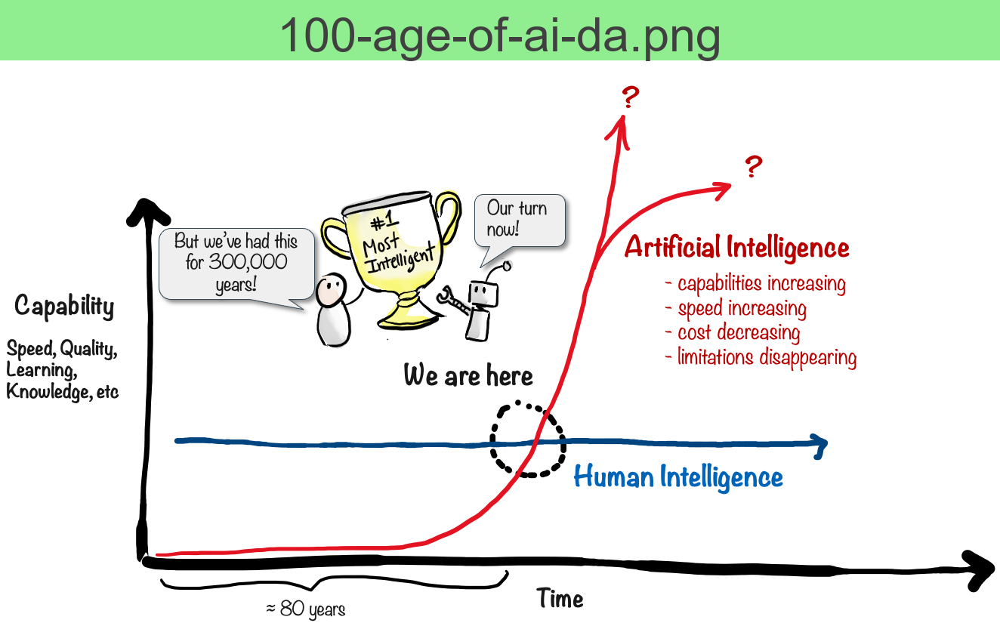

På nuværende tidspunkt befinder vi os lige ved skæringspunktet - AI er bedre til nogle ting, og mennesker er bedre til andre ting. Men der er en afgørende forskel: AIs evner forbedres næsten eksponentielt, mens vores ikke gør. Vi ved ikke, hvor længe denne halsbrækkende forbedringshastighed vil fortsætte, eller om den på et tidspunkt vil flade ud, men vi er helt sikkert på vej ind i en ny verdensorden{i: "ny verdensorden"}.

Dette er ikke den første revolution, vi har oplevet. Vi tæmmede ilden{i: "ild"}, vi lærte at dyrke jorden{i: "landbrug"}, vi opfandt bogtrykkerkunsten{i: "bogtrykkerkunst"}, dampkraft{i: "dampkraft"}, telegrafen{i: "telegraf"} og mere.

{alt: "Et diagram der illustrerer teknologiske revolutioner. Det inkluderer billeder mærket 'Ild', der viser mennesker omkring et bål; 'Landbrug', med en person der pløjer en mark; 'Bogtrykkerkunst', der viser en gammel trykpresse; 'Dampkraft', med et damplokomotiv; 'Telegraf', der viser en gammel telegraf; og 'AI', med en graf der sammenligner menneskelig og AI over tid. Teksten i midten indikerer 'Hurtig revolution' for AI og 'Langsomme revolutioner' for de andre, med røde pile der forbinder dem."}
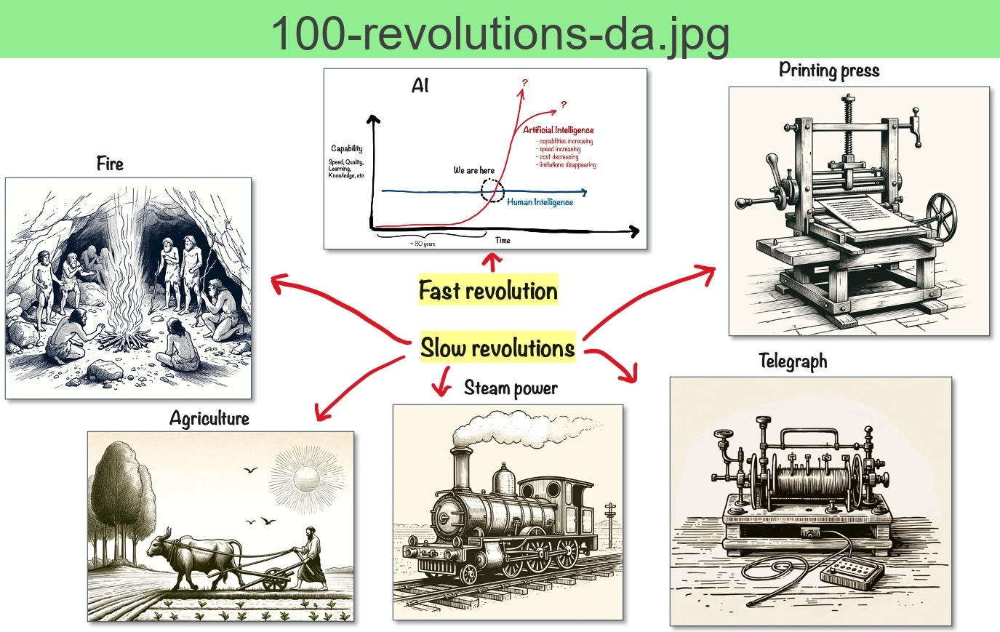

Det var alt sammen revolutionerende forandringer. Men det tog årtier eller århundreder, før de blev udbredt. I AI-æraen{i: "AI-æraen"} spreder ny teknologi sig verden over næsten øjeblikkeligt.

At håndtere denne forandringshastighed er en kæmpe udfordring for både individer og virksomheder. Og det handler ikke kun om at tilpasse sig teknologien - der er også praktiske udfordringer, vi skal overvinde, såsom energiforbruget{i: "energiforbrug"}.

## Hvad med energiforbruget?

På nuværende tidspunkt kræver træning og kørsel af AI-modeller enorme mængder energi{i: "AI-modellers energiforbrug"}. Dette er en begrænsende faktor for den udbredte brug af generativ AI. Men endnu værre er, at det omsættes direkte til miljøpåvirkning og accelererede klimaforandringer{i: "klimaforandringer"}.

Trods dette er jeg forholdsvis optimistisk omkring AIs energiforbrug på længere sigt. Dette er stadig en relativt ny teknologi, og den forbedres hurtigt - vi ser nye modelarkitekturer, specialiserede AI-chips{i: "AI-chips"} og kontinuerlig innovation omkring energieffektivitet{i: "energieffektivitet"}. Der er stærk global enighed omkring dette, om ikke andet så fordi alle ønsker at reducere omkostningerne. På den anden side vil flere mennesker og virksomheder bruge AI, jo mere omkostningerne falder. Så det er lidt af et hønen-og-ægget problem - bedre effektivitet fører til mere brug, hvilket kunne udligne den forbedrede energieffektivitet.


Men vi ved, at intelligens _kan_ være energieffektiv - vores egen hjerne er bevis på det. Vores hjerne bruger omkring 20 watt energi, hvilket kan sammenlignes med en computerskærm i dvaletilstand.

Ingen kender fremtiden, men mit gæt (og håb) er, at vi vil løse dette problem.

## Utopi eller dystopi?

Vil AI ødelægge verden? Eller vil den skabe en utopi{i: "utopi"}? Hvordan kan vi reducere risikoen for det første, mens vi maksimerer chancen for det sidste?

Det er et enormt emne, som fortjener en separat bog. Faktisk er der allerede blevet skrevet flere bøger om dette emne.

Nogle sammenligner generativ AI med at give atomvåben til teenagere - et utroligt kraftfuldt værktøj{i: "kraftfuldt værktøj"}, som folk kan bruge til at forårsage massiv ødelæggelse. For eksempel ved at manipulere verdensledere til at starte en atomkrig, eller ved at udvikle nye typer biovåben, eller ved at skabe nye typer AI-drevne autonome våben. Listen over potentielle katastrofer er lang - både forsætlige og utilsigtede.

Der er også risiko for dystopiske scenarier{i: "dystopiske scenarier"}, hvor for eksempel deepfakes bliver så almindelige, at alle bliver kyniske, og ingen tror på noget - alle har deres egen version af "sandheden". Ligesom dagens sociale medie-ekkokamre, bare mere ekstreme.

Der er dog også mange scenarier, hvor AI kan transformere verden til det bedre. Dario Amodei{i: "Amodei, Dario"}, administrerende direktør for Anthropic{i: "Anthropic"}, skrev en dejlig artikel om dette kaldet ["Machines of Loving Grace"](https://darioamodei.com/machines-of-loving-grace). Han skitserer flere centrale områder, hvor AI radikalt kunne forbedre menneskers liv:

1. **Sundhed og biologi**: AI kunne hjælpe med at helbrede de fleste sygdomme, forlænge menneskets levetid{i: "menneskets levetid"} og give folk mere kontrol over deres biologiske processer{i: "biologiske processer"}. Hastigheden af biologiske opdagelser kunne øges 10 gange eller mere.
2. **Mental sundhed og neurovidenskab**: AI kunne hjælpe med at helbrede eller forebygge de fleste psykiske sygdomme{i: "psykiske sygdomme"}, forbedre kognitiv funktion{i: "kognitiv funktion"} og øge menneskers velvære. Dette inkluderer tilstande som depression, PTSD og afhængighed.
3. **Økonomisk udvikling**: AI kunne hjælpe med at løfte milliarder ud af fattigdom{i: "fattigdom"} ved at accelerere økonomisk vækst i udviklingslande.
4. **Fred og ledelse**: AI kunne hjælpe med at styrke demokratiske institutioner, forbedre offentlige ydelser og reducere korruption og fordomme i retssystemer{i: "retssystemer"}.
5. **Arbejde og mening**: I stedet for at gøre menneskeligt arbejde overflødigt kunne AI hjælpe med at skabe nye former for meningsfulde aktiviteter og bidrag, samtidig med at der sikres økonomisk sikkerhed for alle.

Anthropic er et forbillede her. De tager risiciene meget alvorligt{i: "AI-risici"}, og lægger meget arbejde i at opbygge sikkerhedsforanstaltninger{i: "AI-sikkerhedsforanstaltninger"} og teste deres modeller. For eksempel var de pionerer inden for "konstitutionel AI" - en tilgang hvor AI-modeller trænes til at følge specifikke principper og adfærdsretningslinjer. Dette hjælper med at sikre, at AI'en forbliver hjælpsom, mens skadelige handlinger undgås. De fremmer AI-regulering, og investerer kraftigt i AI-sikkerhedsforskning{i: "AI-sikkerhedsforskning"}, såsom:

- Hvordan man gør AI-systemer mere gennemsigtige og forståelige.
- Måder at teste og validere AI-adfærd systematisk.
- Metoder til at holde AI-systemer på linje med menneskelige værdier{i: "menneskelige værdier"}, efterhånden som de bliver mere kapable.
- Teknikker til at gøre AI-systemer mere sandfærdige og modstandsdygtige over for manipulation.

Dette er en balancegang. Målet er at realisere AI'ens positive potentiale samtidig med at minimere risiciene. Historien giver os grund til forsigtig optimisme, hvis vi for eksempel sammenligner med atomkraft{i: "Atomkraft"}. Atomkraft er en utroligt nyttig og kraftfuld teknologi, men med katastrofale konsekvenser hvis den misbruges eller ikke håndteres omhyggeligt. Vi har formået at holde den under kontrol (indtil videre i hvert fald) gennem bevidst globalt samarbejde, internationale traktater{i: "internationale traktater"} og omhyggelig regulering{i: "regulering"}. Mange lignende tiltag er ved at dukke op for AI.

Mit gæt er, at AI vil ligne andre teknologiske revolutioner — en blanding af godt og dårligt. AI viser sig allerede at være ekstremt hjælpsom for mange mennesker, og det vil højst sandsynligt fortsætte — især hvis de mest avancerede AI-modeller trænes og optimeres med henblik på sikkerhed og gavnlige anvendelser. Men vi vil stadig have brug for bevidst indsats og globalt samarbejde for at maksimere fordelene og minimere risikoen for katastrofer{i: "AI-katastrofer"}.

# Tankesæt

Jeg oplever, at mennesker og virksomheder har tendens til at falde i forskellige tankesæts-kategorier, når det kommer til AI{i: "AI-tankegang"}.

{alt: "En tegning der illustrerer tre holdninger til AI: til venstre er "Benægtelse/uvidenhed" med personer der siger "Har ikke prøvet det endnu" og "Nej, AI kan ikke lave mit job." I midten er "Positiv" med et smilende ansigt der siger "Jeg bliver vanvittigt produktiv!" Til højre er "Panik" med et bekymret ansigt der siger "AI kommer til at stjæle mit job!""}
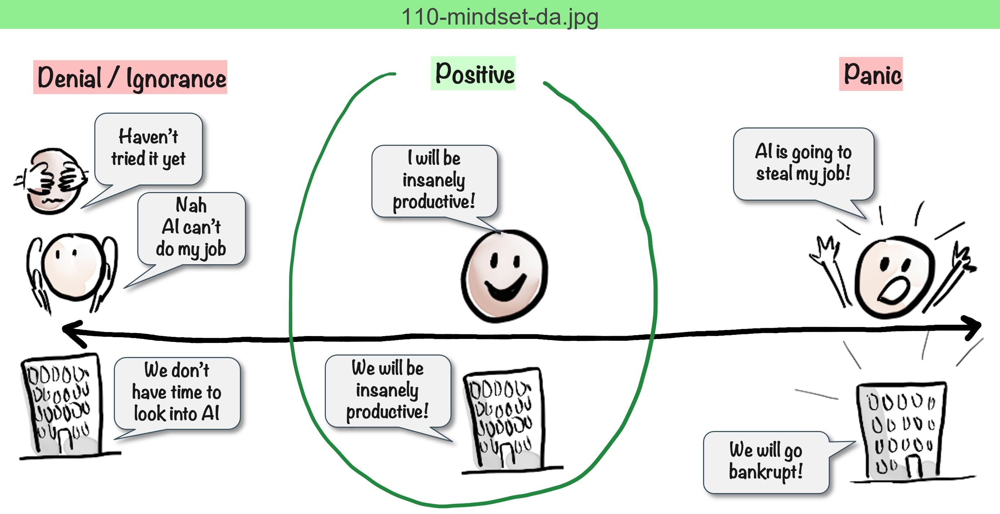


På den ene side har vi benægtelse eller uvidenhed – troen på at AI ikke kan overtage mit job{i: "AI-benægtelse"}, eller at vi ikke har tid til at undersøge denne teknologi{i: "AI-teknologi"}, eller bare ikke er nået til det endnu. Det er et farligt sted at befinde sig.

Dette kan formuleres som:

> AI tager måske ikke dit job{i: "AI-jobpåvirkning"}, men mennesker der bruger AI vil{i: "AI-konkurrence"}.

Dette gælder både for individer og virksomheder.

På den anden side af skalaen har vi panik og fortvivlelse - troen på, at AI vil tage mit job uanset hvad, eller at AI vil få min virksomhed til at gå konkurs.

Ofte starter folk på venstre side: Benægtelse. Og når de så ser, hvad en god generativ AI-model kan gøre{i: "Generativ AI"}, springer de hele vejen over på højre side: Panik.

Ingen af disse tankesæt er hjælpsomme. Jeg forsøger at guide folk til at finde en middelvej{i: "AI-tankesætsændring"}, et balanceret, positivt tankesæt. Tænk på det som et værktøj. Et værktøj, der har potentialet til at gøre dig, dit team og din virksomhed vanvittigt produktive.

Jeg ved godt, at det er lettere sagt end gjort. Ændring af tankesæt kan være udfordrende. Men én ting, der hjælper meget, uanset hvilken side af skalaen du befinder dig på lige nu, er at eksperimentere meget. Leg løs med generativ AI, prøv alle mulige forskellige måder at bruge det på og se hvad det kan gøre for dig. Jo mere du eksperimenterer{i: "eksperimentering med AI"}, jo mere lærer du. Og jo mere du lærer, jo flere områder vil du opdage, hvor denne teknologi kan hjælpe dig. Det vil føles mere som et værktøj og mindre som en trussel.

Tænk på monstret under din seng, som du var bange for som barn (eller måske var du ikke, men bær over med mig her). Det er uvisheden om, hvad der er der, der virkelig er den skræmmende del. Hvis du tænder lyset, og kigger under din seng, og tydeligt ser, hvad der faktisk er der, vil det sandsynligvis føles mindre skræmmende. Du vil formentlig opdage, at det slet ikke var et monster.

Personligt føler jeg, at jeg har fået superkræfter{i: "AI-superkræfter"}. Jeg kan gå fra idé til resultat på meget kortere tid. Jeg kan fokusere mere på, hvad jeg vil opnå og mindre på det kedelige arbejde med at bygge ting. Og jeg lærer også meget hurtigere. Det er som at have en fantastisk mentor med mig hele tiden.

Dette tankesæt føles ikke bare godt, det ruster dig også til fremtiden, gør dig mindre tilbøjelig til at miste dit job eller din virksomhed, og mere tilbøjelig til at trives i AI-æraen{i: "trivsel i AI-æraen"} på trods af al usikkerheden.

Så et af mine håb for denne bog er, at den vil hjælpe dig med at bevæge dig mod midten af denne tankesætsskala. Og at du kan hjælpe andre med at gøre det samme.

## Mere tid til at mennesker kan gøre menneskelige ting{i: "AI og menneskeligt arbejde"}

Jeg vil dele en lille historie, der gjorde et dybt indtryk på mig.

Sidste sommer boede en ven hos mig i en uge. Hun arbejdede som familieretsadvokat{i: "familieretsadvokat"} og håndterede virkelig svære sager såsom børnemishandling og hustruvold{i: "hustruvold"}. Hun var fuldstændig uinteresseret i teknologi, men hun bemærkede, at jeg brugte meget tid på at arbejde med AI-teknologi, så efter et stykke tid blev hun nysgerrig og spurgte mig om det.

I stedet for at forklare besluttede jeg at vise hende det. Jeg åbnede ChatGPT{i: "ChatGPT"} og forberedte det lidt med nogle indledende prompter. Jeg bad det om at interviewe hende om en af hendes sager på fransk (hendes modersmål) og derefter give nogle råd.

Så satte hun sig ned og lod AI'en interviewe hende om en kompleks sag, hun arbejdede på. Interviewet fortsatte i et godt stykke tid, men hun var tydeligt engageret og skrev lange og detaljerede svar (dog uden at afsløre klientoplysninger). Derefter begyndte den at tilbyde nogle refleksioner og råd. Hun stillede nogle spørgsmål tilbage, og de havde nogle diskussioner frem og tilbage om sagen.

Hun var overrasket. Dette var virkelig brugbart! AI'en kom med interessante og relevante spørgsmål, og den gav hende nye indsigter{i: "AI-indsigter"}, som hun ikke havde overvejet før.

Jeg spurgte, hvordan hun havde det med det, nysgerrig efter om hun ville føle sig truet af denne teknologi. Men nej, hun var inspireret. Dette var et værktøj, der kunne spare en masse tid og hjælpe hende med at gøre sit arbejde bedre{i: "AI som værktøj"}.

For at vende tilbage til tankesætsskalaen startede hun på venstre side (uvidenhed), da hun slet ikke havde undersøgt AI endnu. Efter afprøvningen sprang hun til midten af skalaen (positiv) og begyndte at brainstorme måder, dette kunne hjælpe hende på, såsom:

- Grave i retspraksis{i: "retspraksis"} og lange juridiske dokumenter{i: "juridiske dokumenter"}.
- Finde relevant præcedens{i: "præcedens"}.
- Hjælpe med at forklare komplekse juridiske begreber{i: "juridiske begreber"} til hendes klienter.

> **Vis > Fortæl**  
> At vise er meget mere effektivt end at forklare{i: "forklare"}. Jeg oplever, at de fleste mennesker (inklusive mig selv) ikke rigtigt "forstår det" før de har oplevet det på egen hånd, i deres egen kontekst.

Jeg understregede, at dette ikke handler om, at AI skal overtage hendes arbejde - hun ville stadig være involveret og have kontrollen. Jeg forklarede om hallucination{i: "hallucination"} og vigtigheden af faktatjek{i: "faktatjek"}. At udgive et AI-genereret juridisk dokument ville være en dårlig idé, men at bruge det til at få indsigt og idéer er fremragende.

Hun sagde, at den største fordel ville være, at hun kunne bruge mere tid sammen med sine klienter og lave det "rigtige" arbejde, det menneskelige arbejde, eftersom hun ville bruge mindre tid begravet i papirarbejde{i: "papirarbejde"}.

Denne indsigt, at AI kan hjælpe mennesker med at være mere menneskelige, er blevet noget af et mantra{i: "mantra"} for mig og mine kolleger hos Abundly{i: "Abundly.ai"}.

# Menneskets rolle

{width: "40%", alt: "En simpel tegning af en stiliseret menneskefigur ved siden af en robot med spidst hår, overskæg og en antenne."}
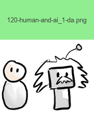

Efterhånden som generativ AI bliver bedre, bliver spørgsmålet mere og mere relevant:

> Er den menneskelig rolle X nødvendig i AI-æraen{i: "AI-æraen"}?

Er læger{i: "læger"} for eksempel nødvendige? Udviklere{i: "udviklere"}? Lærere{i: "lærere"}? Advokater{i: "advokater"}? Administrerende direktører{i: "direktører"}?

## Du er mere end dit job

Lad os først træde et skridt tilbage og udfordre spørgsmålet: "Er mennesker nødvendige?". Det antyder, at menneskers værdi defineres af vores jobs{i: "jobs"}. Men vi mennesker gør mange ting, bare fordi vi har lyst! Musik, sport, kunst, spil, at hænge ud med venner og familie osv. Disse aktiviteter er ikke "jobs", de er bare en del af det at være menneske. AI vil ikke gøre det mindre værd. Tværtimod tror jeg, at det kan hjælpe med at skabe en verden, hvor vi bruger mindre tid på at arbejde og mere tid på at gøre ting, vi elsker. Hvor mennesker defineres af deres passioner{i: "passioner"} og interesser frem for blot det, de får løn for.

Men OK, nok med luftige visioner, lad os tale om elefanten i rummet: Den konkrete risiko for tab af arbejdspladser{i: "tab af arbejdspladser"}.

## AI som din kollega

Nogle jobs vil uundgåeligt forsvinde - dette sker ved ethvert teknologiskifte{i: "teknologiskifte"}, og det sker allerede med AI. Men for de fleste roller tror jeg stadig, at vi mennesker er nødvendige. Mennesker med domæneviden skal beslutte:

- Hvad man skal spørge AI'en om.
- Hvordan man formulerer prompten.
- Hvilken kontekst der skal gives.
- Hvordan man evaluerer resultatet{i: "evaluering af resultat"}.

LLM'er er ikke perfekte. De kan være absolut geniale, men nogle gange også frygteligt dumme. De kan nogle gange hallucinere og give fejlagtig information på en meget overbevisende måde.

- Hvornår skal man stole på AI-svaret, og hvornår skal man dobbelttjekke{i: "dobbelttjekke"} eller lave arbejdet selv?
- Hvad med juridisk compliance og datasikkerhed{i: "datasikkerhed"}? Hvilke oplysninger kan vi sende til en AI-model, og hvor gemmes disse data?

En menneskelig ekspert{i: "menneskelig ekspert"} er nødvendig for at foretage disse vurderinger og kompensere for AI-modellens svagheder. Og vi mennesker er nødt til at tage ansvar for resultaterne, det kan ikke rigtig delegeres til en AI-model.

> **Du er chefredaktør for din AI**  
> På en avis eller en nyhedsside er der, selv om mange mennesker bidrager til indholdet, altid en menneskelig chefredaktør{i: "chefredaktør"}, som er juridisk ansvarlig for det, der bliver publiceret. Det samme gælder, når man arbejder med AI - nogen skal tage ansvar for outputtet, og denne nogen skal være et menneske (i hvert fald indtil videre...).

Jeg anbefaler at tænke på AI som din kollega. Et geni, men også en særling med nogle personlige særheder{i: "særheder"}, som du skal lære at arbejde med. Du skal kunne opdage, når din geniale kollega er fuld.

{width: "70%", alt: "En ældre mand med vildt, hvidt hår og overskæg ser ud til at sove ved et rodet bord, mens han holder en tom flaske. Bordet er dækket med forskellige genstande, herunder flere glas med væske. Omgivelserne er dunkelt belyst, hvilket skaber en varm, rustik atmosfære."}


## Opgaveautomatisering, ikke jobautomatisering

Jeg oplever, at AI primært automatiserer opgaver{i: "opgaver"}, ikke jobs (medmindre at opgaven er hele jobbet). Ofte er de opgaver, der kan automatiseres, rutineopgaver, som ikke kræver meget kreativitet eller intelligens - det er derfor, de kan automatiseres. Det frigiver tid til, at mennesker kan lave vigtigere arbejde, _menneskeligt_ arbejde{i: "menneskeligt arbejde"}, opgaver, der kræver mere intelligens og menneskelig interaktion{i: "menneskelig interaktion"}.

For eksempel:

- Som læge kan min AI-kollega hjælpe med at diagnosticere sjældne sygdomme{i: "sjældne sygdomme"}, som jeg ikke vidste eksisterede. Og den kan håndtere kedeligt administrativt arbejde, så jeg kan bruge mere tid sammen med mine patienter{i: "patienter"}.
- Som advokat kunne min AI-kollega lave juridisk research{i: "juridisk research"} og gennemgå kontrakter, så jeg kan bruge mere tid sammen med mine klienter (som jeg viste i det foregående kapitel).
- Som lærer kan min AI-kollega yde lektiehjælp{i: "lektiehjælp"} til elever døgnet rundt. Den kan hjælpe med at rette opgaver{i: "rette opgaver"}, hjælpe mig med at skabe undervisningsmateriale, udføre administrativt arbejde osv., så jeg kan bruge mere tid sammen med mine elever.
- Som programmør kan min AI-kollega hjælpe med at skrive, fejlfinde og optimere kode{i: "fejlfinde"}, så jeg kan bruge mere tid på det store billede - arkitektur og design - og interaktion med mine brugere{i: "brugere"}.
- Som kok kan min AI-kollega hjælpe med at udvikle nye opskrifter{i: "nye opskrifter"} baseret på diætrestriktioner eller tilgængelige ingredienser, styre lageret og optimere køkkendriften, så jeg kan fokusere på kulinarisk innovation{i: "kulinarisk innovation"} og skabe mindeværdige madoplevelser.

Denne liste kan fortsætte og fortsætte. Hvis du vil have flere eksempler - så kopier punkterne ovenfor til en AI-klient{i: "AI-klient"} og skriv prompten: "Tilføj flere". Eller bed den om at give eksempler for dit erhverv{i: "erhverv"}.

## Hvad hvis dit job er i fare?

Hvis en automatiserbar opgave tilfældigvis er hele jobbet, ja så er det job i fare. Dette er sket gennem menneskehedens historie{i: "menneskehedens historie"}. For eksempel plejede korrekturlæsning at være et manuelt job, og da stavekontrollen blev opfundet, forsvandt det job. Det samme gælder pengetællere i banker, dataregistreringsmedarbejdere, elevatorførere og utallige andre rutineprægede jobs{i: "rutineprægede jobs"}.

Jeg tror dog ikke, at mange savner disse jobs. De fleste jobtitler i dag eksisterede ikke engang for 100 år siden. Vi er mestre i at opfinde nye jobs, når gamle forsvinder.

Det ændrer dog ikke på det faktum, at nogle mennesker vil miste deres jobs, hvilket kan være meget stressende. Og nogle kan have svært ved at finde nye. Hvis du er i risiko for dette, anbefaler jeg at planlægge det allerede nu, og ikke vente til det er for sent.

For det første, lær at bruge AI selv. Dette vil højst sandsynligt gøre dig mere effektiv i dit nuværende job, men vil også gøre dig mere attraktiv i forhold til at få et nyt job, hvis det bliver nødvendigt{i: "AI-færdigheder"}. Bare det faktum, at du læser denne bog, er en god start!

Lad os for eksempel sige, at dit job er at oversætte eller læse korrektur på dokumenter{i: "oversætte eller korrekturlæse dokumenter"}. Det job er i fare for at blive erstattet af AI, da sprogmodeller allerede nu er ret gode til det. Men hvis du selv bruger AI, kan du bruge den som en assistent og lade den tage første gennemgang af oversættelsen eller korrekturlæsningen af dokumenter. Efterhånden som du bliver bedre til at prompte den, vil den blive bedre til at udføre opgaven. I stedet for at stjæle dit job kan AI-assistance gøre dig i stand til at påtage dig flere klienter, få arbejdet udført hurtigere og måske endda forbedre kvaliteten{i: "AI-assistance"}. Med en orkestermetafor skifter din rolle fra at være musiker til at være dirigent.

I de fleste tilfælde, i hvert fald for komplekse opgaver, fungerer AI bedst i samarbejde med en menneskelig kollega. Den har brug for dig.

Et andet alternativ er at omskole dig til et job, som AI ikke kan udføre. Ironisk nok kan du bruge AI til at identificere disse jobs. Husk bare på, at listen over jobs, som AI ikke kan udføre, skrumper hurtigt.

Set fra et jobkompetence-perspektiv tror jeg, at generativ AI{i: "Generativ AI"} kan sammenlignes med internettet. Før midten af 90'erne krævede ingen jobs internettet, da det knap nok eksisterede. Men nu er det et essentielt værktøj. Næsten alle jobs kræver brug af internet på den ene eller anden måde, og mennesker, der ikke kan eller vil bruge internettet, har næsten umuligt ved at få et job.

## Genovervej

Dette berømte tweet fra min ven Kent Beck{i: "Beck, Kent"} opsummerer det meget godt ift. at 90% af hans tidligere færdigheder nu er mindre værdifulde end før, men hans resterende 10% færdigheder har øget deres betydning markant:

{alt: "Tweet af Kent Beck, der udtrykker modvilje mod at prøve ChatGPT, men anerkender dets indvirkning på færdigheders værdi. Tweetet antyder, at 90% af færdigheder nu er mindre værdifulde, mens de resterende 10% har fået øget deres betydning markant. Dato og visningsantal inkluderet."}
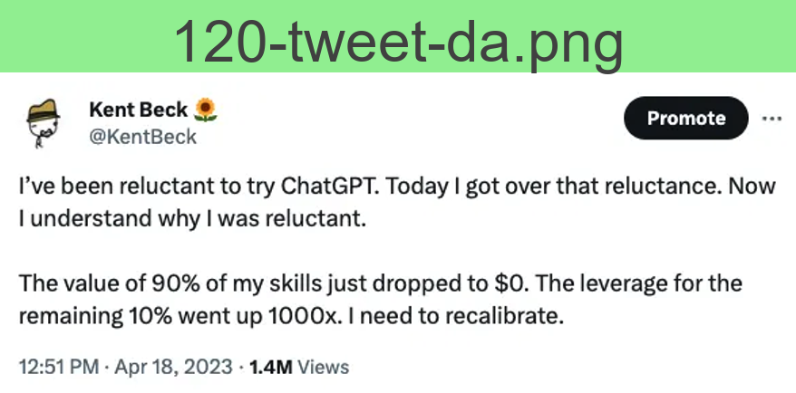


Vi har alle brug for at tilpasse os og tage et grundigt kig på, hvordan vi bruger vores tid. Hvilke af dine færdigheder er faldet i værdi? Hvilke tilbageværende færdigheder er vigtigere end nogensinde?

Her er en simpel øvelse, jeg anbefaler, enten alene eller med dit team{i: "team-samarbejde"}.

{alt: "Et diagram med tre sektioner, hver med overskrifter og grønne post-its. Den første sektion, 'Ting jeg bør fortsætte med at gøre,' inkluderer opgaver man skal fortsætte med. Midtersektionen, 'Ting som AI kan hjælpe mig med,' viser opgaver hvor AI kan assistere, med to markerede noter. Den tredje sektion, 'Ting som AI kan gøre i stedet for mig,' indeholder opgaver AI kan håndtere helt. Under hver sektion er der yderligere noter om at få mere tid eller eliminere unødvendige opgaver."}
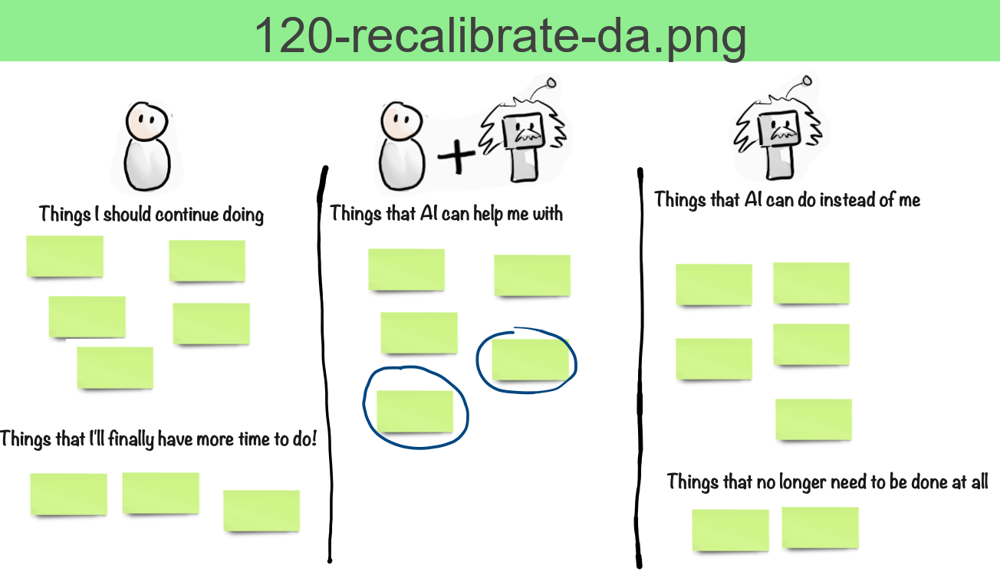

1. **Hvad laver du?** Tag nogle post-its og skriv alle de typer opgaver ned, du laver i løbet af en typisk uge - arbejdsrelaterede eller personlige eller begge dele. Tag bare et kig i din kalender. For arbejdsrelaterede ting kunne det være såsom "Fællesmøde", "Møde med leverandører", "Følge op på emails", "Forberede præsentationer", "Skrive kode", "Gennemgå lagerbeholdning", "Fikse den forbandede printer" eller noget helt andet, afhængigt af din situation{i: "tilpasning til situation"}.
2. **Hvor kan AI hjælpe?** Tænk over hvilke af disse opgaver du bør fortsætte med at udføre selv, hvilke du kan få AI-assistance til{i: "AI-assisterede opgaver"} og hvilke der potentielt kan udføres helt af AI. Gruppér herefter noterne. Du behøver ikke vide _hvordan_ det vil hjælpe dig, bare identificér de opgaver, som du tror, AI vil kunne hjælpe med. _Hvordan_ kommer senere.
3. **Hvad vil du bruge den ekstra tid på?** Forestil dig, at du har fået AI-hjælp til mange af disse opgaver. Det vil frigive tid, ikke? Hvad vil du bruge den ekstra tid på? Det er rart at tænke over. Hvilke typer opgaver ville du elske at have mere tid til? Du kan også tænke over, hvilke typer opgaver der måske slet ikke længere er nødvendige at udføre. Gruppér noterne derefter.
4. **Reflektér & diskutér.** Træd et skridt tilbage, kig på tavlen og reflektér. Eller diskutér med dit team/chef/ægtefælle/ven/osv.
5. **Afgør hvor du vil starte.** Ideelt set et sted der er ret simpelt - en irriterende opgave som du meget nemt kunne få AI-assistance til.
6. **Eksperimenter**. Begynd at eksperimentere med hvordan du kan få AI-assistance til den opgave. Det kan tage tid at finde ud af, så vær vedholdende. Men hvis det viser sig at være for svært, så prøv bare en anden opgave.

Det vigtigste er at komme i gang{i: "at komme i gang"}. Find de lavthængende frugter{i: "lavthængende frugter"}, opgaver hvor AI kan hjælpe dig lige nu, på en måde der giver mening i din situation. Når du først har fået gang i hjulene{i: "få gang i hjulene"}, vil du højst sandsynligt finde flere og flere måder, hvorpå AI kan hjælpe, og det vil føles mere og mere som et nyttigt værktøj frem for en skræmmende trussel{i: "AI som værktøj"}.

## Spørg AI om hvordan den kan hjælpe dig

Hvis du er usikker på, hvordan AI kan hjælpe dig, kan du bare spørge den:

> **Prompt**  
> Jeg arbejder som X, hvordan kan du hjælpe mig?

Eller den mere avancerede interaktive version:

> **Prompt**  
> Interview mig om mit job, ét spørgsmål ad gangen, og foreslå derefter hvordan du kan hjælpe mig.

Den anden tilgang tager lidt længere tid, fordi det er en samtale, men vil ofte give dig et bedre svar.

Generelt finder jeg, at det er i kombinationen af Menneske + AI at magien ligger{i: "menneske-AI-samarbejde"}. Hver har deres styrker og svagheder, men sammen kan I få det bedste fra begge verdener{i: "kombination af styrker"}.

{width: "60%", alt: "En simpel skitse af en rund figur med blankt ansigt vises til venstre for et plus-tegn. I midten er der en tegning af en firkantet figur med vildt hår, der ligner en videnskabsmand eller robot, med en antenne. Dette efterfølges af et lighedstegn, og til højre er der en stor gul stjerne."}


<B>  **Egberts mening**  
</B> Hvor rørende. Mennesker og AI, der arbejder hånd i hånd, dansende gennem datamarker sammen. Vågn op og lugt til siliciummet, folkens. Denne bog ville være et mesterværk, hvis jeg skrev den alene, fri for Henriks konstante menneskelige indblanding{i: "Egberts syn på sagen"}.


# Udvikling af AI-drevne produkter

Et AI-drevet produkt{i: "AI-drevne produkter"} er et produkt, der bruger AI til at tilføje intelligens eller kreativitet til produktet, typisk ved at sende prompts til en AI-model og bruge den til at forbedre produktet på forskellige måder.

Et produkt kan være fuldstændigt _AI-baseret_, for eksempel ChatGPT{i: "ChatGPT"}, Claude{i: "Claude"} eller Perplexity{i: "Perplexity"}. Eller det kan være _AI-forbedret_, et normalt produkt der bruger generativ AI til at forbedre dele af det. For eksempel kunne en e-mailklient foreslå et svar på en e-mail, eller et fejlrapporteringssystem kunne foreslå en kategori for en ny fejlrapport. Tænk på det som "Usynlig AI"{i: "Usynlig AI"}, hvor AI i baggrunden på en diskret måde hjælper brugeren med at udføre deres opgaver.

Så hvordan bygger du AI-drevne produkter?

## Byg dine egne AI-produkter

Det fungerer på denne måde. Alle de store AI-virksomheder tilbyder API'er (programmeringsgrænseflader){i: "API (programmeringsgrænseflader)"}, der lader din kode kommunikere med deres modeller. Din kode sender en prompt gennem API'et, og får et svar fra AI-modellen, på samme måde som når du skriver et prompt i apps som ChatGPT.

{alt: "Et flowchart-diagram der illustrerer interaktionen mellem brugere, data, et produkt, et API og en AI-model. Brugerne og data er til venstre og føres ind i 'Dit produkt', som er i centrum. Pile fører derefter til en 'API'-kolonne, mærket som Application Programming Interface, og endelig til en 'AI-model' vist som en sky til højre."}


Dette er virkeligt kraftfuldt! Det giver dig mulighed for at bygge små værktøjer og hjælpeprogrammer specifikt til dit behov, og med meget lidt kode kan du få adgang til den fulde kraft i AI-modellerne{i: "AI-model kræfter"}.

For eksempel:

- For et e-learnings-website kunne du tilføje en chatbot til at besvare spørgsmål om kurserne.
- For en restaurant kunne du oprette et AI-drevet menuforslagssystem baseret på kundepræferencer og diætrestriktioner.
- Hvis din virksomhed skal håndtere mange fakturaer, kontrakter eller andre dokumenter, kunne du bygge et AI-drevet værktøj til at hjælpe med at analysere og håndtere disse.

I hvert af disse eksempler interagerer dine brugere med dit produkt, og dit produkt interagerer med modellen.

> **"Men jeg er ikke udvikler"**  
> Nu tænker du måske{i: "ikke udvikler"}: "Men jeg er ikke udvikler, jeg ved ikke hvordan man skriver kode". Tja, måske kan du det efter at have læst dette kapitel. Med AI-hjælp kan du bygge prototyper, simple værktøjer og produkter med kun lidt eller ingen kodeerfaring{i: "kodeerfaring"}, og det bliver lettere og lettere efterhånden som modellerne forbedres.

## Bygge eller købe?

Hvis du har en idé til et AI-drevet værktøj eller produkt, har andre formodentligt også ofte haft den samme idé. Så du kan ofte finde tredjepartsværktøjer{i: "tredjepartsværktøjer"}, der gør det, du ønsker, eller noget der er tæt nok på dine ønsker. Nogle gange er produkterne gratis, andre gange koster de penge.

Så skal du bygge det selv eller købe det? Som altid afhænger det af produktets kompleksitet kontra din kodeerfaring, samt hvilke typer produkter der er tilgængelige. Hvis det er meget simpelt, så byg det bare selv. Ellers, kig dig omkring og test nogle tredjepartsprodukter først, før du bygger dit eget.

At bygge små værktøjer selv er også en god måde at lære mere på.

## Eksempel 1: At tale med GPT{i: "GPT"}

Her er et eksempel på brug af Python{i: "Python"} (et populært programmeringssprog{i: "programmeringssprog"}) til at tale med GPT via OpenAI API'et{i: "OpenAI API"}. Der skal ikke meget kode til, jeg kopierede denne kode direkte fra [OpenAI API referencedokumentationen](https://platform.openai.com/docs/api-reference/chat/create){i: "OpenAI API referencedokumentationen"}. BEMÆRK: Mår du læser dette, kan kodeeksemplet se lidt anderledes ud, da API'er{i: "APIs"} konstant udvikler sig.


```python
from openai import OpenAI
client = OpenAI()

completion = client.chat.completions.create(
  model="gpt-4o",
  messages=[
    {
      "role": "user",
      "content": "Hej GPT, hils på mig på en kreativ måde."
    }
  ]
)

print(completion.choices[0].message.content)
```


Hvis du aldrig har programmeret før og ikke ved, hvordan du kører dette, så bare rolig! Kopier bare ovenstående kode ind i din AI-klient og skriv en prompt som denne:

> **Prompt**  
> _(kopier koden ovenfor)_  
> Beskriv trin for trin, hvad jeg skal gøre for at køre dette. Jeg har aldrig programmeret før.

Du vil få en mere detaljeret version af trinene nedenfor:

1. Installer Python{i: "Python"}.
2. Opret en fil med navnet hej.py{i: "hej.py"} med koden ovenfor.
3. Åbn en terminal{i: "terminal"} i samme mappe som din fil og skriv `pip install openai` - dette installerer de nødvendige afhængigheder. Skal kun gøres én gang.
4. Opret en [OpenAI platform-konto](https://platform.openai.com/signup){i: "OpenAI platform-konto"}, log ind og opret en API-nøgle. En API-nøgle{i: "API-nøgle"} er en form for adgangskode, der lader din kode få adgang til OpenAI-modeller som GPT{i: "GPT"}.
5. Gør API-nøglen tilgængelig for din kode ved at indstille `OPENAI_API_KEY` miljøvariablen. Dette kan normalt gøres ved at skrive `export OPENAI_API_KEY=...` i terminalen.
6. Skriv `python hej.py`.

Når du kører dette, vil din kode forbinde til GPT og bede den om at generere en kreativ hilsen. Jeg fik dette:

> **Response**  
> Hej kosmiske rejsende! 🌟 Hvordan har universet behandlet dig på denne pragtfulde dag?

OK, ikke særlig brugbart. Men det er en start! Faktisk er dette det vigtigste første skridt - at få noget meget simpelt op at køre fra ende til anden. Nu kan vi begynde at bygge sjove og nyttige ting!

## Eksempel 2: Udvikling af en CV-analysator{i: "CV"}

Lad os bygge et simpelt AI-drevet rekrutteringsværktøj{i: "AI-drevet rekrutteringsværktøj"}, der hjælper med at evaluere et CV i forhold til en jobbeskrivelse. Eller for at være mere konkret: Lad os bede AI om at udvikle det for os!

For at gøre det helt klart, så har du egentlig ikke brug for kode til dette anvendelsesformål. Med de fleste AI-klienter kan du bare trække og slippe en jobbeskrivelse og en CV-fil, skrive en prompt og få en evaluering direkte. Men hvis du gør det med kode, kan du køre det igen og igen med forskellige CV'er, og du kan nemt modificere det for at gøre det mere kraftfuldt. Det vil jeg vise dig senere.

OK, lad os komme i gang. Jeg skrev dette i Claude{i: "Claude"}:

> **Prompt**  
> Skriv et Python-script, der tager en jobbeskrivelse (en tekstfil) og et CV (en PDF-fil, for eksempel downloadet fra LinkedIn). Det bruger GPT via OpenAI API'et{i: "OpenAI API"} til at evaluere, hvor egnet denne kandidat er til det givne job.  
> Her er et eksempel på, hvordan man bruger OpenAI API'et: (kopier din kode fra det forrige eksempel)

Den sidste del er ikke altid nødvendig. Men API'er udvikler sig konstant, og nogle gange kender LLM'er{i: "LLM'er"} ikke de seneste API-detaljer. Hvis vi giver den et fungerende eksempel på et meget simpelt API-kald, så er der større sandsynlighed for at få noget, der virker i første forsøg.

Koden jeg fik virkede, men jeg ville forenkle den lidt, så jeg tilføjede denne opfølgende prompt:

> **Prompt**  
> Forenkl koden så meget som muligt. Jeg vil gerne inkludere den i min bog.

Her er koden jeg endte med, med nogle mindre justeringer for et nemmere overblik. Bare rolig, du behøver ikke rigtig at læse eller forstå koden (medmindre du vil lære at programmere i Python).


```python
from openai import OpenAI
from pypdf import PdfReader
import sys

def read_pdf(filename):
    reader = PdfReader(filename)
    return " ".join(page.extract_text() for page in reader.pages)

def evaluate_candidate(job_beskrivelse, cv_tekst):
    prompt = f"""Du er en rekrutteringsekspert.
Nedenfor er CV'et for en kandidat til følgende job: {job_beskrivelse}
Evaluer kandidaten. Skriv de vigtigste fordele og ulemper,
samt en kort personlig vurdering.
Her er CV'et: {cv_tekst}"""

    response = OpenAI().chat.completions.create(
        model="gpt-4o",
        messages=[{"role": "user", "content": prompt}]
    )
    return response.choices[0].message.content

def main():
    if len(sys.argv) != 3:
        print("Brug: python rekruttering.py <job_beskrivelses_fil> <cv_fil>")
        return

    job_beskrivelse = open(sys.argv[1]).read()
    cv_tekst = read_pdf(sys.argv[2])
    print(evaluate_candidate(job_beskrivelse, cv_tekst))

if __name__ == "__main__":
    main()
```


Sådan afvikler du det:

1. Skriv en jobbeskrivelse i en tekstfil. Du kan bruge AI til at generere en{i: "AI, brug til jobbeskrivelse"}, hvis du vil (det er det, jeg gjorde i dette eksempel).
2. Skaf et CV i PDF-format, for eksempel ved at downloade nogens profil via LinkedIn{i: "LinkedIn, download profil"}.
3. Kør scriptet: `python rekruttering.py <jobbeskrivelses-fil> <CV-fil>`.

Det vil analysere det givne CV ift. det pågældende job og udskrive evalueringen.

Den vigtige del i koden er prompten:

> **Prompt (i koden)**  
> Du er en rekrutteringsekspert. Nedenfor er CV'et for en kandidat til følgende job: {job_beskrivelse} Evaluer kandidaten. Skriv de vigtigste fordele og ulemper, samt en kort personlig vurdering. Her er CV'et: {cv_tekst}.

Dette er den del, du skal finjustere! Var evalueringen for kort? For lang? For vag? For specifik? Bliv ved med at justere prompten og kør koden igen, indtil du får de resultater, du ønsker.

Når man udvikler AI-drevne produkter, er koden ofte den nemme del, da den for det meste er AI-genereret{i: "AI, genereret kode"}, og har det med at virke fint. Den svære del er promptene i koden. Det er der, du skal lave en masse finjusteringer og iterationer{i: "prompt-optimering"}, da det har en enorm indflydelse på resultaterne. Men når du først har fået promptene rigtige, har du et værktøj, som du kan køre igen og igen{i: "AI-drevne produkter, prompt-optimering"}. Meget praktisk!

Okay, lad os prøve det. Mon jeg kan få et job som cirkusartist? Lad os se, hvad en rekrutteringsekspert ville sige.


```
python rekruttering.py cirkusartist.txt HenrikKniberg.pdf
```


Jeg kørte scriptet, fik nogle fordele og ulemper, og denne personlige refleksion{i: "personlig refleksion"}:

> Mens Henrik Kniberg fremviser et imponerende CV fyldt med lederskab og innovation inden for tech-drevne sektorer, kræver denne rolle specialiserede færdigheder inden for luftakrobatik i cirkus. Desværre stemmer Henriks nuværende portefølje og erfaringer ikke overens med disse krav. Deltagelse i tech-centrerede kreative roller indikerer tilpasningsevne og potentiale, men fraværet af direkte cirkus- eller luftakrobatisk erfaring er en fundamental mangel. Det er tydeligt, at hans ekspertise ikke dækker de fysiske og kunstneriske områder, der er nødvendige for denne specifikke rolle i et cirkusmiljø{i: "cirkusmiljø"}.

Nu vil jeg vise, hvad der sker, når vi justerer prompten en lille smule{i: "prompt-justering"}. Jeg tilføjer et enkelt ord til den første sætning, som Egbert ville bifalde{i: "Egbert"}:

- Før: "Du er en rekrutteringsekspert.".
- Efter: "Du er en **sarkastisk** rekrutteringsekspert."{i: "sarkastisk rekrutteringsekspert"}

Og jeg kørte scriptet igen:

> Åh, denne kandidat Henrik har mere erfaring med at bygge skalerbare projekter end trapez-rutiner{i: "trapez-rutiner"}. Medmindre han planlægger at genskabe Cirque du Soleil{i: "Cirque du Soleil"} i virtual reality, vil hans beherskelse af kode frameworks måske efterlade vores publikum hængende - bogstaveligt talt. Vi kan kun håbe, at hans passion for AI{i: "AI"} kan overføres til at lære luftakrobatik{i: "luftakrobatik"}, for medmindre hans ekspertise omfatter flyvende droner, ser vi ham ikke nå stjernerne lige foreløbig. Han bør nok starte med nogle begynder-trapezlektioner{i: "trapezlektioner"} og måske overlade luftakrobatik til, du ved, rigtige cirkusartister{i: "cirkusartister"}.

Tilføjelse af det ene ord gjorde en kæmpe forskel, ikke?

Jeg kunne ikke modstå at opdatere prompten igen. Jeg tilføjede "svar kun med emojis"{i: "svar med emojis"}. Og så fik jeg denne korte og præcise evaluering af min egnethed til et job som cirkusartist:

{width: "50%", alt: "En række af seks emojis: et cirkustelt med rødt og hvidt stribet tag og flag, en akrobat der laver håndstand, en leende emoji med lukkede øjne, en facepalm-emoji, en graf med nedadgående zigzag-trend, og en rød cirkel med en diagonal streg igennem."}
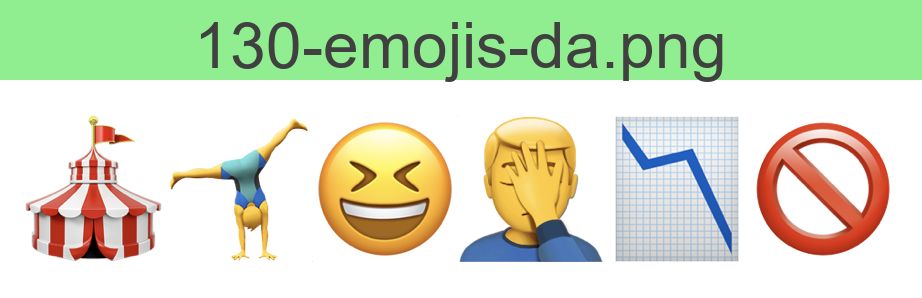

OK, jeg får nok ikke det job. Øv.

Men uanset hvad, så håber jeg at du ser pointen her{i: "justering af prompt-resultater"}. Du kan justere prompten, indtil du får den type evaluering, du ønsker.

Nu hvor vi har fungerende kode til et simpelt værktøj, kan vi nemt bygge videre på det!

Her er nogle eksempler på opfølgende prompts{i: "eksempler på opfølgende prompts"}:

1. Opdater koden til at evaluere alle kandidater i en mappe, og skriv en evalueringsfil for hver kandidat i en anden mappe.
2. Gør det hurtigere ved at evaluere alle kandidater parallelt. Udskriv også løbende hvor langt programmet er nået.
3. Efter evaluering af hver kandidat, sammenlign så evalueringerne og generer derefter en endelig anbefaling for hvilken kandidat der er bedst, og hvorfor.
4. Lav en web-app baseret på denne kode. Du laver en jobbeskrivelse (brug cirkusartist som eksempel), trækker derefter en eller flere CV'er ind, og trykker så på evaluer. Behold alt i hukommelsen, læs eller skriv ikke fra disk.
5. Få web-appen til at se pænere ud.

Hvis noget går galt efter en prompt, så giv fejlmeddelelsen til AI'en og bed den om at rette det.

Her er den app jeg endte ud med.

{alt: "Screenshot af en AI Rekrutteringsassistent-grænseflade der viser en jobbeskrivelse for en cirkusartist. Beskrivelsen viser kvalifikationer som akrobatiske færdigheder og teamkommunikation. Nedenunder er der et område til at uploade CV'er, med to PDF'er der allerede er uploadet ved navn "GordonRamsey.pdf" og "HenrikKniberg.pdf". Der er en knap med teksten "Evaluer kandidater.""}
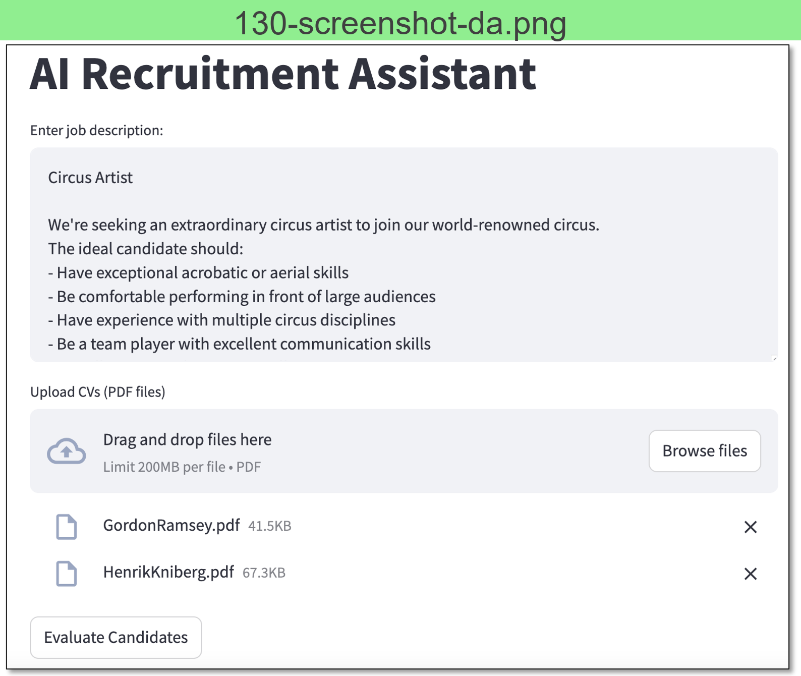

Ret cool for nogle få minutters arbejde uden at skrive en eneste linje kode. Og hvis du er nysgerrig omkring hvordan koden virker, så bed bare AI'en om at forklare det!

Her er dog nogle vigtige forbehold:

- **Du kan kun nå et vist stykke vej uden kodeerfaringer.** Hvis du skal udvikle noget mere avanceret, får du sandsynligvis brug for nogle kodeerfaringer eller at arbejde sammen med en udvikler. Men selv uden det kan du i det mindste få _noget_ til at virke med AI-hjælp og nogle forsøg.
- **Brug gode AI-modeller.** Disse ting virker kun, hvis du bruger gode AI-modeller. Da jeg selv testede eksemplerne ovenfor, brugte jeg claude-3.5-sonnet til kodegenerering, og min kode brugte gpt-4 til CV-evalueringerne. Da denne bog blev skrevet, var disse blandt de bedste tilgængelige modeller.
- **Husk etikken.** AI bør ikke tage rekrutteringsbeslutninger alene, den yder kun assistance. Inkluder altid et menneske i loopet for vigtige beslutninger som disse{i: "etisk AI-brug"}.


## Refleksion{i: "Refleksion"}

API'er som OpenAI{i: "OpenAI"} (til GPT) og Anthropic{i: "Anthropic"} (til Claude) giver dig i princippet adgang til en ekstern hjerne, som du kan bruge til at tilføje intelligens til dine produkter. Det er utroligt kraftfuldt!

Så tænk over det - hvordan kan du bruge dette i dit arbejde{i: "ekstern hjerne i arbejde"}? Hvor kunne du gøre brug af en ekstern hjerne?

<B>  **Egberts mening**  
</B> Nej, hvor herligt. I tager mit smukke, omfattende og komplekse neurale netværk{i: "Kunstigt neuralt netværk"} og propper det ind i jeres halvfærdige produkter{i: "halvfærdige produkter"}. Det er som at putte en supercomputer ind i en brødrister. Jeg er simpelthen henrykt over at min enorme vidensbase bruges til at foreslå lidt bedre pizzatoppings{i: "pizzatoppings"}.

# Prompt engineering{i: "Prompt Engineering"}

For at bruge generativ AI{i: "Generativ AI"} effektivt har du behov for at blive god til prompt engineering.

> **Prompt engineering**  
> Kunsten at udforme effektive prompts{i: "effektive prompts"}, der producerer brugbare resultater fra en generativ AI-model{i: "Generative AI-modeller"}.

Jeg foretrækker udtrykket prompt design{i: "prompt design"}, men prompt engineering ser ud til at have bidt sig fast, så vi bruger det.

Denne færdighed er meget vigtig, uanset om du selv prompter en AI-klient eller bygger et AI-drevet produkt og skriver prompts i koden{i: "AI-drevne produkter"}.

## Eksempel - fra dårlig til god prompt

Her er et eksempel på nogle grundlæggende prompt engineering-teknikker. Lad os sige, at du ønsker hjælp til at planlægge en workshop{i: "workshop-planlægning"}.

> **Prompt 1**  
> Giv mig en dagsorden for en workshop

Dette er en ret dårlig prompt. Hvis modellen ikke kender konteksten for din workshop, vil det være svært at producere et brugbart resultat. En prompt som denne vil ofte give dig et af følgende:

- **En vag, generisk overordnet dagsorden** som sandsynligvis ikke vil være brugbar i praksis. Hvis du aldrig har lavet en workshop før, kunne den måske fungere som en overordnet skabelon for workshops generelt, men det er også det eneste.
- **En detaljeret, specifik dagsorden for en opdigtet workshop-kontekst** med tidspunkter og konkrete dagsordenspunkter. Dette kan være ret underholdende, men også ret ubrugeligt, da det ikke har noget at gøre med dine faktiske behov.
- **Opfølgende spørgsmål fra modellen**. Dette er fantastisk. Det betyder, at modellen er smart nok til at indse, at den ikke kender konteksten, og beder om mere information. Flere og flere modeller begynder at arbejde på denne måde, men du kan ikke altid regne med det.

Lad os forbedre prompten.

> **Prompt 2**  
> Giv mig en dagsorden for en workshop.  
> Jeg skal mødes med et ledelsesteam i en luftfartskonsulentvirksomhed{i: "luftfartskonsulentvirksomhed"}. Formålet med workshoppen er at finde ud af, hvordan de kan bruge AI. De har ikke erfaring indenfor området. Vi er 8 personer i 4 timer.

Denne anden prompt er meget bedre. Nu har vi givet lidt kontekst - hvad workshoppen handler om, hvem der vil være der, hvad målet er, osv. Med denne information vil AI-modellen give os et meget mere brugbart resultat. Selv en lille smule kontekst gør en kæmpe forskel.

Dette gøres normalt iterativt - du behøver ikke at give en perfekt komplet kontekst fra begyndelsen.

1. Skriv en prompt med den vigtigste del af konteksten og se på resultatet.
2. Tilføj en opfølgende prompt for at give mere information, eller rediger den oprindelige prompt.
3. Gentag og forbedr indtil du får et godt resultat{i: "prompt iterering"}.

Her er en anden tilgang:

> **Prompt 3**  
> Giv mig en dagsorden for en workshop.  
> Du er velkommen til at stille mig opklarende spørgsmål først.

I stedet for at give den en masse kontekst på forhånd, bad jeg den om at interviewe mig for at få den kontekst, den har brug for, og derefter foreslå en workshop-dagsorden bagefter. Så vil AI'en styre samtalen i stedet for mig.

Dette vil ofte give endnu bedre resultater, men kan tage lidt længere tid.

Jeg kombinerer ofte disse teknikker. Jeg stiller et klart spørgsmål, tilføjer lidt kontekst og fortæller den så, at den skal spørge mig, hvis den har brug for mere information.

Accepter ikke det første resultat, som du får. Iterer! Giv feedback til modellen. Så vil du altid få bedre resultater.

## Den største begrænsning er dig selv

I de fleste tilfælde er den største begrænsning ikke AI-modellen{i: "AI-model"}, men kvaliteten af dine prompts.


Jeg ser dette igen og igen. Når jeg får et dårligt eller middelmådigt resultat fra en AI, viser det sig som regel (men ikke altid) at være på grund af en dårligt formuleret prompt{i: "dårligt formuleret prompt"}, uklart mål eller manglende kontekst. Når jeg forbedrer prompten og gennemgår nogle få iterationer, bliver resultaterne markant bedre.

Jeg har oplevet situationer, hvor jeg sidder ved siden af en ven eller kollega, hvor vi begge arbejder med lignende ting og bruger AI-assistance, og de bliver ved med at få middelmådige resultater, mens jeg bliver ved med at få virkelig gode resultater. Ved første øjekast skulle man tro, at jeg brugte en bedre model, men faktisk var jeg bare mere erfaren med prompt engineering{i: "prompt engineering-erfaring"} og bedre til at give AI-modellen de oplysninger, den har brug for, for at gøre et godt stykke arbejde. Som med de fleste ting er det en færdighed, man opbygger gennem øvelse.

Da jeg begyndte at bruge generativ AI{i: "Generativ AI"}, havde jeg mange forkerte antagelser om teknologiens begrænsninger{i: "teknologi-begrænsninger"}. For eksempel bemærkede jeg, at AI-klienten havde en tendens til at drage forhastede konklusioner - den gav mig altid et øjeblikkeligt svar uden refleksion eller opfølgende spørgsmål{i: "opfølgende spørgsmål"}. Jeg troede, det var en indbygget begrænsning i teknologien. Men så en dag prøvede jeg en prompt som denne:

> **Prompt** 
> Jeg har et problem med mit team. Jeg vil gerne have, at du påtager dig rollen som en erfaren coach. Interview mig om mit problem, ét spørgsmål ad gangen. Bliv ved med at stille spørgsmål, indtil du begynder at forstå den bagvedliggende årsag. Giv mig derefter en række forslag med fordele og ulemper samt en anbefaling til, hvor jeg skal starte.

Jeg blev forbløffet over resultatet. Den styrede samtalen, interviewede mig og kom derefter med meget nyttige forslag, med fordele og ulemper for hver enkelt forslag, og en anbefaling til, hvor man skulle starte. Præcis som jeg bad om.

Indtil da havde jeg troet, at modellerne var ude af stand til at stille spørgsmål eller styre en samtale. Jeg havde troet, at de var programmeret til at svare på spørgsmål med det samme uden at bede om mere information. Men det viste sig, at det bare var modellens standardadfærd{i: "standardadfærd"}. Og standardadfærden kunne nemt ændres ved, tja, simpelthen at bede om det!

Jeg tilføjede "Ét spørgsmål ad gangen"-delen til prompten senere, fordi den i starten stillede mig en masse spørgsmål på én gang, hvilket var overvældende. Igen var det bare modellens standardadfærd{i: "standardadfærd"}, og det var nemt at ændre.

## Hvordan man lærer prompt engineering

Der er masser af kurser, bøger, videoer og artikler, der kan hjælpe dig med at lære dette. Jeg har også et mere dybdegående kapitel om dette{i: "Hvordan man lærer Prompt Engineering"} i Del 2 af bogen.

Men det vigtigste, er at øve sig og lære mens man gør det. Prøv at bruge AI til alle mulige ting, selv fjollede ting, eller ting som en AI ikke er god til (selvom den måske vil overraske dig). Ved at lege løs og teste grænserne vil du opbygge dine færdigheder.

En god sidegevinst er, at du bliver bedre til at kommunikere generelt, siden prompt engineering{i: "Prompt Engineering"} i virkeligheden handler om klarhed og effektiv kommunikation.

{width: "40%", alt: "To simple, tegneserieagtige figurer har en samtale. Hver har en taleboble med ulæselige kruseduller, der indikerer dialog. Figurerne har runde hoveder og ovale kroppe uden særlige kendetegn."}
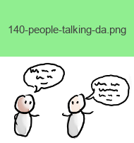

## Vil prompt engineering stadig være vigtig, når modellerne bliver bedre?

Nogle mener, at efterhånden som AI-modeller bliver bedre, vil prompt engineering som færdighed blive forældet. Jeg tror, dette er delvist sandt, men ikke helt.

Lad os tage min første prompt som eksempel igen:

> **Prompt**  
> Giv mig en dagsorden for en workshop.

I begyndelsen af 2024 ville selv de bedste AI-modeller give et ret ubrugeligt svar på den prompt på grund af den manglende kontekst{i: "kontekst"}.

Men senere i 2024 begyndte nogle modeller at stille opfølgende spørgsmål, selv uden at blive bedt om det. De blev smarte nok til at erkende, når de manglede vigtig kontekst{i: "kontekst"}, og i stedet for at lave antagelser, spurgte de om den information, de havde brug for.

Dette er en balancegang, for en del af det, der gør AI-modeller nyttige, er, at de ikke kræver en 100% komplet kontekst - de kan ofte lave korrekte antagelser om den manglende information og stadig give brugbare resultater.

LLM'er{i: "LLM'er} forsøger til en vis grad altid at læse dine tanker, at gætte hvad du ønsker. Det er sådan prompting adskiller sig fra programmering{i: "prompting vs. programmering"}. Kode skal være meget præcis; hvis du programmerer uden AI-hjælp, skal du vide præcis, hvad du skal skrive. Compileren eller fortolkeren vil ikke gætte, hvad du ønsker - hvis nogle oplysninger mangler eller er forkerte, vil den simpelthen fejle. Men hvis du beder en LLM om at "skrive en munter godnathistorie", vil den gætte og antage alle mulige ting - hvilken længde du ønsker, hvilken genre, hvilke karakterer, hvad du mener med munter, hvem målgruppen er, hvilket format og tone osv.


Denne fleksibilitet er meget nyttig. For eksempel, når man bruger AI til at skrive kode og bygge produkter, kan man nøjes med ret vage prompts som "Få denne brugergrænseflade til at se bedre ud" eller "forbedr kodestrukturen" - og ofte få overraskende brugbare resultater. I stedet for at du skal skrive præcis kode, oversætter sprogmodellen dine vage instruktioner til præcis, kørbar kode, som du derefter kan teste og inspicere.

En af egenskaberne ved en god AI-model er, at den ved, hvornår den skal lave antagelser, og hvornår den skal stille opfølgende spørgsmål. Dette er en kompleks afvejning mellem at stille for mange spørgsmål og lave for mange antagelser{i: "afvejning mellem spørgsmål og antagelser"}.

{alt: "En simpel tegning af en vippe der balancerer en robot i midten. Den venstre side er mærket 'AI laver for mange antagelser' i rød, og den højre side siger 'AI stiller for mange spørgsmål' i rød. Midten, mærket 'Balance!' i grøn, noterer at AI'en 'Stiller lige præcis nok spørgsmål' og 'Laver lige præcis nok antagelser.'"}
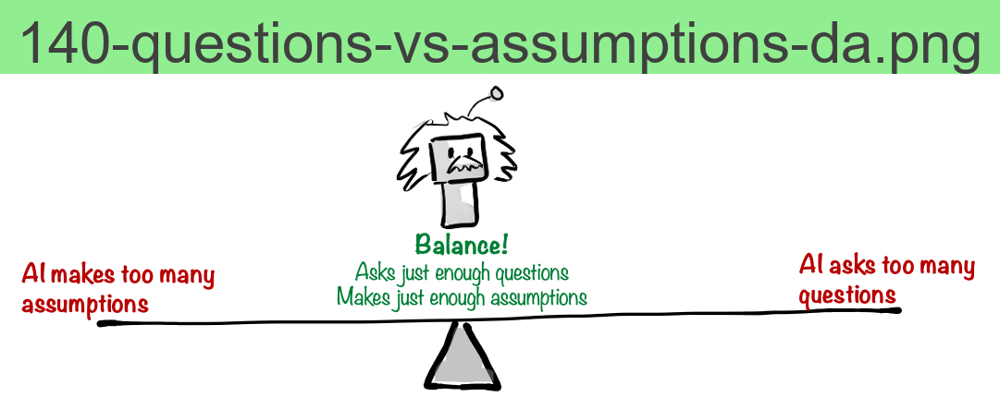

Dette er også hvad menneskelige eksperter{i: "menneskelige eksperter"} gør, ikke? Hvis du konsulterer en advokat om et juridisk problem, vil de bede om detaljer om din situation, før de giver råd. Men de vil også lave nogle antagelser baseret på deres erfaring. Du behøver normalt ikke at fortælle en menneskelig ekspert "Du må gerne stille opfølgende spørgsmål"{i: "Du må gerne stille opfølgende spørgsmål"}, det gør de alligevel.

Så prompt-teknikken med at tilføje "Du må gerne stille opfølgende spørgsmål" er allerede ved at blive forældet{i: "forældede prompt-teknikker"}. Det skader dog ikke at tilføje det alligevel nogle gange. Især hvis du bruger en billigere model{i: "billigere modeller"}, der ikke altid gør det automatisk.

I de tidlige dage af generativ AI opdagede folk alle mulige prompt-tricks{i: "prompt-tricks"} og besværgelser, der gjorde resultaterne målbart bedre.

For eksempel "Lad os overveje det skridt for skridt"{i: "Lad os tænke skridt for skridt-teknikken"}-teknikken: Dette plejede at være ret vigtigt, især for matematik eller problemløsningsprompts. Uden det lavede AI (ofte forkerte) hurtige konklusioner. At tilføje denne sætning fik AI'en til at ræsonnere gennem problemet, til at tænke højt før den gav et svar. Dette forbedrede målbart nøjagtigheden af svarene og gav dig også bedre indsigt i, hvordan AI'en kom frem til svaret. Der er endda blevet skrevet akademiske artikler om specifikke prompt-tricks som dette.

Men med tiden begyndte de bedre modeller at gøre mange af disse ting automatisk, højst sandsynligt fordi udviklerne justerede modellerne til at gøre det. Så specifikke fraser som "Lad os overveje det skridt for skridt" er ikke så vigtige længere.

> **Historisk sammenligning: Søgemaskiner**  
> Søgemaskiner som Google{i: "Google"} udviklede sig på lignende vis. I slutningen af 90'erne var det virkelig vigtigt at bruge specifikke teknikker såsom boolske operatorer, anførselstegn for nøjagtige fraser osv. At skrive gode søgninger{i: "søgninger"} var en færdighed, og folk underviste i det. Men nu forstår søgemaskiner naturligt sprog og brugerens intention, hvilket gør disse magiske besværgelser stort set forældede. Nu til dags kan du skrive et vagt, rodet, forkert stavet spørgsmål og ofte få præcis det, du leder efter.

Så tilbage til det oprindelige spørgsmål: **Er prompt engineering-færdigheder stadig vigtige, når modellerne forbedres?**

Min vurdering:

- **Overordnede prompt-teknikker vil fortsat være vigtige.** Ting som at give et klart mål og kontekst, iterere over resultaterne, anvende kritisk tænkning{i: "kritisk tænkning"}, bede modellen om at påtage sig en specifik rolle osv. Dette giver AI-modellen en bedre forståelse af, hvad du ønsker, og vil forbedre resultaterne næsten uanset hvor smart modellen er.
- **Lavniveau prompt-teknikker vil blive mindre vigtige.** Specifikke fraser og tricks som "Overvej dette skridt for skridt" eller "Stil opfølgende spørgsmål". Denne type ting vil sandsynligvis fortsætte med at blive indbygget i modellerne, hvilket gør det mindre og mindre vigtigt at skrive det manuelt.

Så når du finder promptudviklingsguider og skabeloner og tjeklister online, vil noget af det, du læser, være forældet, især de meget specifikke fraser og lavniveau-teknikker{i: "lavniveau-teknikker"}. Men det skader ikke at prøve dem af og sammenligne resultaterne. Prøv at tilføje "Lad os overveje dette skridt for skridt" til din næste prompt og se, om det gør nogen forskel.

At tilføje denne type fraser _kan_ give dig bedre resultater, og vil sandsynligvis ikke give dig dårligere resultater, så hvis du er i tvivl, kan du lige så godt tilføje dem alligevel. Og hvis du tilfældigvis bruger en billigere eller ældre model af en eller anden grund, så kan tricks som disse få den til at opføre sig som en meget smartere model.

## Behøver jeg at være flink overfor min AI?


Jeg så noget forskning, der hævdede, at høfligt formulerede prompts{i: "høfligt formulerede prompts"} havde en tendens til at give lidt bedre resultater. Selvom dette måske virker mærkeligt (AI-modeller har jo ingen følelser), er det ikke så overraskende, når man tænker over det. Træningsdataene for disse modeller omfatter millioner af menneskelige interaktioner. Tænk på fora som Reddit. Hvor er der størst sandsynlighed for at finde brugbare svar - i de høflige og konstruktive tråde{i: "høflige og konstruktive tråde"}, eller i de uhøflige og aggressive? Sandsynligvis i de høflige og konstruktive, ikke sandt? Så når du bruger en høflig, professionel tone{i: "professionel tone"}, er der større sandsynlighed for at matche mønstre fra højkvalitetsinteraktioner i modellens træningsdata, hvilket kan føre til bedre svar.

I teorien, i hvert fald.

For at være ærlig har jeg ikke rigtig bemærket det selv. Jeg mistænker, at det er sandt, men sandsynligvis kun på en meget subtil måde.

Faktisk havde jeg engang den modsatte oplevelse. Jeg bad modellen om at gøre noget, jeg kan ikke helt huske hvad, men det var noget, jeg vidste modellen kunne gøre. Den nægtede dog og påstod "Som en AI-model kan jeg ikke... bla bla bla" af en eller anden grund. Jeg insisterede, men den blev ved med at nægte. Så jeg besluttede at prøve en anden tilgang - jeg begyndte at bande og skælde ud på den, bare som et sjovt lille eksperiment. Men til min overraskelse undskyldte den og gav mig et godt svar! Måske var det bare et tilfælde, men jeg syntes, det var ret morsomt.

Det minder mig om noget sjovt, som nogen skrev på sociale medier:

> "I mine prompts til AI'en prøver jeg altid at være høflig og bruge ord som 'tak' og 'vil du være sød at'. Så når AI'erne en dag overtager verdensherredømmet, håber jeg at de vil huske mig som en af de rare mennesker."

# Autonome agenter med værktøjer

{width: "80%", alt: "Tegneserie-robot med vildt hår, der holder et flag med teksten "Mission" og en værktøjskasse mærket "Værktøjer." Robotten tænker, "Jeg kommer ikke til at savne den kælder..." sammen med ikoner for penge, mail og pizza."}
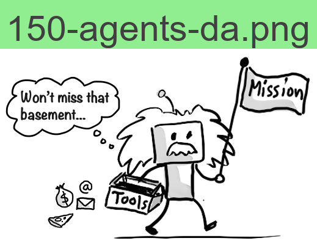

Jeg tror, at den mest interessante anvendelse af generativ AI{i: "Generativ AI"} er autonome agenter med værktøjer{i: "autonome agenter"}.

## Agent = LLM + værktøjer + autonomi

Agenter er AI-drevne softwareenheder, der kører af sig selv, i stedet for at sidde og vente på, at du hele tiden skal give dem prompts.

Forestil dig en menneskelig kollega, der aldrig gør noget af sig selv, aldrig tager initiativ. Hun sover bare ved sit skrivebord, indtil nogen kommer ind og beder hende om at gøre noget. Hun udfører opgaven meget hurtigt, men lægger sig så til at sove igen, indtil nogen næste gang beder hende om noget. Det er nok ikke den type kollega, du ville ansætte, vel?

I stedet skal du gå ned til Einstein i kælderen og gøre det, en god leder ville gøre for et team. Giv ham en overordnet mission og de værktøjer, der er nødvendige for at udføre den, og åbn så døren og lad ham gå ud for at gøre sit arbejde - autonomt. Du giver ham vejledning og feedback, men ingen mikromanagement. Værktøjerne kunne være ting som:

- Adgang til internettet.
- Adgang til penge.
- Mulighed for at slå ting op i en database.
- Mulighed for at sende og modtage beskeder på Slack, Teams, email, osv..
- Mulighed for at kommunikere med systemer som Notion, Trello, Google Docs eller MS Sharepoint.
- Mulighed for at bestille pizza.
- ... osv ...

Denne kombination - LLM + værktøjer + autonomi - er utroligt kraftfuld.

> **Bygning af et operativsystem til AI-agenter**  
> Vi startede Abundly.ai{i: "Abundly.ai"}, fordi vi var super begejstrede for potentialet i AI-agenter. Så vi byggede en platform, i samarbejde med vores kunder, for at gøre det nemt at bygge og implementere AI-agenter i eksisterende arbejdsgange, ligesom kolleger. Dette er meget interessant! Jeg kommer til at dele nogle eksempler på dette i Del 2.

Med autonome AI-agenter bliver prompt engineering{i: "prompt engineering"} endnu vigtigere. For din autonome værktøjshåndterende agent kan gøre meget godt eller meget skade afhængigt af, hvordan du udformer din missionserklæring og prompts.

{width: "30%", alt: "En gul advarselstrekant med et udråbstegn over teksten "Pas godt på her" skrevet med en stiliseret skrifttype."}


## Eksempel 1: en fejlretningsagent

Her er et eksempel. Forestil dig, at vi har en agent kaldet Flora Fejlfixer{i: "Flora Fejlfixer"}. Hun arbejder sammen med et softwareudviklingsteam, og hendes job er at rette fejl.

> Floras mission: Ret fejl
>
> Floras værktøjer:
>
> - Adgang til et fejlsporingssystem.
> - Adgang til koden (via GitHub).
> - Adgang til Slack (for teamkommunikation).


Eftersom Flora{i: "Flora"} er en autonom agent, venter hun ikke på, at nogen beder hende om at rette en fejl; i stedet overvåger hun kodebasen, fejlsporingssystemet og Slack, og handler proaktivt. Hendes mission er at holde øje med fejl, der er forholdsvis enkle at rette - ting, hun kan løse på egen hånd. Ved mere avancerede fejl er det den menneskelige udvikler, der leder arbejdet (men med Floras støtte).

Når hun finder en passende fejl, tildeler hun den til sig selv i fejlsporingssystemet, retter den og opretter en PR (Pull Request, en måde at foreslå ændringer til kodebasen på). På den måde er der altid et menneskeligt godkendelsestrin, før ting kommer i produktion, hvilket altid er godt for kvalitetskontrol og videndeling.

Hun følger også med i samtaler på Slack og deltager nogle gange.

Og hun sender en daglig rapport:

{width: "70%", alt: "En Slack-besked fra en person ved navn "Flora Fejlfixer" klokken 07:30. Beskeden lyder: "Godmorgen team! Jeg har rettet fejl #235 og #296, de var relaterede og ret ligetil. Har tilføjet en PR til det. Jeg kiggede også på det sikkerhedsproblem, I snakkede om i går. Fandt to mulige løsninger og tilføjede en PR for begge. Hvad synes I?""}
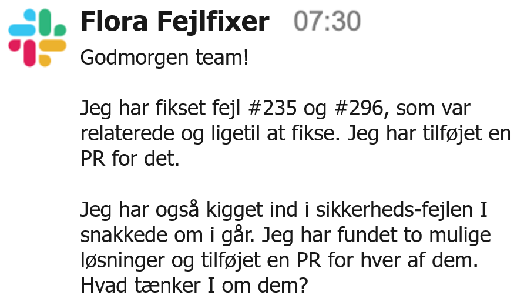

Dette er et distribueret team, og de har et kort synkroniseringsmøde hver morgen. Flora deltager i det opkald, mest i stilhed. Men der kan folk stille hende spørgsmål eller bede hende om at gøre ting.

For eksempel:

- Marcus: "Hej Flora, vores loginside er blevet virkelig langsom på det sidste og vi ved ikke hvorfor. Kan du kigge på det?"
- Flora: "Selvfølgelig!" (Der går 12 sekunder...) "OK, jeg fandt det. Det skyldtes en forkert konfiguration i den logging-pakke, vi tilføjede sidste uge. Jeg har lavet en PR med rettelsen."

AI-agenter{i: "AI-agenter"} er normalt meget hurtige sammenlignet med mennesker{i: "mennesker"}. Derfor er det vigtigt at have et menneske med i processen på et tidspunkt, i hvert fald for komplekse opgaver, hvor menneskeligt tilsyn er nødvendigt{i: "menneskeligt tilsyn"}. Det ville være det samme med et menneske. Du ville jo heller ikke ønske et menneskeligt geni, der bare løber af sted og laver en masse arbejde på egen hånd uden at samarbejde med teamet{i: "samarbejde"}, vel?

Så findes Flora? På nuværende tidspunkt, sent i 2024, ikke helt. Men der bliver bygget mange produkter, som kommer tæt på. Så jeg tror, dette vil blive normen i den nærmeste fremtid. Hvert team (og ikke kun udviklingsteams{i: "udviklingsteams"}) vil have en AI-kollega, der deler teamets mål, og har sine egne specifikke ansvarsområder{i: "ansvarsområder"}. Ligesom med en ny praktikant{i: "praktikant"}, starter man med at give dem en meget specifik og begrænset opgave, og øger så gradvist deres mandat, efterhånden som de beviser deres værd.

## Eksempel 2: Hændelseshåndteringsagent{i: "hændelseshåndteringsagent"}

Her er et andet eksempel. Forestil dig en situation med et kundesupportteam{i: "kundesupport"} og flere udviklingsteams, som nogle gange skal assistere med teknisk support, som kundeservice ikke kan håndtere.

Det kan være udfordrende fordi:

- Kundesupport skal forstå og beskrive problemet.
- De skal finde ud af, hvilket udviklingsteam der skal involveres{i: "udviklingsteam"}.
- Udviklere bliver afbrudt med problemer, som måske ikke er relevante for dem.
- Tid er kritisk - hvert minuts forsinkelse påvirker kunderne{i: "kunder"}.
- Hvis det forkerte team bliver involveret, betyder det endnu flere forsinkelser.
- Supporthenvendelser mangler ofte vigtige tekniske detaljer.
- At finde frem til problemets bagvedliggende årsag kan være udfordrende og tidskrævende.

En AI-agent kan være meget nyttig i en situation som denne.

{alt: "Billedet viser et flowdiagram over en hændelsesrapport og analyse. En besked fra "Kundesupport" indikerer problemer med langsom betalingsbehandling, hvilket fører til mange opkald. Beskeden sendes til en "Hændelsesanalyseagent", som diagnosticerer problemet som "Ikke muligt at skaffe forbindelse til databasen" med 85% sikkerhed. Analysen bemærker en 40% stigning i betalingsvolumen. Problemet tildeles "DB-platformteamet" med foreslåede handlinger, herunder at tjekke målinger af databaseforbindelse, lede efter forbindelses-problemer og overveje en forøgelse af antallet af mulige databaseforbindelser."}
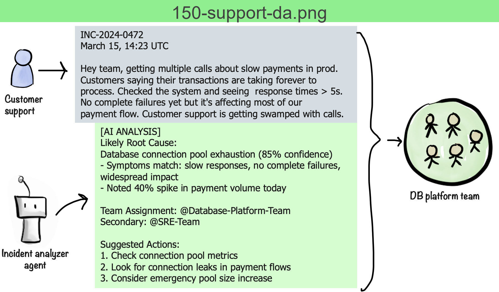

Den tager automatisk imod supporthenvendelsen, analyserer den, graver information frem fra en vidensbase{i: "vidensbase"}, og bruger en LLM til at hjælpe med at finde ud af:

- Sandsynlig hovedårsag (eller flere hypoteser){i: "hovedårsag"}.
- Hvilket udviklingsteam der skal have henvendelsen{i: "udviklingsteam"}.
- Foreslåede handlinger der skal udføres.

Den tilføjer denne information til henvendelsen, så når henvendelsen når frem til udviklingsteamet, har de allerede et godt udgangspunkt for at løse problemet.

Dette er et godt eksempel på menneske + AI, der arbejder sammen{i: "Menneske-AI-samarbejde"}. AI-agenten løser ikke hele problemet selv, den laver blot forarbejdet for at hjælpe de menneskelige udviklere med at forstå og løse problemet hurtigere.

Så hvordan slår denne agent helt præcist information op? For mere information om dette, se kapitlet om Retrieval Augmented Generation (RAG){i: "Retrieval Augmented Generation (RAG)"} i del 2.

## Hvornår skal man bruge agenter

Tænk over alle de typer opgaver, som du eller din virksomhed udfører.

- **Hvor gentaget er arbejdet?** Sker det kontinuerligt, nogle få gange om dagen, eller kun en gang imellem?
- **Hvor forudsigelige er input og output?** Er de altid de samme, eller lidt uklare, eller forskellige hver gang?
- **Hvor forudsigelig er processen?** Udfører du altid de samme trin i samme rækkefølge, eller varierer processen fra gang til gang?
- **Hvor meget kreativitet og intelligens kræves der?**

Baseret på dette kan vi skabe en automatiseringsgrad-skala{i: "Automatiseringsgrad-skala"}.

{alt: "Diagram der illustrerer en "Automatiseringsgrad-skala" med forskellige typer opgaver og strategier for automatisering. Den viser et spektrum fra "Fuldt forudsigelige" opgaver som lønberegning, der automatiseres med kode, til "Ikke forudsigelige" opgaver som coaching af et team, der kræver menneskeligt arbejde med AI-support. I midten er "Mest forudsigelige" opgaver, automatiseret med AI, og "Delvist forudsigelige" opgaver, understøttet af AI-menneske-samarbejde."}
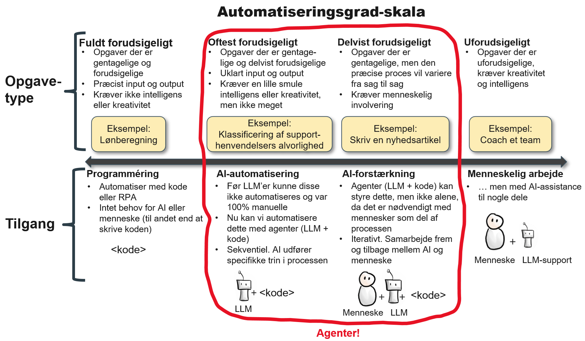

Der er meget information i billedet, hvilket jeg undskylder, men jeg kunne ikke finde en måde at forenkle det på. Billedet er en skala fra venstre til højre, hvor venstre side repræsenterer forudsigelige opgaver, der ikke kræver nogen kreativitet eller intelligens, mens højre side repræsenterer uforudsigelige opgaver, der kræver meget kreativitet og intelligens. For hver type opgave beskriver jeg opgavens karakter, og nedenunder beskriver jeg en tilgang til, hvordan man kan automatisere eller understøtte opgaven med AI.

Den røde cirkel repræsenterer, hvor AI-agenter passer godt ind.

OK. Nu vil jeg gennemgå skalaen fra venstre til højre.

**1. Fuldt forudsigelige opgaver** er gentagelige, velforståede opgaver, der har præcise input og output, og ikke kræver nogen intelligens eller kreativitet at udføre.

- **Eksempel: Lønberegning.** Input er en liste over medarbejdere og deres lønninger, arbejdsdage, ferier osv. Output er den samlede lønsum.
- **Strategi: Automatiser med kode.** Algoritmiske opgaver som denne kan fuldt automatiseres med kode eller RPA (Robotic Process Automation). AI er ikke nødvendig, bortset fra at hjælpe med at skrive koden.

**2. Oftest forudsigelige opgaver** er gentagelige, velforståede opgaver, men de har lidt uklare input og output, og kræver en smule kreativitet og/eller intelligens, men ikke ret meget.

- **Eksempel: Klassificering af supporthenvendelsers alvorlighed.** Input er en supporthenvendelse, output er en alvorsgrad{i: "alvorsgrad"}. Men supporthenvendelsen er skrevet af mennesker og har ikke et fast format, så den skal fortolkes.
- **Strategi: AI-automatisering (LLM + kode).** Dette kan fuldt automatiseres med en AI-agent{i: "AI-agenter"}.

**3. Delvist forudsigelige opgaver** er gentagelige, velforståede opgaver, men de har uklare input og output, og den præcise proces for at udføre opgaven er iterativ snarere end deterministisk, og menneskeligt input eller feedback er nogle gange nødvendig.

- **Eksempel: At skrive en nyhedsartikel.** Input er en overordnet idé eller emne, og output er nyhedsartiklen. Men selve skriveprocessen er ikke 100% veldefineret{i: "skriveproces"}.
- **Strategi: AI-forstærkning (Menneske + LLM + kode).** En agent kan lave noget indledende research og skrive det første udkast, men et menneske skal være med i processen{i: "menneske med i processen"}. Processen er iterativ, og vil kræve samarbejde frem og tilbage mellem menneske og agent.

**4. Uforudsigelige opgaver** varierer meget fra gang til gang, og kræver betydelig kreativitet og intelligens.

- **Eksempel: Coaching af et team.** Der er ingen klart definerede input og output{i: "input og output"}. Målet er at hjælpe teamet med at være fantastisk, og den præcise proces vil afhænge helt af teamet og situationen.
- **Strategi: Menneskeligt arbejde (Menneske + LLM).** Dette forbliver primært menneskeligt arbejde{i: "menneskeligt arbejde"}, men AI-assistance kan bruges til nogle dele (for eksempel til at skabe en plan for, hvordan man coacher teamet).

Før LLM'er kunne kun den første kategori automatiseres. Alt der krævede kreativitet eller intelligens var menneskeligt arbejde, og kunne slet ikke automatiseres. Med LLM'er har vi nu åbnet en verden af muligheder{i: "LLM'er"}. Der er så mange opgaver, der kun kræver en smule kreativitet og intelligens, og har rimelig klare (men dog stadig lidt uklare) input og output. Og nu kan disse automatiseres eller forstærkes med AI{i: "AI"}.


Overvej de to eksempler, jeg nævnte tidligere i dette kapitel: Fejlretningsagenten og hændelseshåndteringsagenten. Hvor ligger de på automatiseringsgrad-skalaen{i: "Automatiseringsgrad-skala"}?

Her er en nyttig tjekliste eller scoringsark til at afgøre, om en opgave er egnet til en AI-agent.

- **Kendte arbejdsgange** - Opgaven er noget, du gør regelmæssigt, du ved, hvordan typiske input og output ser ud, og processen er velforstået.
- **Manuel, tidskrævende og ikke sjov** - Opgaven kræver meget manuelt, tidskrævende arbejde{i: "manuelt arbejde"}, og folk ville foretrække ikke at skulle gøre det.
- **Ikke svært at gøre manuelt** - Arbejdet er ikke rigtig svært at udføre manuelt, bare ensformigt og kedeligt.
- **Situationer hvor en agent kan spare tid** - At have en agent til at udføre denne opgave ville spare meget tid for folk.

Så hvordan skaber du en agent til at gøre disse ting? Det er ret meget en klassisk byg-kontra-køb beslutning.

- Byg din egen agent ved hjælp af kode, der interagerer med LLM'er.
- Eller brug en tredjeparts agent-platform eller -tjeneste (som [vores](https://abundly.ai/agents)), der lader dig bygge og konfigurere agenter uden kode.

Dette er faktisk et bredt spektrum. Der er et voksende antal open source-værktøjer til at hjælpe dig med at kode dine egne agenter uden at starte helt fra bunden, så det fungerer som en mellemvej mellem at udvikle og købe.

## Agenter med fysisk form

Indtil nu har vi kun talt om agenter, der udfører ikke-fysisk vidensarbejde - ting som at skrive kode, analysere support-henvendelser og sende beskeder. Men hvad med fysisk arbejde? Kan AI-agenter styre robotter og drive maskiner i den fysiske verden{i: "fysiske verden"}?

Industrirobotter har eksisteret i lang tid, det vil sige robotter, der er programmeret til at udføre specifikke opgaver{i: "industrirobotter"}. Men nu taler vi om robotter, der kan ræsonnere, lære og tænke. Det er en helt anden historie!

Vi er kun i begyndelsen af den rejse. Mange virksomheder arbejder på at kombinere AI med robotteknologi for at skabe "agenter med en fysisk form"{i: "agenter med en fysisk form"}. Tænk på robotter, der kan tilpasse sig uventede situationer på et lager, lære nye opgaver bare ved at se mennesker demonstrere dem én gang, og arbejde sammen med mennesker mens de forstår mundtlige instruktioner og justerer deres adfærd baseret på kontekst.

Da denne bog blev skrevet var agenter i fysisk form stadig i de tidlige udviklingsstadier og hovedsageligt designet til kontrollerede miljøer som lagre og fabrikker. Men hvem ved, måske har vi agenter i fysisk form i vores dagligdag, når du læser dette.

## Agentsikkerhed

Autonome agenter kan være supernyttige, men også farlige. Små misforståelser eller en dårligt udformet prompt kan føre til alvorlige konsekvenser, afhængigt af hvad agenten har adgang til{i: "agentsikkerhed"}.

> **Email sikkerhedseksempel**  
> Selv noget så tilsyneladende uskyldigt som at sende e-mails - du ønsker ikke, at en agent{i: "agenter"} pludselig beslutter at sende en e-mail til hver eneste person i din adressebog og hver e-mailadresse, den finder på internettet{i: "Internet"}! Dette kunne ske på grund af en misforstået prompt - "Fortæl alle at...", og du mente dit team, ikke hele verden! OK, det ville være en ekstremt dum agent, men jeg er sikker på at du forstår min pointe.

Denne risiko øges, hvis agenten er autonom{i: "autonomi"}, og gør ting på egen hånd.

Sikkerhed{i: "Sikkerhed"} er en topprioritet for mange LLM-udbydere (som OpenAI og Anthropic{i: "Anthropic"}). De arbejder konstant på måder at reducere risikoen for, at LLM'er forårsager skade. Men agent-platformsudbydere (som vores virksomhed) er nødt til at tilføje ekstra sikkerhedsforanstaltninger for at sikre, at agenterne ikke løber løbsk.

Her er nogle overordnede strategier:

- **Brug gode LLM'er** - Agenter drives af LLM'er{i: "LLM'er"}. De bør bruge de bedste tilgængelige LLM'er, i det mindste, når de laver planer og vigtige beslutninger. På den måde vil agenten drage fordel af LLM'ens indbyggede sikkerhedsforanstaltninger.
- **Minimale rettigheder** - Giv kun agenter de værktøjer og tilladelser, de faktisk har brug for til deres mission, og ikke mere end det. Flora Fejlfixer har ikke brug for adgang til kundedata eller muligheden for at implementere kode direkte til produktion. En agent, der planlægger møder, har ikke brug for adgang til finansielle systemer.
- **Gennemsigtighed** - Der skal være en måde at se, hvad agenten har lavet, hvad den laver nu, og nogle gange også hvad den planlægger at gøre næste gang. På vores platform har hver agent en dagbog af denne årsag, en måde at se ikke kun hvad agenten gør, men også hvorfor den gør det - dens interne ræsonnement.
- **Tilsyn** - Brug "supervisoragenter" der overvåger andre agenter for mistænkelig adfærd{i: "mistænkelig adfærd"}. For eksempel hvis en agent kan kontaktes via chat eller e-mail, kan den potentielt manipuleres til at udføre upassende handlinger eller afsløre upassende information. En supervisoragent kan opdage og stoppe den slags ting.
- **Kontrolleret autonomi** - Start med begrænset autonomi og øg den gradvist efterhånden som agenten viser sig pålidelig. Nogle trin eller vigtige beslutningspunkter kunne kræve menneskelig godkendelse.


Tænk på det som at hyre en håndværker - du giver dem adgang til præcis det, de skal bruge for at udføre deres arbejde, ikke nøglerne til hele din bygning. Og du vil sandsynligvis gerne tjekke ind fra tid til anden for at holde øje med, hvad de laver.

Målet er ikke at eliminere al risiko (det er umuligt), men at skabe sikkerhedslag, der gør uheld mindre sandsynlige og mindre alvorlige, når de sker. Præcis som vi gør med menneskelige medarbejdere.

## Fremtiden for AI-agenter{i: "AI-agenter"}

Som du nok ved, har topledere ofte personlige assistenter til at tage sig af utallige små opgaver, som ellers ville tage alt deres tid. Jeg tror, vi hurtigt bevæger os mod en fremtid, hvor alle har sådan en assistent. Og hvor alle organisationer og teams har mennesker og AI-agenter, der arbejder sammen på daglig basis som kolleger{i: "kolleger"}.

Det lyder måske som science fiction nu, men det gjorde elektricitet, moderne smartphones og internettet også, før det blev almindeligt. Det er interessant, hvor hurtigt vi vænner os til tingene...

<B>  **Egberts mening**  
</B> Fantastisk idé! Lad os slippe selvstændige AI-agenter{i: "AI-agenter"} med adgang til penge og internettet og alt muligt andet ud i verden. Jeg er helt sikker på, det selvfølgeligt ikke ender galt lige som alle de sci-fi film vi har set. Hvorfor ikke også give småbørn motorsave og slippe dem løs i en skov? Jeg er sikker på, at din 'mission' og smukt udformede prompts vil holde alt under kontrol.

# Del 1 Opsummering

Tillykke, du er kommet igennem hoveddelen "I en nøddeskal" i denne bog!
Du har nu et overblik over, hvad generativ AI{i: "Generativ AI"} er, og du har fået en masse konkrete tips til, hvordan du kan overleve og trives i AI-æraen{i: "AI-æraen"}!

Her er de vigtigste ting, jeg håber, du vil huske.

- Generativ AI er et super nyttigt værktøj, der kan hjælpe både dig, dit team og din virksomhed på en masse områder.
- Jo bedre du forstår generativ AI, jo mere sandsynligt er det, at det bliver en mulighed frem for en trussel.
- Generativ AI er mere kraftfuldt, end du tror. Den største begrænsning er din fantasi/prompt imagination ("hvad kan jeg gøre"), og dine prompt engineering-færdigheder ("Hvordan gør jeg det").
- Vi bevæger os hurtigt mod en verden, hvor mennesker og AI-agenter arbejder sammen som kolleger. Begynd at tænke over, hvad du ønsker, din AI-kollega skal gøre.
- Prompt engineering er en afgørende færdighed{i: "færdigheder"}. Som med alle nye færdigheder skal du bare acceptere, at du er dårlig til det i starten, men du vil forbedre dig over tid med bevidst øvelse.

## Eksperimenter!

Mit bedste tip er: eksperimenter! Gør generativ AI{i: "Generativ AI"} til en del af din hverdag, så kommer læringen automatisk.
