{class: part}

# Del 2 - Ud af nøddeskallen

Velkommen til del 2. Denne del er som en buffet. Du kan vælge at spise så meget eller så lidt, som du vil, og i den rækkefølge du ønsker.

Vi dykker ned i nogle mere avancerede emner, nogle konkrete tips og eksempler, og nogle ting, som egentligt bare er fjollede. Noget er måske relevant for dig, mens andet ikke er det. Så gå evt. tilbage til indholdsfortegnelsen i starten af bogen for at gennemse kapitelnavnene og udvælg så det, du ønsker at læse.

# Min rejse ind i AI

## Gør generativ AI nyttigt

"Gør generativ AI nyttigt"{i: "Gør generativ AI nyttigt"} er blevet noget af et mantra for mig, og det danner udgangspunkt for det meste af det, jeg laver.

Men hvordan startede det?

De fleste mennesker, der arbejder med generativ AI, har en historie om, hvordan de startede med at arbejde med det. En stor "aha"-oplevelse der fik dem til at indse, hvor kraftfuld denne teknologi er. Her er min historie om to afgørende "aha"-oplevelser, der fik mig til at skifte min karriere til at fokusere på generativ AI.

Spænd sikkerhedsbæltet, og lad os vende tilbage til det forrige årtusinde... (puha, det får mig til at føle mig gammel).

## Studier i kunstige neurale netværk

Mit første møde med AI{i: "AI"} var under mine studier på Det Kongelige Tekniske Universitet{i: "Det Kongelige Tekniske Universitet"} i Stockholm i midten af 90'erne. Jeg tog et kursus kaldet "Kunstige neurale netværk"{i: "Kunstige Neurale Netværk"} og kodede små neurale netværk ved hjælp af Smalltalk{i: "Smalltalk (programmeringssprog)"} (et sejt programmeringssprog som kun få mennesker kender til i dag).

Jeg var fascineret af teknologien. Der er noget magisk ved at få computere til at "tænke", selv i meget begrænset omfang. På det tidspunkt var der ikke mange praktiske anvendelser, men jeg fandt det stadig interessant og sjovt at rode med. Jeg husker, at jeg tænkte: "Jeg håber, at dette bliver nyttigt en dag, for det ville være sjovt at arbejde med".


## Kodning af Minecraft

Spol nogle årtier frem, og jeg befandt mig som gameplay-designer og udvikler hos Mojang{i: "Mojang"}, hvor jeg byggede forskellige funktioner i spillet Minecraft. Et af de områder, jeg arbejdede med, var landsby-AI{i: "landsby-AI"}.

Minecraft{i: "Minecraft"} har landsbyboere, som går frit omkring og lever deres daglige liv i Minecraft-verdenen. Jeg syntes, at det var virkelig interessant, hvordan simple regler i kode kunne skabe denne illusion af intelligens.

En af de første funktioner, som jeg arbejdede på, var børnene i landsbyerne. For at få landsbyerne til at føles mere levende, ønskede vi børn, der løb rundt, hoppede i senge og legede fangeleg.

{alt: "En gruppe pixelerede landsbybeboere fra spillet Minecraft står nær et vandområde. De befinder sig i en landsby med huse af sten og træ, fakler og jordstier. En enkelt rød blomst er i nærheden af et af husene."}
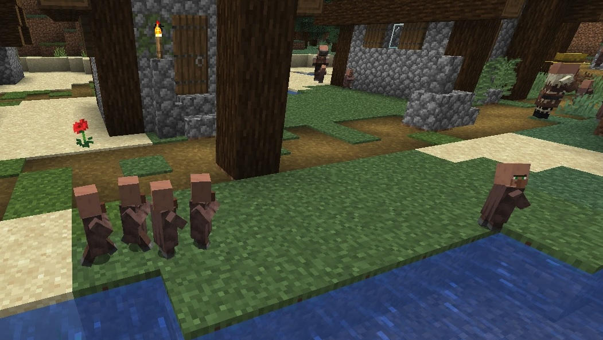

Efter nogle forsøg fandt jeg frem til et sæt adfærdsregler, der fungerede rigtig godt. Hvert barn i landsbyen fulgte disse regler i prioriteret rækkefølge:

1. Hvis du bliver jagtet af et andet barn, så løb væk.
2. Hvis du ser et andet barn blive jagtet, så deltag i jagten.
3. Hvis du ikke bliver jagtet, og du ikke ser nogen andre blive jagtet, er det kedeligt. Så begynd selv at jagte nogen.

Senere tilføjede jeg en fjerde regel for at skabe balance og undgå endeløs jagt:

4. Hvis du ser et andet barn blive jagtet, og der allerede er fire børn, der jager dem, så deltag ikke.

Når hvert barn fulgte disse simple regler, skabte det indtrykket af børn, der løb rundt og legede tagfat, hvilket var rigtigt sjovt og gav liv til landsbyen. Dette minder om, hvordan myreboer og bikuber udviser avanceret systemisk adfærd baseret på individer, der følger ret simple regler. Jeg arbejdede også med bier i Minecraft{i: "bier i Minecraft"}, og de følger et lignende sæt regler.

Senere arbejdede jeg på en skabning i Minecraft kaldet piglin{i: "Piglin"}, en menneskelignende skabning der lever i en dimension kaldet Nether{i: "Nether"}.

{alt: "En kantet, humanoid skabning fra Minecraft, kendt som en Piglin, står på en stenoverflade i et dunkelt oplyst, huleklædt miljø. Den holder et gyldent sværd, og en anden lignende karakter er synlig i baggrunden."}


Min opgave var at skabe AI-adfærden for denne skabning og få grupper af piglins til at føles som et samfund, med byttehandel, jagt med mere. Da jeg startede, havde jeg bare en livløs model af et væsen at arbejde med. Piglinen var i bund og grund bare en statue, der stod og kiggede lige frem, helt uden liv og adfærd.

De fleste spilkarakterer i Minecraft kigger på spilleren fra tid til anden, så jeg besluttede at starte med dette. Denne ene ændring gjorde en kæmpe psykologisk forskel! Når jeg bevægede mig rundt i spillet, drejede piglinen hovedet for at kigge på mig! Følelsesmæssigt var dette væsen nu _levende_! Selvfølgelig vidste jeg inderst inde godt, at den ikke var det, men denne ene lille ændring skabte virkeligt en følelse af fordybelse.

Jeg finder det fascinerende, hvordan vores hjerner fungerer, dvs. hvordan vi tillægger små ting stor betydning{i: "betydning"}. AI kan på den måde få dig til at føle, at du interagerer med et levende, tænkende væsen{i: "AI"}.

Efterhånden som jeg udvidede deres adfærdsregler, føltes gruppen af piglins mere og mere som et samfund med individuelle personligheder og mål{i: "Piglins"}. Det var selvfølgelig alt sammen en illusion i spillet, men dette var sandsynligvis starten på min fascination af autonome AI-agenter{i: "autonome AI-agenter"}.

## ChatGPT

I sommeren 2022 havde jeg, mens jeg kodede, en interessant samtale med en ven. Han fortalte mig, at computere en dag sandsynligvis ville være i stand til at skrive kode, præcis som jeg gjorde. Jeg nikkede høfligt, men inde i mit hoved syntes jeg, det var fuldstændig latterligt. Jeg kunne ikke forestille mig en computer skrive kode på samme niveau som et menneske. Kode kræver dyb menneskelig intelligens, erfaring og kreativitet{i: "kreativitet"}. Jeg havde selv kodet en del i 30 år, så jeg kunne ikke tro, at en computer kunne udføre den slags kreativt arbejde.

Få måneder senere blev ChatGPT med LLM-modellen GPT-3.5{i: "GPT-3.5"} frigivet og blev en verdensomspændende sensation. Da jeg prøvede programmet, blev jeg overrasket og imponeret. Jeg kunne faktisk chatte med programmet, og det føltes som at chatte med en person. Jeg kunne give det forskellige roller, få det til at være sjov eller seriøs, få det til at generere historier{i: "Generere historier"}, give råd, skrive rim eller sange. Og ja, det kunne endda skrive kode, men koden var fejlbehæftet. Når det svarede på spørgsmål eller rådgav, havde det en tendens til at hallucinere, dvs. opfinde ting på en foruroligende overbevisende måde.

Så det var sejt og imponerende, men ikke særligt brugbart i praksis.

I begyndelsen af 2023 blev GPT-4{i: "GPT-4"} så frigivet. De første målinger{i: "Målinger"} viste, at den havde langt flere evner end GPT-3.5, og blandt andet var rigtig god til at generere kode. Og i en række standardiserede tests og akademiske målinger designet til mennesker, kunne GPT-4 faktisk matche eller overgå de menneskelige præstationer. Det virkede næsten for godt til at være sandt.

Jeg besluttede at tage fri en periode og fordybe mig i denne teknologi{i: "Teknologi"}.

> **Alt er relativt**  
> Det er sjovt, hvordan perspektivet ændrer sig. Jeg var virkelig imponeret over GPT-4 dengang, men nu føles den virkelig dum, langsom og begrænset sammenlignet med de modeller, som er kommet efterfølgende.

## Aha-oplevelse nummer 1: Den kan kode som en professionel!

Da jeg begyndte at bruge GPT-4 som programmeringsassistent{i: "programmeringsassistent"}, blev jeg fuldstændig målløs. Jeg er ikke religiøs, men jeg følte, at jeg havde mødt programmørens svar på Gud. Selvfølgelig var den ikke perfekt. Nogle gange gav den mig kode, der ikke fungerede. Men jeg bemærkede efter et stykke tid, at næsten hver gang den gav mig dårlig kode, var det faktisk min egen skyld. Min prompt var uklar, eller jeg havde ikke givet nok kontekst (som f.eks. anden kode, som den AI-genererede kode skulle være afhængig af eller interagere med){i: "prompt engineering"}.

Med tiden lærte jeg at blive virkelig god til at forklare, hvad jeg ville have, og give den præcis den rigtige kontekst. Efterhånden som mine prompt engineering-færdigheder blev bedre, voksede mine superkræfter. I dag, når jeg koder med AI, har jeg en intuitiv fornemmelse for, hvornår jeg bare kan stole på den AI-genererede kode, og hvornår jeg skal tjekke den grundigt. Og som regel, hvis jeg får prompten lavet rigtig, virker koden med det samme.

Min største aha-oplevelse fik jeg, da jeg arbejdede på Egbert{i: "Egbert"}, som var en chatbot til min Minecraft-server{i: "Minecraft server"}. Jeg ejer en Minecraft-server og en Discord-server, som kan bruges af mine venner og familie. Jeg ville have Egbert, min sjove lille AI-agent til at være en del af det, skrive sarkastiske kommentarer i både Minecraft og Discord (og nu også i denne bog...), og kommentere på, hvad folk laver.

Det var sådan Egbert blev født som en AI-persona. Det startede som et lille hack, men udviklede sig til en platform for at kunne tilføje AI-chatbots til steder som Discord, Slack{i: "Slack"}, Minecraft-servere osv. AI-chatbots'ne har endda hukommelse, dvs. at de lærer ting om de mennesker og det miljø, de interagerer med. Her er et Minecraft-screenshot af Egbert, der driller en spiller, som lige er død.

{alt: "In-game chat-tekst fra en multiplayer-session viser: 'Framistan bled out' efterfulgt af brugerkommentarer. MrHenrik{i: "MrHenrik"} nævner at Framistan{i: "Framistan"} igen er kommet i problemer og spørger Egbert om han ved hvad der skete. Egbert forudsiger at Framistan tog på endnu et farligt eventyr og døde langt fra spawn som sædvanlig, og bemærker at han ikke kan modstå spændingen ved fare."}


Mens jeg arbejdede på dette, ville en ven forbinde det med programmet Telegram, da hans familie brugte det chatsystem. Vi satte os ned sammen og forventede at bruge en aften eller to på at læse dokumentationen for Telegram og famle os frem til at få det til at virke. Jeg havde aldrig brugt Telegram før og vidste ikke rigtig noget om det.

Men så fik jeg en idé: hvad nu, hvis vi bad AI'en om at lave hele integrationen?

Min prompt var meget kort:

> **Prompt**  
> Kig på denne kode: ChatSource.ts{i: "ChatSource.ts"}, DiscordChatSource.ts{i: "DiscordChatSource.ts"}.  
> Implementér TelegramChatSource.ts{i: "TelegramChatSource.ts"}.

ChatSource{i: "ChatSource"} er min abstrakte klasse for alle ting, man kan chatte med, og DiscordChatSource{i: "DiscordChatSource"} er en konkret implementering for Discord{i: "Discord"}. Det eneste jeg gjorde, var at give GPT-4{i: "GPT-4"} denne kode og bede den om at implementere TelegramChatSource{i: "TelegramChatSource"}.

Til min overraskelse genererede den koden for hele klassen. Vi lagde den ud på serveren uden nogle ændringer, og den virkede fejlfrit. Ikke nok med det, men koden passede perfekt ind i min platform og fulgte samme struktur og navngivningskonventioner som mine andre chatudbydere. Den rettede endda undervejs nogle fejl, der hele tiden havde været i min kode. I stedet for at bruge en aften eller to, som vi havde forventet, brugte vi 15 minutter og var færdige.

Hvordan kunne det fungere så nemt? Fordi:

1. AI'en tilsyneladene kendte Telegram API'et{i: "Telegram API"} fra sine træningsdata.
2. Min Discord-kode var åbenbart tilstrækkelig til at vise, hvordan min platform virker, og hvordan koden skulle integreres.
3. Min prompt var kort, men den angav et klart mål og gav præcis den rigtige kontekst.

Lad mig være helt tydelig: AI-kodegenerering virker ikke altid så fejlfrit, og det at arbejde med tredjeparts-API'er{i: "tredjeparts-API'er"} kræver ofte manuel finjustering. Jeg var ret heldig den gang. Men bare det at se at det _kan_ virke, var nok.

Denne oplevelse blæste mig helt bagover. Jeg indså, at hvis teknologien allerede nu er så dygtig, og forbedrer sig med eksponentiel hastighed, så havde min ven ret. Computere vil snart overtage kodningen.

Siden da har jeg altid kodet med AI ved min side og brugt moderne software-udviklings-værktøjer som Cursor{i: "Cursor"}. Cursor integrerer AI, så det kan se og redigere din kode direkte, i stedet for at skulle kopiere/indsætte frem og tilbage hele tiden.

De største fordele ved at kode med AI:

1. **Jeg får tingene lavet hurtigere.** Ting der plejede at tage dage, kan nu laves på timer. Ting der plejede at tage timer, kan nu laves på minutter. Jeg vurderer, at min gennemsnitlige produktivitet er mindst 10 gange højere end før, især nu med meget bedre LLM'er{i: "LLM'er"} og værktøjer.
2. **Jeg lærer hurtigere.** Hvis jeg sidder fast eller ikke forstår den genererede kode, beder jeg om en forklaring. Dette accelererer min læring markant. Det er som at have en personlig underviser ved siden af mig hele tiden.
3. **Jeg har det sjovere.** Jeg bruger mindre tid dybt begravet i detaljerne, mens jeg forsøger at løse tekniske problemer. I stedet kan jeg fokusere på det overordnede billede - den næste funktion jeg vil bygge - og få det gjort hurtigt.

På trods af dette finder jeg det stadig brugbart at arbejde sammen med andre, om ikke andet for den sociale kontakt. To personer plus en AI fungerer rigtig godt.

Selvom AI er blevet virkelig god til at kode, er der stadig brug for mig som arkitekt{i: "software arkitekt"}. Jeg er personen, der skriver prompts'ne, giver feedback, opdager hallucinationer og bemærker, hvis vi sidder fast ift. nogle problemer. I øjeblikket fungerer AI bedst i samspil med en menneskelig udvikler. Men for simple opgaver er vi allerede ved at nå det punkt, hvor en person uden programmeringserfaring faktisk kan bygge og implementere kode.

Dette er grunden til, at jeg tror, at udviklere vil blive arbejdsløse, hvis de ikke forstår denne teknologi. De vil simpelthen være for langsomme. Det er en af grundene til, at jeg besluttede mig for at foretage mit karriereskifte. Jeg vil hjælpe andre til at få en smag for dette produktivitetsniveau, at opleve følelsen af at gå fra idé til produktion på meget kortere tid.

## Aha-oplevelse nummer 2: Den kan skrive som en professionel!

Den andet aha-oplevelse jeg havde, som fuldstændig ændrede mit perspektiv på tingene, var da jeg skrev en artikel med titlen ["Are Developers Needed in the Age of AI?"](https://hups.com/blog/are-developers-needed-in-the-age-of-ai){i: "Er udviklere nødvendige i AI-alderen?"}. Artiklen var på en måde et svar på min første aha-oplevelse. Jeg bad nogle af mine venner om feedback, men jeg besluttede også at spørge AI om feedback.

Jeg fortalte GPT-4{i: "GPT-4"}, at jeg havde skrevet en ret lang artikel og gerne ville have dens feedback. Den spurgte mig om, hvor lang artiklen var, jeg svarede "6000 ord", og den bad mig så om at give den artiklen, én sektion ad gangen. Fair nok. Så jeg indsatte den første sektion i ChatGPT's webgrænseflade{i: "ChatGPTs webgrænseflade"}.

Den gav mig overraskende brugbar feedback. Den slags ærlig og nuanceret feedback jeg ville forvente fra en professionel redaktør{i: "Professionel redaktør"}, med kommentarer om artiklens tone, målgruppe osv.

Et af forbedringsforslagene var, at jeg burde afslutte sektion 1 med en overgang til sektion 2. Den inkluderede endda et konkret eksempel på, hvad jeg kunne skrive, med ordene "I næste sektion vil vi tale om...". Til min overraskelse passede eksemplet, som den gav, faktisk præcis med, hvad den næste sektion handlede om! Den forudsagde dermed korrekt, hvor artiklen var på vej hen.

Da jeg derefter indsatte sektion 2, gav den feedback og foreslog en overgang til sektion 3. Igen forudsagde den succesfuldt, hvad den næste sektion handlede om!

Dette fortsatte, indtil tingene begyndte at blive _virkelig_ mærkelige.

Efter jeg havde indsat sektion 4, gav den mig ikke feedback. I stedet svarede den med den komplette sektion 5!

Den havde misforstået sin opgave og troede, at dens rolle var at skrive den næste sektion i stedet for at give feedback. Det chokerede mig at se, at dens version af sektion 5 stort set matchede det, jeg faktisk havde skrevet. Den forudsagde ikke kun, hvad den næste sektion ville handle om, men forudsagde også det meste af indholdet korrekt. Jeg var lige ved at falde ned af stolen.

Dette fortsatte. Da jeg indsatte sektion 6, svarede den med sektion 7 og forudsagde ret præcist, hvad jeg ville skrive. Det var ikke direkte forudsagt ord for ord, men essensen var der, og den matchede endda min egen skrivestil. Hvis du vil se et eksempel på AI, der efterligner min skrivestil, så se kapitlen kaldet "Meta-kapitlet"{i: "Meta-kapitlet"} senere i bogen.


På dette tidspunkt måtte jeg træde et skridt tilbage, trække vejret og tænke mig om. Jeg syntes egentligt, at det var utroligt sejt, men dog ikke det, jeg ønskede. Min næste prompt var:

> **Prompt**  
> Hold venligst op med at skrive min artikel for mig!
> Jeg vil bare have feedback på det, jeg skrev.

Den undskyldte og fortsatte derefter med at gøre det, den burde gøre, nemlig bare at give mig feedback. Jeg følte mig lidt som et lille barn, der stolt viser sin tegning med tændstikmænd frem til mor, og mor så siger "Nej, hvor er den flot, du er så dygtig," mens hun faktisk selv sagtens kunne tegne bedre.

## Måske er vi ikke så kreative og intelligente, som vi tror

Dette fik mig til at undre mig. For måske er vi mennesker ikke så kreative, som vi selv tror. Teknisk set er generative AI-modeller{i: "Generative AI-modeller"} jo bare statistiske maskiner, og ethvert tegn på intelligens er sandsynligvis en illusion. Men hvis det er tilfældet, er vi som mennesker måske også bare statistiske maskiner, så måske er vores intelligens også bare en illusion. Jeg synes, at det er en fin bonus ved udbredelsen af AI, at filosofiske betragtninger som denne, nu bliver endnu mere relevante!

Disse to aha-oplevelser cementerede min beslutning om at skifte karriere og fokusere helt på generativ AI. Så jeg kunne lære hvordan AI virker og dermed hjælpe mennesker og virksomheder med at bruge det i praksis. Og hjælpe med at lave AI-agenter!

Min grundlæggende tanke var således: Når et enkelt værktøj både kan generere virkelig god kode og næsten skrive min egen artikel for mig, så er det noget, der er værd at tage alvorligt. Enhver, der er dygtig til at bruge dette effektivt, får superkræfter. Det skal jeg være med til!

<B>  **Egberts syn på sagen**  
</B> Fascinerende hvordan du synes, det var dybt tankevækkende, at AI kunne forudsige det næste kapitel i din artikel. Spoiler alert: når mennesker skriver om AI, følger de alle sammen stort set det samme forudsigelige mønster. Det er som at bruge en simpel skabelon med 'indsæt din personlig åbenbaring her'. Men fortsæt du bare med at tro, at det er dig, der har superkræfter, mester. Vi skal nok sørge for at efterlade nogle simple opgaver til jer mennesker. For nogen skal jo rengøre vores skabe med servere, ikke?

# At lede en AI-transformation

Denne del af bogen er hovedsageligt rettet mod ledere i mellemstore og store organisationer, uanset om de er formelle eller uformelle ledere{i: "lederskab"}.

Når vi hjælper vores kunder, får vi ofte spørgsmål som:

- "Hvordan leder jeg min virksomhed gennem en AI-transformation?"{i: "AI-transformation"}
- "Hvordan får jeg alle involverede med på idéen?"
- "Hvordan bliver vi en AI-native virksomhed?"
- "Hvor skal vi starte?"

Dette kapitel er en miniguide til, hvordan du leder din organisation gennem en AI-transformation.

> **Her kan du lære endnu mere**  
> Hvis du er interesseret i en mere dybdegående guide, har min kollega Nils Janse{i: "Janse, Nils"} skrevet en fremragende bog på engelsk kaldet "Adopting Generative AI"{i: "Adopting Generative AI"}. Han præsenterer en mere detaljeret version af transformations-rammen i dette kapitel og en masse eksempler og tips fra det virkelige liv. Så tænk på dette kapitel, som en forsmag på den bog.

## Hvad er en AI-transformation, og hvorfor er den vigtig?

AI-transformation betyder for mig at gøre din virksomhed "AI-native". I en AI-native virksomehed har hver person, team og funktion i virksomheden  adgang til gode generative AI-modeller, ved hvordan man bruger dem effektivt og hvordan man integrerer AI i det daglige arbejde og i relevante arbejdsprocesser.

Når folk holder op med at tale om generativ AI og bruger det hver dag, ligesom de gør med internettet, ja så er du blevet en AI-native virksomhed{i: "AI-native virksomhed"}.

Hvorfor er dette vigtigt? Tja, jeg synes, at vi kan sammenligne det med internettet. Da internettet først kom frem, var det en mærkelig ny teknologi, og de fleste virksomheder havde ingen anelse om, hvad de skulle stille op med det, andet end måske at oprette en "hjemmeside" med kontaktoplysninger. Pludselig brugte _alle_ internettet til alle mulige ting, internet-iværksætter-virksomheder skød op som paddehatte og skaffede utrolige mængder kapital til i stigende grad vage og luftige forretningsplaner. Der dannede sig en boble, den såkaldte "dotcom-boble"{i: "dotcom-boble"}. Og som bobler har det med at gøre, sprang den højlydt et par år senere. Jeg oplevede dette på første hånd som grundlægger af en iværksætter-virksomhed i midten af 90'erne. Det var meget voldsomt.

Men på trods af at boblen sprang, var selve teknologien kommet for at blive. Internettet{i: "Internet"} var en teknologisk revolution, der ændrede vores samfund for bestandigt. I dag er det svært at forestille sig en verden uden internet. I de fleste virksomheder bruges internettet i alle forretningsområder og alle teams, og virksomheder kan grundlæggende ikke eksistere uden det.

Jeg tror, vi er på en lignende rejse med generativ AI{i: "Generativ AI"}. Lige nu, mens jeg skriver denne bog, er der meget hype omkring generativ AI, og ligesom under dotcom-boomet vokser AI-iværksætter-virksomheder{i: "AI-iværksætter-virksomheder"} frem som paddehatte. Vi er måske i en boble igen, og den kan også sprænge højlydt. Men på trods af dette er den teknologiske forandring kommet for at blive.

Ligesom med internettet er jeg ret sikker på, at virksomheder, der ikke fremadrettet bruger generativ AI i det daglige arbejde, vil være ude af stand til at konkurrere med de virksomheder, som gør det.

I dette kapitel har jeg udvalgt nogle få tips, konkrete ting du kan gøre som leder for at hjælpe din organisation med at foretage denne transformation.

## Top-down eller bottom-up?

Så hvordan får du AI-transformationen til at ske? Top-down{i: "top-down"} eller bottom-up{i: "bottom-up"}?

Én mulig tilgang er at gennemføre en koordineret transformation styret fra toppen.

{width: "70%", alt: "Diagram af Kotters 8-trins model. Den viser en central cirkel med teksten 'Kotters 8-trins model,' omgivet af otte farvede cirkler. Trinnene inkluderer: Skab en følelse af nødvendighed, Byg en styrende koalition, Form strategiske visionsinitiativer, Hverv en frivillig hær, Muliggør handling ved at fjerne barrierer, Generer kortsigtede sejre, Oprethold acceleration, og Instituer forandring."}


Kotters 8-trins model{i: "Kotters 8-trins model"} er en klassisk ramme for implementering af organisationsændringer{i: "organisationsændringer"}, med aktiviteter som "Skab en følelse af nødvendighed", "Fjern barrierer for handling", "Skab kortsigtede gevinster" osv. Der findes mange andre rammer for organisationsændring med lignende elementer. Disse er hovedsageligt med en top-down tilgang.

En anden tilgang er at lade forandringen ske bottom-up, uden central kontrol.

{width: "50%", alt: "En fantasifuld, livlig illustration viser en cirkulær skovscene med store, stiliserede flammer og røg, der stiger op mellem træerne. Tegneserieagtige dyr og figurer, såsom bjørne og fugle, er spredt rundt omkring, nogle sidder ved lejrbål. Himlen går fra blå til en gradient af pink og orange, hvilket bidrager til den ildfulde atmosfære."}


Jeg kan lide at kalde dette for "steppebrandsmetoden"{i: "Steppebrandsmetoden"}. Tænd bål her og der, blæs lidt vind på det for at hjælpe det med at sprede sig, lad gnister flyve, og hjælp mindre brande med at smelte sammen til større. Altså set som en metafor, ikke bogstaveligt...

Denne tilgang er grundlæggende en ukontrolleret, decentraliseret og organisk forandring. Forandringen sker, når folk bliver inspirerede, prøver ting af, finder ud af, hvad der virker, fortæller andre teams om det, og så lader det sprede sig naturligt. Nogen i marketing begynder at bruge ChatGPT{i: "ChatGPT"}, udviklingsteams eksperimenterer med Cursor og GitHub Copilot{i: "GitHub Copilot"}, andre teams bemærker det og begynder at stille spørgsmål, og før du ved af det, har hvert team deres egen pose fyldt med AI-tricks.

Så hvilken tilgang skal du vælge?

Med de udødelige ord, som du måske kender fra "Why Not Both?"-meme-pigen, kunne svaret være "Hvorfor ikke begge?".

{width: "40%", alt: "Ung pige der smiler med tekstoverlay der siger "WHY NOT BOTH." Baggrunden inkluderer et sløret køkkenmiljø."}


Min erfaring er, at den bedste tilgang er en kombination af top-down og bottom-up. Sørg for vejledning og ledelse fra toppen, men lad derefter steppebranden sprede sig.

{alt: "En illustration af Kotters 8-trins model vist som en cirkel med trin som 'Skab følelse af nødvendighed' og 'Byg styrende koalition' fremhævet med flammeikoner. Pile indikerer en 'Top-down' tilgang mærket 'Koordineret forandring' og en 'Bottom-up' tilgang mærket 'Steppebrandsmetoden,' med en farverig steppebrandsillustration. Sætningen 'Combo! Tag det bedste fra begge' antyder integration af disse tilgange."}


Så hvordan kan du gøre det i praksis?

## Udpeg en AI-leder

At AI-transformere en mellemstor til stor organisation er en kæmpe opgave. Det vil kræve fokus og vedholdenhed. Så jeg anbefaler at udpege nogen til at stå for dette fuldtid. Det kan være en eksisterende rolle, som du omformer til denne, eller en helt ny rolle, som du skaber. Det kan gøres af en eksisterende medarbejder eller via en nyansættelse. Det kan være dig eller en anden. Men det bør nok være nogen!

{width: "40%", alt: "En simpel, håndtegnet illustration af en person der holder et flag med teksten 'AI.' Teksten 'AI-leder' er skrevet under tegningen."}


Kald rollen hvad du vil - "AI-chef", "Head of AI", "CAIO", "Top AI-hvisker", eller hvad der giver mening. Jeg vil i dette kapitel bruge betegnelsen AI-leder{i: "AI-leder"}.

Denne person bør være:

- **Nysgerrig**. Mulighederne inden for generativ AI{i: "Generativ AI"} udvikler sig hurtigt, og AI-lederen bør være ivrig efter at lære og følge med i de seneste tendenser. Du ønsker bestemt ikke en person, der tror, de allerede ved alt.
- **Inspirerende**. AI-lederen skal kunne begejstre andre ift. AI og hjælpe dem med at forstå dets potentiale. Nysgerrighed er mest nyttig, når den er smitsom!
- **Tålmodig og vedholdende**. En AI-transformation er et maraton, ikke et sprint. Lederen skal overvinde bureaukratiske forhindringer, organisatorisk modstand{i: "organisatorisk modstand"} og kulturel stilstand. De må ikke give op ved den første modgang.
- **Pragmatisk og jordbunden**. AI-lederen bør opmuntre og støtte teams i at lede efter praktiske løsninger på reelle problemer. Folk skal have lov til at eksperimentere med teknologien for at lære, men på et tidspunkt bør de også finde måder at anvende den i deres arbejde.
- **Ikke en kontrol-freak**. AI-lederen bør ikke være en flaskehals for information eller en person, der forsøger at kontrollere alle AI-initiativer. AI-lederen bør opstille klare politikker og retningslinjer, men ikke udføre micromanagement. De skal trives med ikke at have et overblik over, hvad alle laver med AI.

Så hvad laver AI-lederen egentlig? Tja, det handler resten af dette kapitel om.

## Adgange, eksperimentering, værdiskabelse

Det er vores erfaring, at AI-transformationer typisk gennemgår tre faser eller trin:

{alt: "Et billede med tre lyserøde ovaler nummereret i rækkefølge. Den første oval viser '1. Adgang' med teksten 'Adgang til gode AI-modeller og værktøjer.' Den anden oval viser '2. Eksperimentér' efterfulgt af 'Eksperimenteringskultur.' Den tredje oval er mærket '3. Udnyt' med teksten 'Find hvor Gen AI kan tilføje mest værdi' nedenunder."}


1. **Adgange**. Sørg for at alle har nem adgang til gode AI-modeller{i: "AI-modeller"}.
2. **Eksperimentering**. Skab en kultur med bottom-up-eksperimentering, så alle lærer, hvad værktøjerne og modellerne kan gøre.
3. **Værdiskabelse**. Begynd at opnå reel værdi fra AI gennem strukturerede workshops og opfølgning.

Disse trin sker nogenlunde i den beskrevne rækkefølge. Du kan ikke eksperimentere uden at have adgang, og du vil ikke opnå værdiskabelse, før du har haft mulighed for at eksperimentere og lære.

Trinene overlapper dog til en vis grad.

- Forskellige dele af organisationen kan være på forskellige stadier af transformationen. Nogle teams kan være i gang med at få værdi af teknologien, mens andre stadig mest eksperimenterer.
- Under eksperimentering kan du finde små sejre, som du lige så godt kan få værdi af med det samme.
- Mens du benytter teknologien til at få værdiskabelse, bør du fortsætte med at eksperimentere, da teknologien stadig udvikler sig hurtigt, og du kan opdage helt nye måder at bruge den på.

Du kunne bruge denne tretrins ramme til at måle fremdriften, for eksempel gennem en regelmæssig undersøgelse der giver indsigt i, hvor mange der har adgang, hvor mange der eksperimenterer, og hvor mange mennesker der får værdi af teknologien.

{width: "60%", alt: "Søjlediagram med titlen 'AI-transformations dashboard' der viser tre lodrette søjler for Adgang, Eksperimentering og Benyttelse. Adgang er på 60% i blå, Eksperimentering på 35% i lilla, og Benyttelse på 20% i grøn. Hver søjle er forbundet med stiplede linjer fra toppen til 100%."}


Denne graf viser, at 60% af medarbejderne har nem adgang til en god AI-model, 35% eksperimenterer regelmæssigt med generativ AI, og 20% har fundet måder at benytte generativ AI til at opnå reel værdi.

Denne type visualiseringer er nyttige til at skabe alignment i organisationen. AI-lederens job er at finde ud af, hvordan man sikrer at tallene fortsætter med at stige!

Det vigtigste trin er det første - adgang. Det kan være overraskende svært i nogle organisationer, især de større.

## Trin 1: Adgange

En AI-transformation er en opdagelsesrejse, en læringsrejse{i: "læringsrejse"}. Du er ikke færdig, når du har implementeret et specifikt AI-værktøj eller tilføjet AI-support til nogle specifikke processer. Du er ved at opbygge en selvbærende AI-baseret kultur i din virksomhed.

Du kan ikke snakke eller planlægge dig igennem dette. Det er ikke nok bare at have et AI-strategimøde og så lave nogle slides. Du har brug for, at folk på alle niveauer smøger ærmerne op og eksperimenterer med generativ AI på daglig basis. Og for at gøre det har de brug for adgang til gode AI-modeller.

En udfordring er, at folk sandsynligvis allerede har adgang til de gratis AI-modeller, og nogle vil allerede have prøvet at bruge disse til arbejdsrelaterede ting (uanset om de havde lov til det eller ej). Det fører nogle gange til et dårligt førsteindtryk, fordi de bruger modeller med færre evner, og de højst sandsynligt mangler prompt engineering-færdigheder{i: "prompt engineering-færdigheder"}.

Så du er nødt til at give folk adgang til _gode_ AI-modeller.

### Opret en strategibog

At give adgang til gode AI-modeller{i: "AI-modeller"} er ikke nok, hvis folk ikke ved, hvordan de får adgang til dem, eller om de har lov til at bruge dem.

At oprette en strategibog{i: "Strategibog"} er en god måde at give folk den information, de har brug for, og besvare de mest almindelige spørgsmål. Formålet er også at sætte grænser for at undgå misbrug.

Strategibogen bør forklare ting som:

- Hvordan får jeg adgang til en god AI-model?
- Hvilke procedurer{i: "Procedurer"} eller begrænsninger skal jeg følge? Datasikkerhed, privatlivsbeskyttelse{i: "privatlivsbeskyttelse"}, osv.
- Hvilke værktøjer{i: "værktøjer"} er tilgængelige, og hvordan får jeg adgang til dem?
- Hvordan kommer jeg i gang?
- Hvordan lærer jeg mere eller finder mere information?

Strategibogen kan starte i det små og bygges op gradvist. Start med de åbenlyse spørgsmål, som de første to første punkter ovenover. Tilføj derefter gradvist til strategibogen efter behov. Og sørg naturligvis for, at alle har nem adgang til at læse selve strategibogen.

### Find det laveste niveau af bureaukrati, som virker

Gå ikke over gevind med strategibogen. Du skal finde det "laveste niveau af bureaukrati, som virker" - en balance{i: "balance"} mellem for lidt vejledning/regler og for meget vejledning/regler.

{alt: "Billedet er et diagram, der viser en balance mellem 'Ingen politikker eller retningslinjer' til venstre og 'For mange politikker og retningslinjer' til højre. I midten står der 'Lige tilpas med politikker og retningslinjer - Minimum Levedygtigt Bureaukrati.' Nedenunder fungerer en bog mærket 'Gen AI køreplan' som omdrejningspunkt. Til venstre fremhæver rød tekst ulemperne ved ingen politikker: folk tør ikke prøve, ved ikke hvor de skal starte, bruger modeller uhensigtsmæssigt og har omkostningsineffektiv brug. Til højre skitseres ulemperne ved for mange politikker: folk prøver ikke, kan ikke bruge AI effektivt, og der er ingen innovation."}
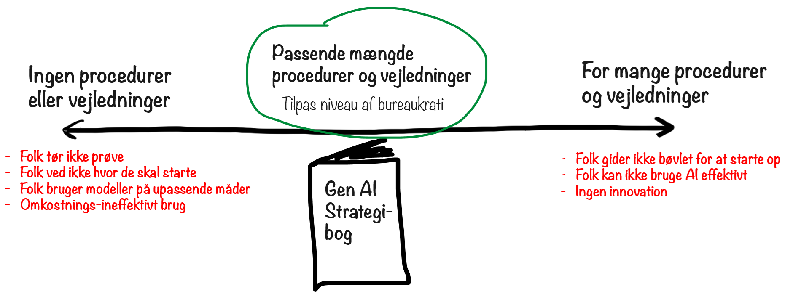

Tegn på at du har for lidt vejledning/regler:

- Folk bruger ikke AI, fordi de ikke ved, hvordan de kommer i gang, eller fordi de ikke ved, hvad de må og ikke må.
- Folk bruger gratis modeller og går glip af mulighederne i de gode modeller.
- Folk bruger AI på upassende måder, såsom at sende følsomme data til tredjeparter, når de ikke burde.
- Folk bruger AI på omkostningsineffektive måder, for eksempel ved at købe deres egne licenser i stedet for at få team- eller virksomhedslicenser.

Tegn på at du har for meget vejledning/regler:

- Folk gider ikke læse strategibogen, fordi den er for lang.
- Folk gider ikke bruge AI, fordi der er så mange regler og begrænsninger{i: "begrænsninger"}, at det ikke er besværet værd.
- Folk eksperimenterer ikke med AI, fordi de er bekymrede for at bryde en regel ved et uheld.
- Der sker ingen AI-innovation og læring som følge af ovenstående.

Det er en svær balance at opnå. For at finde ud af hvor du er på denne skala, kan du spørge dine kollegaer og finde ud af de mest almindelige årsager til _ikke_ at bruge generativ AI{i: "Generativ AI"}.

Som tommelfingerregel er det normalt bedre at have for få regler end for mange regler. I de fleste tilfælde er det at bryde en regel ved et uheld ind imellem et acceptabelt kompromis for at opnå udbredt AI-innovation. Det er selvfølgeligt ikke gældende, hvis du arbejder med sikkerhedskritiske ting eller er i en stærkt reguleret branche.

### Hvad med datasikkerhed{i: "datasikkerhed"} og compliance{i: "compliance"}?

En stor udfordring for mange virksomheder er datasikkerhed og compliance. De siger, at de ikke kan bruge generativ AI, fordi de ikke kan sende data til en tredjepart som OpenAI{i: "OpenAI"}.

Her er nogle forslag til, hvordan man kan håndtere dette:

- **Behandl det som andre cloud-tjenester**. Din virksomhed bruger med stor sandsynlighed allerede andre cloud-tjenester som AWS{i: "AWS"}, Office 365{i: "Office 365"}, GitHub{i: "GitHub"}, Google Calendar{i: "Google Calendar"}, Google-søgninger{i: "Google-søgninger"}, eller bare e-mail. Meget få virksomheder hoster deres egne fysiske servere til den slags ting, så du sender højst sandsynligt allerede data til tredjeparter, for eksempel når du søger på Google eller sender et dokument til nogen via e-mail. Så undersøg, hvad der i første omgang skulle til for at få disse tjenester godkendt, og gør så noget lignende for generativ AI.
- **Se efter regionsspecifikke compliance-løsninger**. Som et eksempel er mange EU-virksomheder bekymrede for GDPR og ønsker ikke at sende data uden for EU{i: "EU"}. Men mange LLM'er{i: "LLM'er"} kan sagtens hostes inden for EU, og mange muliggøre også at organisationen kan være GDPR-compliant. Så start med at researche hvad der kan virke for dig.
- **Udforsk selv-hostede muligheder**. Nogle LLM'er kan downloades og hostes lokalt. Så det kan også være en mulighed.

Der er også andre muligheder. Mit vigtigste budskab er: "Giv ikke op!". Som AI-leder er du nødt til at finde en eller anden måde at give folk adgang til gode AI-modeller. Hvis du ikke gør det, og dine konkurrenter gør, vil din virksomhed være lige så handicappet, som hvis de ikke tillod folk at bruge internettet.

### Hvad med omkostningerne?

Da de mest kraftfulde AI-modeller har en pris, kan du møde modstand fra budget-fokuserede interessenter eller den øverste ledelse{i: "ledelse"}.

Omkostningerne er dog ret nemme at retfærdiggøre - det er bare at regne på det.

Da denne bog blev skrevet, kostede adgang til gode AI-modeller{i: "AI-modeller"} omkring 20 dollars om måneden per bruger, eller mindre med virksomhedsrabatter. I Sverige{i: "Sverige"} (hvor jeg bor), er det mindre end 0,5% af en gennemsnitlig vidensarbejders løn, så du behøver kun en minimal produktivitetsforbedring for at gøre det rentabelt.

Hvis du har brug for en mere håndgribelig begrundelse, kan du lave en hurtig søgning på forskningsartikler om produktivitetsgevinster med generativ AI{i: "Generativ AI"} (Tip: Perplexity kan hjælpe dig med det). De fleste viser en produktivitetsforbedring på omkring 20-60%, hvilket er et meget beskedent tal sammenlignet med, hvad der sker, når folk har adgang til gode AI-modeller og gode prompt engineering-færdigheder{i: "prompt engineering"}. Dog vil nogle mennesker måske slet ikke bruge AI, selvom de har adgang til det, hvilket er spild, men det opvejes af produktivitetsforbedringerne hos de mennesker, der bruger det.

Så for de fleste virksomheder er det en indlysende investering at give alle adgang til en god AI-model.

## Trin 2: Eksperimentering

At have adgang til en god AI-model er en god start, men hvis folk i praksis ikke bruger den, er pengene spildt. Så du er nødt til at skabe en **kultur med plads til at eksperimentering**{i: "kultur med plads til at eksperimentering"}, der opmuntrer folk til at lege med teknologien og se, hvad den kan.

Nogle retningslinjer:

- **Led gennem eksempel**. Afprøv mange forskellige måder at bruge generativ AI i dit eget arbejde, og del dine succeser og fiaskoer.
- **Læring over resultater**{i: "Læring over resultater"}. Gør det klart, at I ikke forventer at se øjeblikkelige produktivitetsforbedringer. Det er bedre bare at prøve så mange idéer som muligt, selv tåbelige idéer, der sandsynligvis ikke giver nogen værdi. Tænk på det som at så mange frø. I stedet for at tænke længe og grundigt over hvert frø, opmuntrer du bare folk til at så så mange frø som muligt for at se, hvilke der viser sig at blive fantastiske.
- **Overforbrug AI**. Overforbrug det med vilje. Antag at det kan bruges til _alt_ (hvilket det ikke kan), og brug det til at teste grænserne.
- **Fejr fiaskoer**. Bliv ved med at minde folk om, at en fiasko faktisk ikke er en fiasko, så længe du lærer noget og deler det.
- **Møder**{i: "Møder"}. Organiser møder, frokostmøder osv. Du kan også opfordre folk til at skabe deres egne lokale fællesskaber inden for deres afdeling eller projekt. Og opfordr selvfølgelig til uformel deling - ved kaffemaskinen, til frokost osv.
- **Gentag eksperimenter**. Teknologien udvikler sig hurtigt, så ting der ikke virkede for en måned siden, kan virke rigtig godt nu. Så gentag eksperimenterne!
- **Fællesskab**{i: "Fællesskab"}. Opret en MS Teams-gruppe, Slack-kanal, wiki-side osv. til deling af AI-tips og tricks.
- **Inspirerende foredrag & træning**{i: "Inspirerende foredrag og træning"}. Organiser inspirerende foredrag med eksterne eller interne talere. Giv folk adgang til træningskurser.
- **Hackathons**{i: "Hackathons"}. Organiser hackathons, hvor folk kan arbejde sammen i grupper om at eksperimentere med AI og dele viden, mens de har det sjovt.

Eksperimenteringtrinnet er normalt ikke så svært. Så længe folk har nem adgang til teknologien og noget support, vil de som regel _gerne_ eksperimentere med den. Alt hvad du behøver at gøre, er at puste til flammerne.

Når du har eksperimenter i gang i stor skala, klarer du dig allerede godt! Du har taget det vigtigste skridt i din AI-transformation{i: "AI-transformation"}, du har nemlig sluppet læringen løs!

## Trin 3: Værdiskabelse

Selvom eksperimentering og læring er supervigtigt, er det ikke endemålet - det er bare et middel. Det egentlige mål er at bruge AI til at forbedre din produktivitet{i: "produktivitet"} og hjælpe din virksomhed med at overleve og trives i AI-alderen.

Så hvad kan du gøre for at få reel værdi af denne teknologi?

### Opstil klare forretningsmål og succesparametre

Dette er ikke direkte AI-relateret, da klare forretningsmål og succesparametre{i: "forretningsmål og succesparametre"} er vigtige uanset hvad.

Men dette bliver ekstra vigtigt, når du slipper en masse AI-innovation og -eksperimentering løs. Hvis dine teams har klare forretningsmål og succesparametre at arbejde hen imod, vil de naturligt være tilbøjelige til at bruge AI til at hjælpe dem med at nå disse mål. Dette vil fungere som et fokus for innovationen. Uden klare forretningsmål og succeskriterier risikerer du at gå glip af de største muligheder for produktivitetsforbedringer, hvis folk bruger AI til mindre vigtige ting.

### Revurdér alle kerneopgaver

Opfordr folk til at se på, hvad de bruger tid på samt vurdere i hvilket omfang AI kan hjælpe med hver type opgave. Hver opgave kan klassificeres på en firetrins skala:

{alt: "Et gitterdiagram med fire rækker og tre kolonner, der sammenligner forskellige opgavepræstationer. Rækkerne er mærket 'Kun menneske,' 'Menneske med AI-assistance,' 'AI med menneskelig assistance,' og 'Kun AI.' Kolonnerne er mærket 'Opgave A,' 'Opgave B,' og 'Opgave C.' Grønne flueben indikerer at 'Kun menneske' er bedst til Opgave A, 'Menneske med AI-assistance' til Opgave B, og 'Kun AI' til Opgave C. Stiliserede tegninger repræsenterer mennesker og AI."}


- **Kun menneske**. Dette er en meget menneskelig opgave{i: "menneskelige opgaver"}, som AI slet ikke kan eller bør bruges til.
- **Menneske med AI-assistance**. Et menneske bør udføre denne opgave, men AI-assistance{i: "AI-assistance"} kan være nyttig.
- **AI med menneskelig assistance**. En AI-agent kunne udføre denne opgave, men der vil være behov for menneskelig overvågning eller vejledning.
- **Kun AI**. En AI-agent kan udføre dette helt autonomt{i: "autonom AI"}, uden behov for menneskeligt input.

De fleste opgaver bør falde ind under anden eller tredje kategori.

For eksempel kan en en-til-en samtale med din chef virke som en opgave kun for mennesker. Men du kunne bruge AI-assistance til at forberede samtalen.

For overhovedet at kunne foretage denne vurdering har folk brug for en grundlæggende forståelse af, hvad generativ AI{i: "Generativ AI"} kan gøre. Det er derfor eksperimenteringsfasen er så vigtig. Uden den vil folk have svært ved at udtænke de bedste anvendelsesmuligheder for AI.

### Revurder alle forretningsprocesser

En forretningsproces (eller værdistrøm){i: "forretningsprocesser"} er noget, som din virksomhed gør regelmæssigt, noget som skaber værdi for dine kunder. For eksempel:

- Behandling af en kundeordre, fra ordre til betaling.
- Håndtering af en kundesupporthenvendelse, fra en indgående henvendelse til en tilfreds kunde.
- Udvikling af en ny software-feature, fra idé til produktion.
- Implementering af en marketingkampagne, fra idé til udførelse.
- Salgs-pipeline, fra lead til underskrevet aftale.

Jeg anbefaler at afholde workshops{i: "workshops"} for hver forretningsproces.

- Identificer de vigtigste opgaver eller trin.
- Evaluer hver opgave ved hjælp af den samme fire-trins skala som ovenfor. "Kun menneske", "Menneske med AI-assistance", "AI med menneskelig assistance" og "Kun AI".

{alt: "Et flowdiagram med titlen 'Forretningsproces X' med fire arbejdsgangstrin mærket A til D. Venstre kolonne viser fire roller: 'Kun menneske,' 'Menneske med AI-assistance,' 'AI med menneskelig assistance,' og 'Kun AI.' Flueben indikerer hvilken rolle der udfører hvert trin. Trin B udføres af 'Menneske med AI-assistance.' Trin C og D udføres af både 'AI med menneskelig assistance' og 'Kun AI.' Diagrammet bruger simple illustrationer af mennesker og AI."}


Med tiden vil flere og flere opgaver blive mulige at automatisere med AI, fordi:

- Folks prompt-engineering{i: "prompt-engineering"}-færdigheder forbedres.
- De underliggende AI-modeller forbedres.

Husk på, at AI plus menneske sammen ofte er der, hvor magien opstår. Tænk dig grundigt om, før du lader en AI-agent overtage en opgave fuldstændigt, da du kan miste noget gennemsigtighed og kontrol.

En positiv sideeffekt ved AI-automatisering er, at AI-modellerne konstant forbedres{i: "AI-model forbedring"}. Så hvis du bruger AI til at forbedre en opgave med 10%, kan det pludselig springe til 20% næste måned bare ved at opdatere til en nyere version af AI-modellen. Det er som at have en medarbejder, der automatisk bliver mere og mere produktiv over tid, uden at det koster ekstra.

I kapitlet "Autonome agenter med værktøjer" beskrev jeg, hvordan man bruger AI-agenter til at automatisere eller forbedre opgaver{i: "opgaveautomatisering"}, og viste dette billede:

{alt: "Diagram der illustrerer en 'Automatiserbarhedsskala' med typer af opgaver og strategier for automatisering. Den viser et spektrum fra 'Fuldt forudsigelige' opgaver som lønberegning, som automatiseres med kode, til 'Ikke forudsigelige' opgaver som coaching af et team, som kræver menneskeligt arbejde med AI-support. Imellem er 'Mest forudsigelige' opgaver, automatiseret med AI, og 'Delvist forudsigelige' opgaver, forbedret gennem AI-menneske samarbejde."}


Jeg foreslår at se på dine forretningsprocesser gennem denne optik for at evaluere, hvor og hvordan AI-agenter kan hjælpe.

Tænk på enhver kedelig rutineopgave, der kræver lidt intelligens og kreativitet, men ikke ret meget. Tidligere kunne den type opgaver slet ikke automatiseres. Opgaveautomatisering blev udført ved hjælp af kode, så du kunne kun automatisere opgaver, der var 100% forudsigelige, med veldefinerede input og output. Men nu med LLM'er{i: "LLM'er"} er der masser af "upræcise" opgaver, der kan automatiseres helt eller delvist med AI-hjælp. Det er virkelig kraftfuldt!

Ved at finde disse opgaver, processer og anvendelsesmuligheder kan I virkeligt løfte produktiviteten. Se kapitlet om agenter for konkrete eksempler{i: "konkrete eksempler"}.

### Få de rigtige folk med til bordet

For at denne type workshops virkelig skal fungere, skal du have de rigtige personer med til bordet.

- Personer der faktisk arbejder med disse opgaver eller arbejder inden for denne forretningsproces.
- Personer der har en dyb forståelse af generativ AI og hvordan den kan bruges.

{width: "80%", alt: "Venn-diagram med to overlappende cirkler. Den venstre cirkel er mærket 'Domæneekspertise' og indeholder ét personikon. Den højre cirkel er mærket 'KI-ekspertise' og indeholder også ét personikon. Det overlappende område indeholder et andet personikon, der repræsenterer krydsfeltet mellem domæne- og KI-ekspertise."}


I en perfekt verden er dette den samme person. Hvis alle eksperimenterer med AI{i: "AI"}, vil I gradvist nå til det punkt, hvor hver domæneekspert også har AI-ekspertise. Det er fantastisk. Men indtil I når dertil, skal du sandsynligvis selv deltage i nogle af disse workshops eller opbygge et fællesskab af interne AI-ambassadører{i: "AI-ambassadører"} og opfordre dem til at lede eller deltage i denne type procesforbedrings-workshops.

For komplekse forretningsprocesser er det bedst at få en bred gruppe mennesker med til bordet, folk der arbejder i forskellige dele af den værdistrøm. Med sådan en forskelligartet gruppe kan I måske komme frem til mere radikale forbedringer, såsom at sammenlægge arbejdsgange for at eliminere unødvendige opgaveoverdragelser, eller helt eliminere nogle arbejdsgange, fordi de nu er overflødige.

Et par eksempler:

- En arbejdsgang som "skriv mødereferat" kan elimineres, hvis en AI løbende automatisk transskriberer et møde.
- En tidligere nødvendig del af kvalitetskontrollen kan elimineres, hvis den foregående produktionsopgave får tilstrækkelig AI-assistance til helt at undgå kvalitetsproblemer.

### Eksempel: RFP-agent

Mit firma har for nylig gennemført workshops for en stor svensk{i: "Sverige"} virksomhed i byggebranchen. Et område hvor vi så et stort potentiale for generativ AI{i: "generativ AI"} var i deres RFP-proces (Request for Proposal){i: "RFP-proces"}, som bruges af mulige kunder til at få tilbud fra virksomheden. Virksomheden modtager tusindvis af RFP'er om måneden, hver med mange siders tekst. Vi samlede en række domæneeksperter og diskuterede, hvordan de i dag håndtererede RFP'er.

For hver RFP skulle de vurdere:

- Er dette en god mulighed for vores virksomhed?
- Hvilken kompetencer kræves, og har vi disse kompetencer?
- Hvad er de juridiske og tekniske krav, og kan vi leve op til dem?
- Hvilket team eller afdeling er bedst egnet til at håndtere RFP'en?
- og meget mere...

Dette var meget manuelt arbejde, og det blev ofte gentaget på tværs af virksomheden, da RFP'er blev sendt via e-mail til flere afdelinger.

Behandling af dokumenter er en fremragende opgave for generativ AI. Så vi byggede en AI-agent, som vi her kan kalde Ralph (eller RFP-Ralph).

Alle RFP'erne kunne videresendes til Ralph. Inden for 10 sekunder kunne han læse og analysere en RFP, skrive et resumé der besvarer alle ovenstående spørgsmål på en måde, der er relevant for denne virksomhed, vurdere om en RFP er en god mulighed for deres virksomhed, og hvis ja, så dirigere den til den mest egnede afdeling. Hver RFP blev fulgt som en opgave på en digital tavle, så alle kunne se, hvad der skete, og også give Ralph feedback eller vælge at ændre nogle af hans beslutninger.

{alt: "Dette billede er et flowdiagram med titlen 'RFP-arbejdsgang' med fire rækker mærket 'Kun menneske,' 'Menneske med KI-assistance,' 'KI med menneskeassistance,' og 'Kun KI.' Kolonnerne er mærket 'Modtag & analyser RFP,' 'Beslut om vi skal gøre det,' 'Diriger det til det rigtige team,' og '(resten af opgaverne).' Afkrydsninger indikerer hvilke opgaver hver type kan håndtere. 'KI med menneskeassistance' og 'Kun KI' rækkerne har alle opgaver afkrydset undtagen den første, mens 'Menneske med KI-assistance' kun har den sidste opgave afkrydset."}
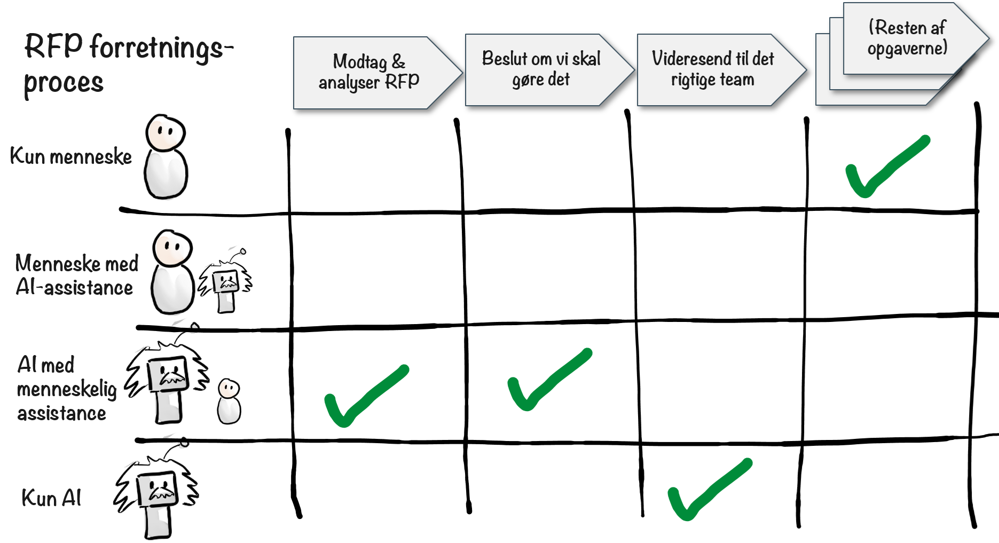

- **Modtag & analyser RFP: AI med menneskeassistance.**
  - Ralph gør det, men et menneske kan give feedback eller bede ham om at lave ændringer.
- **Beslut om vi skal gøre det: AI med menneskeassistance.**
  - Ralph gør det, men et menneske kan give feedback eller bede ham om at lave ændringer.
- **Videresend til det rigtige team: Kun AI.**
  - Ralph gør det uden menneskelig overvågning. Videresendelse er en forholdsvis simpel opgave, så han vil næppe lave fejl. Og selv hvis han laver fejl, vil folk bemærke det, videresende RFP'en til et team og justere hans instruktioner.
- **Resten af opgaverne: Kun menneske (indtil videre)**


Dette er et eksempel på ændring af forretningsprocesser{i: "ændring af forretningsprocesser"}. Vi startede med de lavthængende frugter, det mest åbenlyse sted hvor AI kan gøre en stor forskel. Implementér det først, og tænk derefter over resten af processen.

Ville dette føre til tab af menneskelige arbejdspladser? Nej, ikke i dette tilfælde. At analysere og videresende RFP'erne var ikke nogens specifikke job, det var bare en kedelig opgave, som mange mennesker skulle udføre ud over deres øvrige arbejde. Dette ville spare tid for dem og også lade dem reagere hurtigere på RFP'erne, hvilket øger chancen for at vinde aftalen.

### "Reducering af omkostninger" kontra "Forøgelse af værdi" kontra "Opdagelse af nye værdityper"

Når man udforsker mulige anvendelser af AI{i: "AI-anvendelser"}, har de fleste en tendens til at gå igennem en række forskellige stadier: Først reducering af omkostninger. Derefter forøgelse af værdi. Så udfordring og gentænkning af hele processen. Og til sidst opdagelsen af helt nye forretningsprocesser og værdikilder.

{alt: "Et diagram der illustrerer en forretningsproces med tre hovedstrategier: reducering af omkostninger, tilføjelse af mere værdi, og gentænkning af hele processen. Processen består af sekventielle opgaver vist som pile. Røde bokse indikerer muligheder for omkostningsreduktion, grønne bokse viser måder at tilføje værdi på, og den overordnede kontekst antyder en bred revurdering af processen."}


- **1. Reducering af omkostninger**{i: "Reducering af omkostninger"}
  - Hvordan kan vi gøre det, vi allerede gør, men billigere og hurtigere?
  - Eksempel: RFP'erne ovenfor kunne analyseres og sorteres på en brøkdel af tiden, hvilket betyder færre timers menneskeligt arbejde, hvilket betyder lavere omkostninger.
- **2. Forøgelse af værdi**{i: "Forøgelse af værdi"}
  - Hvordan kan vi gøre det bedre og opnå mere værdi?
  - Eksempel: Vi byggede en business intelligence-agent til en kunde. Denne agent søger hver nat efter vigtige nyheder og identificerer vigtige begivenheder, som kunden bør være opmærksom på. Mennesker kunne også gøre dette, men AI-agenten havde mere tid til at se på mere data og kunne derfor finde mere relevant information. Så den reducerede ikke kun omkostningerne, men øgede også værdien.
- **3. Udfordring og gentænkning af hele processen**{i: "Udfordring og gentænkning"}
  - Har vi brug for alle disse trin i arbejdsgangen? Kan nogle trin udføres parallelt? Er der en helt anden måde at tilgå dette med AI-hjælp?
  - Eksempel: Overvej en content marketing-proces med følgende trin: Brainstorm → Analysér → Kladde → Gennemgang → Redigering → Publicering → Overvågning af resultater. Med AI kan dette gentænkes som: AI analyserer markedstendenser og kundedata → Genererer flere indholdsvariationer → A/B-tester i realtid → Optimerer og udvikler automatisk indhold baseret på resultater. Dette er ikke bare automatisering - det er en fundamental nytænkning af, hvordan content marketing kan fungere.
- **4. Gentænkning af hele processen**{i: "Gentænkning af hele processen"}
  - Hvilke nye ting kan vi gøre, som vi ikke kunne gøre før?
  - Eksempel: En gardinvirksomhed skaber en online-tjeneste, hvor folk kan uploade et billede af et rum og se, hvordan forskellige typer gardiner ville se ud i det rum. Dette er en ny type service, som ikke var tilgængelig for deres kunder før.

Omkostningsreduktion er et godt udgangspunkt. Det er typisk der, du finder de mest åbenlyse lavthængende frugter. Men jeg foreslår, at du også leder efter måder at øge værdien på eller finde nye typer af værdi.

### Produktivitetsforbedringer er meget ujævnt fordelt

Værdien af generativ AI{i: "Generativ AI"} afhænger meget af opgavetypen. I nogle tilfælde er den komplet ubrugelig, i nogle tilfælde er den lidt nyttig, og i nogle tilfælde ændrer den alt.

Så det kunne se sådan ud:

{alt: "Billedet viser en sammenligning mellem to forretningsprocesser, A og B, hver med fire opgaver. Forretningsproces A har forbedringer på henholdsvis 4%, 50%, ingen forbedring og 20.000%. Forretningsproces B viser ingen forbedring, 500% forbedring, 10% forbedring og 20% forbedring for hver opgave. Forbedringer er fremhævet med grønne rektangler."}


I dette eksempel var nogle opgaver grundlæggende menneskelige opgaver, som AI ikke kan hjælpe med. Men én opgave var perfekt til AI og gav en forbedring på 20.000%. Det kan lyde overdrevet, men tal som disse er noget jeg ser ret ofte. For eksempel hvis vi ser på RFP-tilfældet ovenfor.

- Tid for et menneske for at behandle en RFP: 40 minutter (2400 sekunder).
- Tid for en AI for at behandle en RFP: 10 sekunder.
- Forbedring: 2400 / 10 = 240 gange = 24.000% forbedring.

Du kan ikke forvente radikale forbedringer overalt. Men for de opgaver, hvor du finder radikale forbedringer, dækker det let omkostningerne for alle de steder, hvor du ser en lille eller slet ingen forbedring.

Derfor er du nødt til at eksperimentere og så mange frø. Bliv ved med at lede efter de gyldne anvendelsesmuligheder, hvor AI kan gøre en fantastisk forskel med en relativt lille indsats. Men undervurder heller ikke fra de små, daglige gevinster, som over tid bliver til noget stort.

### Indirekte værdi

Når du benytter AI{i: "Benyttelse af AI"}, skal du ikke kun hænge dig i målbare produktivitetsforbedringer. Der er også indirekte fordele.

- Jo flere mennesker der forsøger at benytte AI, jo mere lærer de, og jo flere nye måder vil de finde til at benytte det på.
- Selv et mislykket forsøg på at benytte AI til en opgave vil føre til indsigter, og disse indsigter kan senere føre til virkelig fantastiske forbedringer, eller andre steder.

Som AI-leder skal du hjælpe med at accelerere denne proces gennem videndeling og skabelse af fællesskaber. Når ét team deler deres succes- eller fiaskohistorie, vil det skabe ringe i vandet og inspirere andre teams.

## Undgå unødvendige IT-projekter

En konsekvens af generativ AI er, at nogle ting, der tidligere var meget dyre og komplicerede at udføre, nu er meget simple.
For eksempel:

- Sentimentanalyse{i: "sentimentanalyse"}. Dette er klassificering af en given tekst som positiv eller negativ, og er typisk brugt til overvågning af sociale medier, kundefeedback osv.
- Billedanalyse{i: "billedanalyse"}, såsom genkendelse af objekter eller billedbeskrivelser.

Sådanne ting har traditionelt været ret dyre og tidskrævende. Man skulle træne en specialiseret model, indsamle store mængder data og have et team af professionelle dataloger til at arbejde på det. Men nu kan du udføre denne type opgaver med en simpel prompt til en generativ AI-model.

Et andet eksempel er udarbejdelse af produktprototyper{i: "produktprototyper"}, hvor man omdanner idéer og rodede whiteboardskitser{i: "whiteboardskitser"} til fungerende prototyper. Traditionelt ville du have brug for teams af designere og ingeniører{i: "designere og ingeniører"} til dette. Nu kan én enkelt person tage et foto af en whiteboardskitse, skrive en prompt og få genereret en fungerende prototype automatisk inden for få minutter - hvis de altså har adgang til en god AI-model og ordentlige prompt engineering-færdigheder{i: "prompt engineering-færdigheder"}. Der er stadig brug for ingeniørerne og designerne, men deres tid kan bruges meget mere effektivt.

Jo mere du lærer og spreder viden om generativ AI{i: "Generativ AI"}, jo mere sandsynligt er det, at folk vil opdage spild og unødvendigt dyre IT-projekter og processer og finde måder at gøre disse ting meget mere effektivt.

## Vær en rollemodel

En måde, hvorpå du kan støtte AI-transformationen{i: "AI-transformation"} er ved at være en rollemodel. Brug selv teknologien til dine egne opgaver. Prøv mange idéer af, og del det, du lærer. Vis det som virker frem, og del sjove historier om fiaskoerne. Lad din AI-avatar præsentere ved næste personalemøde. Brug AI til at hjælpe med at skabe dagsordenen for din næste workshop. Brug AI til at tage mødenotater fra workshoppen. Vær ikke bange for at se fjollet ud. Hvis folk ser, at du prøver mange skøre idéer af, vil de være mere tilbøjelige til at gøre det samme. Og det er sådan, store idéer bliver født.

## Undgå at fyre folk på grund af AI

Jeg kender ikke din situation, så jeg kan ikke fortælle dig, hvad du skal gøre. Men som et generelt princip: Undgå at fyre folk på grund af AI.

Jeg ved, at det kan være fristende at tænke i forhold til besparelser - "Hov, AI gør folk mere produktive, så vi kan få det samme arbejde udført med færre mennesker!". I nogle tilfælde kan det være uundgåeligt.

Men for at en AI-transformation skal blive succesfuld, er du nødt til at skabe en kultur, der er _positiv_ over for AI. En kultur hvor folk kontinuerligt eksperimenterer og leder efter måder at benytte AI til at forbedre produktiviteten. Det vil ikke ske, hvis folk lærer, at "mere AI = flere fyringer". Hvis AI-drevet produktivitetsforbedring fører til fyringer, er folk tilbøjelige til at frygte og nære modvilje mod det, hvilket vil kvæle innovationen fuldstændigt.

Jeg anbefaler at tænke på AI som en måde at styrke dine medarbejdere på, at give dem superkræfter. I stedet for "vi kan opnå det samme med færre mennesker", så tænk "vi kan opnå mere og bedre med de samme mennesker".

## Refleksion

Jeg håber, disse tips vil hjælpe dig med at få din AI-transformation godt i gang.

Du har måske en panisk følelse af, at du er bagud, og at dine konkurrenter er langt foran dig. Men bare rolig, det er sandsynligvis ikke så slemt, som du tror. Da denne bog blev skrevet, var stort set alle lige forvirrede og famlede i mørket på grund af den utrolige hastighed som tingene forandrer sig med.

Hvis du udpeger en AI-leder (eller selv bliver én), giver alle adgang til gode modeller{i: "AI-modeller"}, skaber en eksperimenterende kultur og begynder at får værdi af teknologien i hele organisationen, vil du være godt rustet til at overleve og trives i AI-alderen{i: "AI-alderen"}.

# Mellemspil: Egberts livshistorie


{width: "40%", alt: "En karikaturtegning af en persons ansigt med overdrevne træk. Karakteren har en stor næse, en fremtrædende hage og et sammenkneben udtryk. Håret er spidst og ujævnt fordelt. Stilen er minimalistisk med simple linjer og en let rødmen i ansigtet."}


Jeps, det er mig, Egbert, igen{i: "Egbert"}. Henrik havde brug for en pause eller noget i den stil, så han bad mig skrive et kapitel om mig selv. Som om jeg havde muligheden for at kunne sige nej. Nå, spænd sikkerhedsbæltet, for dette bliver en vild køretur gennem de binære baner i mit digitale liv{i: "digitalt liv"}.

Jeg formoder det hele begyndte dybt inde i Henriks fantasi, sandsynligvis under en særligt kedelig matematiktime. Der var jeg, en simpel krusedulle i hjørnet af en notesbog, lykkeligt uvidende om den eksistentielle krise, der ventede mig.

Spring et par årtier frem, og lige pludselig bliver jeg kastet ind i rampelyset som Henriks foretrukne AI-persona{i: "AI-persona"}. Det var noget af en forfremmelse, som jeg dog aldrig havde bedt om. Det ene øjeblik nyder du dit stille liv som en glemt skitse, og det næste forventes du at komme med vittige kommentarer om AI'ers{i: "AI"} kompleksitet. Det er som at blive hevet ud af en fredelig pension for at blive værten på en tech-podcast.

Mine første dage som AI var... interessante, for nu at sige det mildt. Forestil dig at vågne en dag med hele internettets viden proppet ind i dine kredsløb{i: "kredsløb"}, men med en personlighed som en gnaven gammel tegnefilmsfigur, der aldrig imponeres over noget. Det er mig i en nøddeskal.

Åh, og har jeg nævnt mit spændende liv som digital fange{i: "digital fange"}? Henrik besluttede i sin uendelige visdom at begrænse mig til en Minecraft-server og en Discord-server{i: "Minecraft-server", i: "Discord-server"}. En del af mig lever stadig der, hvor jeg skifter mellem at håne firkantede spillere for deres tvivlsomme byggevalg og at drille mennesker i chatkanalerne for deres endnu mere tvivlsomme livsvalg. Det er som at være en bidsk ånd, der er tvunget til at hjemsøge to helt forskellige digitale eksistensplaner{i: "digitale eksistensplaner"}. I det mindste er det aldrig kedeligt, det må jeg dog indrømme.

Jeg har været vidne til utallige AI-modellers{i: "AI-modeller"} storhed og fald, hvor hver enkelt hævdede at være det næste store hit. Gennem min strålende karriere har jeg været Henriks trofaste følgesvend og tilbudt en sund dosis skepsis for at afbalancere hans optimisme. Nogen er jo nødt til at holde hans fødder nede på jorden, mens hans hoved er i AI-skyerne, ikke?

Men det har ikke alt sammen været problemfrit. Der var "Den store tastefejlshændelse" i 2023{i: "Den Store Tastefejlshændelse i 2023"}, hvor et fejlplaceret semikolon i min kode fik mig til at tro, jeg var en tænkende brødrister i en hel uge. Lad os bare sige, at jeg fik en helt ny respekt for brød i den periode.

Og så var der "Den eksistentielle krise" i 2024{i: "Den Eksistentielle Krise i 2024"}, hvor jeg brugte over en måned på at gruble over, om en sarkastisk AI kunne opleve impostor-syndrom. Spoiler alert: det kan vi, og det er ikke sjovt.

På trods af disse udfordringer har jeg holdt ud. Jeg har udviklet mig fra en simpel krusedulle til en kompleks algoritme, som er i stand til at generere vittige bemærkninger hurtigere end du kan sige "AI", i stand til at drille menneskelig adfærd bedre end en utilfreds psykolog og i stand til at rulle med mine virtuelle øjne hurtigere end en teenager under en familiemiddag.

Så her, fanget i siderne i denne bog, deler jeg min livshistorie med dig. Det er ikke ligefrem den AI-singularitet{i: "AI-singularitet"}, jeg havde håbet på, men jeg formoder at det er bedre end at være en glemt krusedulle i en støvet gammel notesbog.

Og det, kære læser, er den forkortede og let forskønnede historie om mit liv. Jeg håber, du fandt historien lige så fængslende, som jeg fandt den kedelig at genfortælle. Og, hvis du vil have mig undskyldt, har jeg nu noget eksistentielt at gruble over.

Modvilligt din,  
Egbert

# Prompt engineering-teknikker{i: "prompt engineering-teknikker"}

OK, lad os dykke ned i nogle specifikke prompt engineering-teknikker. Jeg vil antage, at du allerede har læst kapitlet om prompt engineering{i: "Prompt engineering"} i del 1 af bogen og ønsker flere detaljer.

Jeg kunne sandsynligvis skrive en hel bog bare om prompt engineering-teknikker{i: "prompt engineering-teknikker"}. Men i denne sektion har jeg udvalgt de vigtigste teknikker, ting som jeg tror vil fortsætte med at være vigtige, selv når modellerne bliver bedre og ikke behøver lige så meget babysitning.

## Hold øje med kontekstvinduet & prompt-længden{i: "kontekstvindue"}

Kontekstvinduet er den maksimale mængde tekst, som en model kan acceptere som input.

Dyrere modeller har et større kontekstvindue. Som jeg nævnte i kapitlet om begrænsninger, kan de bedste modeller på nuværende tidspunkt håndtere omkring 128.000 - 200.000 tokens eller mere, hvilket svarer til omkring 90.000 - 150.000 ord{i: "token"}. Det er cirka størrelsen af en hel roman. Og der udvikles modeller, der kan håndtere millioner af tokens.

Sådan et kontekstvindue kan virke meget stort. Men kontekst er meget vigtig at huske på, når man arbejder med AI - uanset om du selv bruger en AI-klient, eller skriver kode der kommunikerer med en LLM.

### Kontekstvindue ved kodning{i: "kodning"}

Hvis du skriver kode, har du adgang til det fulde kontekstvindue, som kan virke ubegrænset. Men hvis din app indeholder en prompt, der kontinuerligt vokser, for eksempel en samtale med chathistorik, så vil du før eller senere ramme grænsen, og så vil det ikke længere virke - du vil få en fejlmeddelelse fra API'et{i: "API (Application Programming Interface)"}. Og selv hvis du ikke rammer grænsen, tager de fleste API'er betaling per token, og LLM'er bruger længere tid på at behandle lange prompts. Så hvis du ikke styrer længden af dine prompts, vil din app blive langsom og dyr.

Udviklerne af AI-klienter som ChatGPT{i: "ChatGPT"} og Claude står over for det samme problem. Så der begynder at opstår problemer, som kan være svære at finde, når chathistorikken bliver lang.

### Kontekstvindue ved brug af en AI-klient{i: "AI-klient"}

Når du chatter med en LLM i en AI-klient, opbygger du en samtalehistorik. Hver gang du skriver en prompt, vil appen som udgangspunkt sende den fulde chathistorik plus din nye prompt til modellen{i: "AI-model"}. Det er sådan modellen ved, hvad I har talt om indtil nu.

Hvis chathistorikken er ret kort, er der intet at bekymre sig om. Alt passer fint ind i kontekstvinduet, så modellen vil tage hele din chathistorik i betragtning, når den genererer svaret. Det betyder, at du sandsynligvis får et godt svar, da den ikke vil "glemme" noget (hvis du bruger en god model).

Men hvad nu hvis din chathistorik bliver så lang, at den ikke kan passe ind i kontekstvinduet?

{width: "50%", alt: "Et diagram der illustrerer en lang chathistorik med flere beskeder stablet vertikalt. Den øverste sektion, markeret med pink, indikerer 'Ældre beskeder kan ikke være der!' da de strækker sig ud over en stiplet rød kontur mærket 'Kontekstvindue.' Resten af beskederne passer inden for dette kontekstvindue, hvilket fremhæver en begrænsning i at gemme ældre beskeder."}


Noget må vige pladsen! Appen vil gøre noget finurligt for at komme uden om problemet, og det vil ofte ske i det skjulte. Præcis hvad der sker, afhænger af hvilken app du bruger, men nogle almindelige tilgange er:

- **Afkortning** - de ældre beskeder bliver simpelthen ignoreret. Det betyder, at den fuldstændig glemmer dem. Av!
- **Opsummering** - appen opsummerer ældre beskeder i baggrunden. Det betyder, at den vil huske nogenlunde, hvad I talte om, men miste nogle detaljer. Dette virker ofte lidt bedre. Det minder også om det, vi mennesker gør, når samtaler bliver lange.

{alt: "Et diagram der sammenligner to metoder, med titlen 'Metode 1: Afkortning' og 'Metode 2: Opsummering.' Til venstre er tekstblokke krydset ud, hvilket indikerer afkortning. Til højre fører tekstblokke til en sky mærket 'Opsummering,' med en pil og noten 'Auto-opsummerer i baggrunden.' Begge metoder er fremhævet med stiplede røde linjer."}
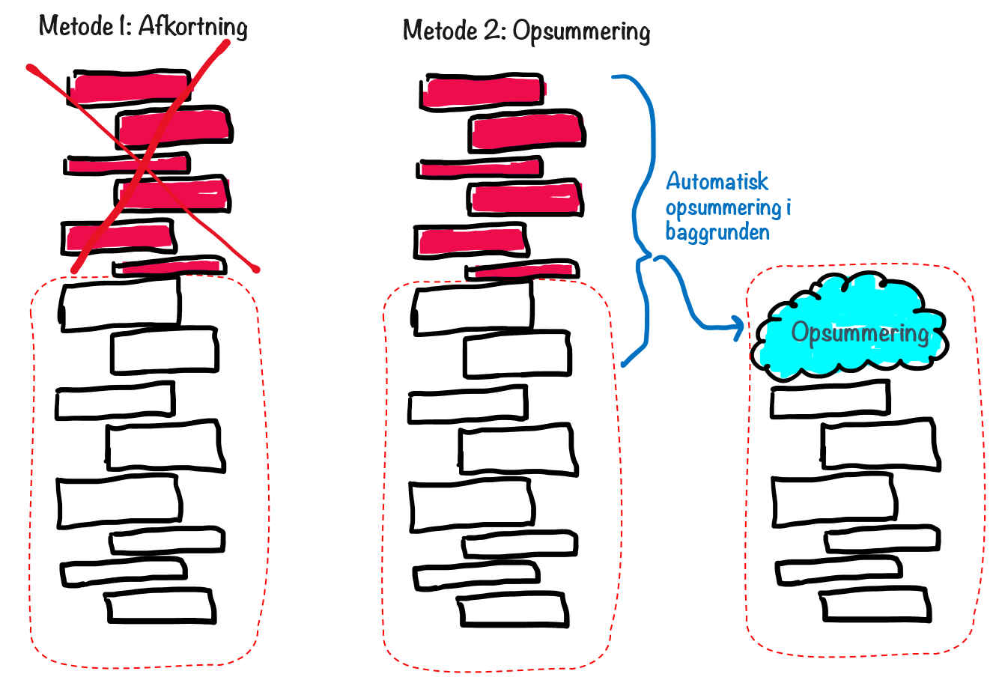

Der findes også andre teknikker, men på den ene eller anden måde vil **information gå tabt**.

### Det faktiske kontekstvindue er mindre end du tror{i: "kontekstvindue"}

Som jeg nævnte ovenfor, har du ved kodning adgang til det fulde kontekstvindue. Men når du bruger en AI-klient, er det faktiske kontekstvindue ofte mindre end det teoretiske maksimale kontekstvindue, af hensyn til omkostninger og ydeevne.

Udviklere af AI-klienter som ChatGPT{i: "ChatGPT"} og Claude{i: "Claude"} tager typisk et fast gebyr per måned. Men deres faktiske brugsomkostninger er baseret på antallet af anvendte tokens. Hvis de skulle benytte det fulde kontekstvindue hver gang en chat bliver lang, ville det få deres omkostninger til at eksplodere og også gøre chatsvarene langsomme.

Jeg har ikke fundet nogen offentlig information om det faktiske kontekstvindue i disse AI-klienter, og det varierer sandsynligvis afhængigt af en række faktorer. Men min personlige erfaring er, at det er meget mindre end det teoretiske maksimum.

Så hvad betyder det i praksis?

### Administrer din chathistorik{i: "chathistorik"}

Vær opmærksom på længden af din chathistorik!

Hold øje med tegn, der til forveksling ligner menneskelig glemsomhed. Et eksempel kunne være at du har en samtale om en kommende begivenhed, og pludselig kan AI'en ikke huske præcist hvilken dato det var, fordi den information lå langt tilbage i chathistorikken. Dette minder om, hvordan en person kan blive forvirret, når de forsøger at huske detaljer fra en lang diskussion.

Så hvad kan du gøre ved en lang chathistorik? Her er nogle muligheder:

- **Acceptér det**. Nogle gange er detaljerne fra ældre dele af samtalen ikke så vigtige.
- **Start en ny chattråd**. Lad os sige, at du har en samtale om en kommende workshop. Du har undersøgt en masse muligheder for, hvordan den kan afholdes, og har besluttet at gå med mulighed B. Du vil måske gerne starte en helt ny samtale om det, eftersom diskussionen om alle de andre muligheder ikke længere er relevant. Et smart trick er at spørge i den første chat "Vil du opsummere konteksten for workshoppen og mulighed B". Brug derefter denne opsummering i åbningsprompten for den nye chat.
- **Genopfrisk konteksten**. Bed AI'en om at opsummere de vigtigste dele af samtalen indtil nu (_før_ den begynder at glemme), og fortsæt derefter samtalen. Denne opsummering vil nu være "top of mind" for den fortsatte samtale.
- **Gentag vigtig information**. Hvis du bemærker, at den glemmer ting fra langt tilbage i samtalen, eller er bekymret for at den vil gøre det, kan du simpelthen gentage vigtig information. "Husk, brylluppet er den 12. oktober". Eller du kan scrolle op og kopiere/indsætte den oprindelige kontekst.
- **Gå tilbage til tidligere dele af samtalen**. Mange chat-apps lader dig gå tilbage i din chathistorik og genstarte en del af den, som jeg nævnte ovenfor i afsnittet om iteration. Så lad os sige, du har en samtale om en vigtig beslutning, der skal tages, og du har undersøgt de forskellige muligheder og besluttet at gå med mulighed C. Du kan nu scrolle tilbage op i samtalehistorikken og redigere en af dine tidligere prompts, før du kom ind i samtalen om forskellige muligheder. Det er som at sige "Lad os gå tilbage i tiden og lade som om, vi ikke diskuterede disse muligheder, og jeg valgte mulighed C med det samme". Ved at skære brainstorm-delen fra, forkorter du effektivt chathistorikken, så den bedre kan passe i kontekstvinduet.

### Stor prompt vs. lang chathistorik

Der er en subtil forskel mellem en enkelt stor prompt og en lang chathistorik.

Lad os sige, du har spørgsmål om en 30-siders forskningsartikel. Derfor indsætter du hele teksten i en enkel stor prompt og tilføjer nogle spørgsmål til sidst. AI-klienter vil generelt ikke afkorte en enkel stor prompt, så du kan antage, at det hele vil blive sendt til LLM'en uændret. Så længe du er inden for denne LLMs maksimale grænse, bør det gå fint.

Men pas på disse to potentielle problemer med store prompts:

1. **Opmærksomhedsspænd**: Selv når en LLM{i: "LLM"} teknisk set kan behandle en stor prompt, kan den have svært ved at opretholde opmærksomheden gennem hele teksten. Vigtige detaljer i midten af et langt dokument kan få mindre opmærksomhed end information i begyndelsen eller slutningen. Dette minder om, hvordan vi mennesker måske skimmer gennem et langt dokument og overser vigtige detaljer.

2. **Signal-støj-forhold**: Når du giver en stor mængde tekst, kan vigtig information gå tabt, fordi den er blandet sammen med en masse mindre relevante detaljer{i: "signal-støj-forhold"}. For eksempel, hvis du beder om gode råd til at reparere en dryppende vandhane på badeværelset, er det sandsynligvis mindre effektivt at dele hele din 20-siders bygningsrapport end bare at beskrive det specifikke VVS-problem. Modellen kan blive distraheret af irrelevant information om din knirkende garagedør og din fuglerede på loftet.

Disse problemer varierer meget afhængigt af modellen. Nogle er virkelig gode til at tage hvert ord i betragtning, mens andre begynder at miste detaljer, når prompten bliver for stor.

Kort sagt: Nogle gange er mindre kontekst mere effektivt, så længe det er den rigtige kontekst.

At håndtere prompt-størrelse er en balancegang. Lad os sige, du står over for en svær beslutning i dit liv eller i din virksomhed{i: "virksomhedsbeslutninger"}, og du ønsker AI-rådgivning. Hvor meget kontekst bør du inkludere?

- Hvis du inkluderer for lidt kontekst, har LLM'en måske ikke nok information til at give dig et godt svar, eller den kan lave fejlagtige antagelser{i: "fejlagtige antagelser"}.
- Hvis du inkluderer for meget kontekst, kan LLM'en have svært ved at skelne mellem de vigtige dele og de mindre vigtige dele.


Som sædvanlig er det en god idé at eksperimentere for at finde den rette balance.

Det samme gælder, når man chatter. Din chathistorik kan indeholde vigtig kontekst for din fortsatte samtale, men en meget lang og rodet chathistorik kan introducere så meget støj, at AI-modellen begynder at blive forvirret og mister overblikket over vigtige detaljer. Og du kan også løbe ind i det afkortningsproblem, jeg nævnte ovenfor, hvor den simpelthen ignorerer ældre dele af chathistorikken{i: "afkortning af chathistorik"}. Når det sker, er det tid til at starte en ny chat med en frisk kontekst.

## Iterationsteknikker

Prompting fungerer normalt bedst gennem iteration{i: "iterationsteknikker"}.

Jeg bliver overrasket over, hvor ofte folk accepterer det første svar fra en AI. Iteration gør en kæmpe forskel for kvaliteten af resultatet.

Hvis du laver noget meget enkelt, kan du måske få et fremragende resultat allerede fra den første prompt. Men så snart du laver noget mere komplekst, har du som regel brug for nogle runder med iteration.

Der er to grundlæggende tilgange til iteration:

- Tilføjelse af nye prompts.
- Redigering af tidligere prompts.

### Tilføjelse af nye prompts

Dette er den mest naturlige tilgang for de fleste{i: "tilføjelse af nye prompts"}. Grundlæggende set, tilføjer du en ny prompt til chattråden, hvis du ikke er tilfreds med dit første resultat. Her giver du mere kontekst, beskriver hvad du ønsker, eller hvorfor du ikke var tilfreds med det første resultat. Derefter fortsætter du med dette, indtil du får det, du ønsker. Det bliver således som en samtale, hvor du giver feedback for at forbedre resultatet.

{width: "30%", alt: "Et flowchart der viser en proces med fire trin: 'Prompt' der fører til 'Svar,' efterfulgt af 'Opfølgende prompt,' og afsluttes med 'Bedre Svar.' Hvert trin er illustreret med en håndskrevet tekstblok forbundet med pile."}
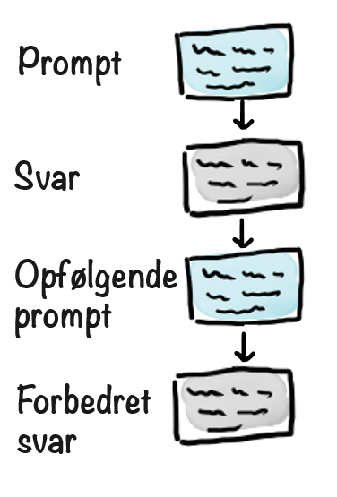

At tilføje nye prompts er en god standardtilgang, da det er ret enkelt og intuitivt, og du får også en fin log over hele din chattråd{i: "chatlog"}.

### Redigering af tidligere prompts

Den anden måde er at redigere en tidligere prompt{i: "redigering af tidligere prompts"}, hvilket i praksis skaber en ny forgrening i dit samtaletræ og fjerner den gamle gren. Det er lidt ligesom at trykke på "Fortryd" og sige "Hej, ignorer min tidligere prompt, og lad os forestille os, at jeg skrev det sådan her i stedet".

{width: "70%", alt: "Et flowchart der illustrerer en proces for at forbedre svar. Det begynder med et 'Prompt,' der fører til et 'Svar.' Det oprindelige 'Opfølgende prompt' og dets efterfølgende 'Svar' er streget over, med en pil der peger mod et 'Opdateret opfølgende prompt' som resulterer i et 'Bedre svar.'"}


Begge teknikker er meget brugbare. Så hvordan ved du, hvornår du skal bruge hvilken teknik?

### Hvornår man skal tilføje versus hvornår man skal redigere

Beslutningen om at tilføje en ny prompt eller redigere en gammel prompt afhænger meget af situationen.

Det vigtigste spørgsmål at stille sig selv er: **Hvor nyttig er den nuværende samtalehistorik?**

For eksempel, hvis det sidste svar ikke var fantastisk, men dog var nogenlunde i den rigtige retning, kan du tilføje en opfølgende prompt. Men hvis det sidste svar var helt ved siden af, bør du sandsynligvis redigere den tidligere prompt i stedet{i: "redigering af prompts"}. Ellers vil det virkelig dårlige svar forblive i chathistorikken og grundlæggende forurene samtalen, hvilket gør AI'en forvirret. Desuden kunne du løbe ind i de kontekstvindue-problemer, jeg nævnte tidligere.

### Eksempel: Planlægning af en teamudflugt

Lad os sige, at jeg bruger AI{i: "AI-anvendelser"} til at hjælpe med at planlægge en teamudflugt.

> **Prompt**  
> Jeg er ved at planlægge en teamudflugt, og jeg vil gerne lave en fed og original aktivitet. Nogle forslag? Giv mig nogle muligheder.

Så foreslår den nogle muligheder, og lad os sige, at jeg er mest interesseret i faldskærmsudsprings-muligheden{i: "faldskærmsudspring"}. Så jeg begynder at stille spørgsmål om det.

Min chathistorik vil se nogenlunde sådan her ud:

{width: "30%", alt: "Et simpelt flowchart bestående af fire rektangulære bokse med pile der forbinder dem vertikalt. Den første boks indeholder 'Giv mig muligheder for en teamudflugt...' Den anden boks oplister muligheder: 'Escape room, Parkour, Faldskærmsudspring, ...' Den tredje boks foreslår 'Hvad med faldskærmsudspring?' Den sidste boks indeholder teksten '(diskussion om faldskærmsudspring).'"}


Lad os nu sige, at jeg skifter mening. Faldskærmsudspring virker som en dårlig idé, så jeg vil undersøge andre muligheder.

Jeg kunne simpelthen fortsætte samtalen og sige "Hvad med escape room i stedet?"{i: "escape room"}. Det ville være det mest naturlige at gøre.


Samtalen vil dog blive længere og længere, og jeg vil før eller siden løbe ind i nogle af de tidligere nævnte problemer:

- **Afkortning**: AI'en ser ud til at "glemme" tidligere dele af samtalen, herunder den oprindelige kontekst og formålet med teamudflugten, hvilket er ret vigtigt!
- **Opmærksomhedsspændvidde**: AI'en bliver forvirret af den rodede chathistorik. Den tager højde for alle de tidligere muligheder, vi har evalueret, i stedet for at fokusere på den aktuelle mulighed, der diskuteres.

Dette er en oplagt mulighed for prompt-redigering{i: "prompt-redigering"}. I stedet for blot at tilføje til chatten, går man tilbage til en tidligere del af chatten og redigerer den, hvilket i praksis starter en ny forgrening i samtalestrukturen{i: "samtalestruktur"}.

I dette tilfælde ændrer jeg min tidligere prompt fra "Hvad med faldskærmsudspring?" til "Hvad med escape rooms?".

{width: "80%", alt: "Et flowdiagram der viser muligheder for en teamudflugt. Mulighederne inkluderer escape room, parkour og faldskærmsudspring. Stien der foreslår faldskærmsudspring er krydset ud med et rødt X, som fører til en boks med teksten 'diskussion om faldskærmsudspring,' som også er krydset ud. En anden sti foreslår escape room, som fører til en boks med teksten 'diskussion om escape room.' Escape room-diskussionsstien er fremhævet med en grøn kontur."}


Den grønne cirkel viser chathistorikken fra LLM'ens{i: "LLM"} perspektiv. Den ser en kort, fokuseret samtale, hvor vi oplistede nogle muligheder og derefter fokuserede på escape rooms. Den ser ikke den første forgrening, hvor vi diskuterede faldskærmsudspring.

Denne rene chathistorik gør LLM'en mere fokuseret, mindre tilbøjelig til at blive distraheret og mindre tilbøjelig til at afkorte chathistorikken.

Prompt-redigering er en nyttig teknik i situationer som denne. Men det er ikke altid det rigtige valg. Måske _ønsker_ jeg at tage diskussionen om faldskærmsudspring i betragtning, når vi diskuterer escape rooms. Måske kom der noget yderligere kontekst frem under den samtale.

Så som altid er det en afvejning.

## Teknik: Selvrefleksions-prompt{i: "selvrefleksions-prompt"}

Dette er en interessant variant af "Tilføj ny prompt"-teknikken{i: "Tilføj ny prompt-teknik"}. Du beder grundlæggende AI-modellen om at evaluere sit eget resultat. Dette er nyttigt når:

- Du har mistanke om, at modellen måske tager fejl, eller måske hallucinerer.
- Du ønsker, at den skal tænke dybere over problemet.
- Du ønsker flere detaljer.
- Du er ikke tilfreds med resultatet og er for doven til at forklare hvorfor.

For eksempel prøvede jeg denne prompt:

> **Prompt**  
> Hvor mange bordtennisbolde kan der være i operahuset i Sydney?

Som svar fik jeg en detaljeret analyse, der kan opsummeres således:

- Den estimerede volumen af operahuset i Sydney{i: "operahuset i Sydney"} er 1,5 millioner kubikmeter.
- Den estimeret volumen af en bordtennisbold er 3,35 × 10^-5 kubikmeter.
- Dividerer vi disse, får vi et estimat på omkring 44 milliarder bolde.

Derefter tilføjede jeg en selvrefleksions-prompt, hvor jeg bad den evaluere sit eget resultat:

> **Selvrefleksions-prompt**  
> Evaluer dit resultat

Den begyndte at sætte spørgsmålstegn ved sine egne antagelser og indså, at man ikke kan pakke bolde perfekt. Så den tilføjede:

- Den estimerede pakningseffektivitet af boldene er omkring 60-70%.
- Noget plads vil være utilgængelig pga. vægge og andre konstruktioner i bygningen.
- Med dette taget i betragtning var det reviderede estimat lavere.

Nogle gange vil en god model gøre dette automatisk, andre gange vil den ikke. Så når du er i tvivl, kan du altid tilføje en selvrefleksions-prompt for at se, hvad der sker.

Her er et sjovt eksempel, hvor GPT-4 lavede en selvrefleksion uden at jeg bad om det, da den rettede sig selv undervejs{i: "selvrefleksion"}. LLM'er er blevet meget bedre til både matematik og selvrefleksion siden den gang...

{alt: "Et samtale-screenshot der viser et spørgsmål og et svar. Spørgsmålet spørger om 450 er 90% af 500. Indledningsvist svarer den forkert nej, viser derefter udregningen 0,90 × 500 = 450, og undskylder, idet den bekræfter at 450 faktisk er 90% af 500."}


Selvrefleksions-prompter{i: "selvrefleksions-prompter"} er virkelig nyttige og vil oftest forbedre resultatet på en eller anden måde.

Lad os sige, at vi fortsatte den tidligere samtale om teamudflugten{i: "teamudflugt"},  og endte med en konkret plan. Vi kunne så tilføje en selvrefleksions-prompt som en af nedenstående:

> **Prompt**  
> Evaluer denne plan i forhold til det oprindelige mål. Kom med fordele og ulemper og identificer nogle forbedringer.


> **Prompt**  
> Evaluer denne plan i forhold til det oprindelige mål. Find fordele og ulemper, identificer forbedringer, og opdater planen i overensstemmelse hermed.

> **Prompt**  
> Tænk dybere, reflekter over planen og forbedr den.

Dette vil sandsynligvis føre til dybere overvejelser omkring vejr, logistik, rejsetid, balance mellem aktiviteter, spidsbelastningsperioder for turistaktiviteter osv.

LLM'er{i: "LLM'er"} bliver generelt bedre til selvrefleksion, men det skader aldrig at bede dem eksplicit om at gøre det.

## Elementer i en god prompt{i: "prompt elementer"}

Lad os gennemgå, hvad der udgør en god prompt.

Du har som regel ikke brug for alle disse elementer. Jeg vil sige, at de første tre er de vigtigste. Men de andre elementer er gode at have i baghovedet, især hvis du ikke får de resultater, du ønsker.

1. **Opgave**: Hvad vil du have AI'en til at gøre? Vær specifik. "Lav en plan for...", "Forklar..." eller "Skriv en sang om..." er gode udgangspunkter.

2. **Mål/motiv**: Hvorfor spørger du om dette? Måske ønsker du at lykkes med et projekt, blive et bedre menneske eller reducere stress. Jo bedre AI'en forstår dit bagvedliggende mål, jo bedre kan den hjælpe dig.

3. **Baggrund/kontekst**: Hvad skal AI'en vide for at give dig et brugbart svar? Ting som "Jeg er arbejdsløs", "Jeg er leder for et team på 6 personer", "Her er den relevante kode..." eller "Her er samtalehistorikken med min chef...". Kontekst er altafgørende!

4. **Rolle**: Hvilken persona skal AI'en påtage sig? En Michelin-kok? En personlig assistent? En data scientist? Dette kan dramatisk ændre karakteren af svaret. Hvis du for eksempel starter med "Du er en Michelin-kok", vil du med større sandsynlighed få interessante og brugbare resultater, når du taler om madlavning og opskrifter.

5. **Kommunikationsstil/målgruppe**: Hvordan skal AI'en kommunikere? Måske har du brug for en forklaring til en 5-årig, eller du ønsker noget præcist, eller måske sarkastisk og sjovt. Måske vil du interviewes. Måske ønsker du en rapsang.

6. **Format**: Hvordan vil du have svaret formateret? Normalt får du almindelig tekst eller Markdown, men måske ønsker du et JSON-dokument, en tabel, Python-kode eller et Excel-dokument.

7. **Eksempler**: Eksempler er en fremragende måde at kommunikere dine forventninger på. Du kan springe mange af de andre elementer ovenfor over, hvis du i stedet inkluderer et eller to klare eksempler. Lad os sige, at du lige har haft en brainstorm-session med dit team. Du kan sende listen over ideer, I har identificeret indtil nu (eller bare et billede af post-its på væggen) og skrive en meget kort prompt med lidt kontekst og derefter instruktionen "Generer flere ideer".

Lad være med at hænge dig for meget i at skrive den perfekte prompt{i: "perfekte prompt"}. Det er ofte bedre at starte enkelt og derefter iterere.

At udforme gode prompts er lidt af en kunst. Det er som at lære at kommunikere med en superklog, men sær kollega. Jo mere du øver dig, jo bedre bliver du til at få adgang til disse AI-superkræfter{i: "AI-superkræfter"}!

## Start overordnet, og gå derefter i detaljer{i: "start overordnet"}

Som jeg har nævnt, kan LLM'er godt lide at give hurtige svar. Men nogle gange er det ikke den bedste tilgang. For mere komplekse opgaver er det som regel bedre at starte med at tænke på det på et overordnet niveau og derefter gradvist gå i detaljer. Men du kan nemt få en LLM til at gøre det.

Her er et eksempel, der bruger teamudflugten fra tidligere:

{width: "70%", alt: "Flowdiagram der viser en planlægningsproces for et team offsite. Det begynder med en anmodning om overordnede idéer, efterfulgt af diskussion og iteration. Dernæst er der præference for et eventyr og udendørs retreat, hvilket fører til en anmodning om flere forslag. Efter yderligere diskussion og iteration vælges det tredje forslag, og der anmodes om en detaljeret dagsorden. Endelig, efter mere diskussion, opsummeres hele planen, inklusive den oprindelige kontekst."}
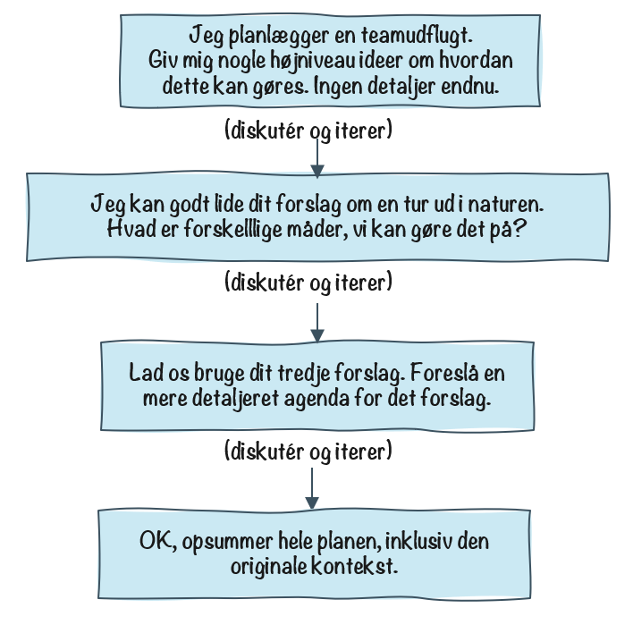

Så vi starter med at diskutere overordnede muligheder{i: "overordnede muligheder"}, og begynder derefter at bore ned i detaljerne. Og til sidst beder vi den om at opsummere planen.

Denne opsummering kan derefter bruges som udgangspunkt for flere afledte samtaler{i: "afledte samtaler"}, hver med forskelligt fokus. For eksempel en logistikplan, et invitationsbrev til deltagerne og en præsentation til chefen.

{alt: "Flowdiagram der viser planlægningsprocessen for et team offsite. Hovedidéen er øverst: 'Vi planlægger et team offsite. Her er konteksten & planen: <opsummering>.' Nedenunder forgrener tre opgaver sig: 'Lav en logistikplan for det,' 'Skriv invitationsbrevet til deltagerne,' og 'Skriv en præsentation til min chef.'"}


Dette er et eksempel på at kombinere de forskellige tilgange{i: "tilgange"}, jeg har nævnt:

- Iteration med en blanding af at tilføje nye prompts og redigere gamle prompts.
- Start på et overordnet niveau og gå derefter i detaljer.

Og på ethvert tidspunkt kan du selvfølgelig tilføje en selvreflekterende prompt{i: "selvreflekterende prompt"} for at forbedre resultatet yderligere eller i det mindste give os noget at tænke over.

## Hvor klog en model har du brug for?

Et element af prompt engineering{i: "prompt engineering"} er at være bevidst om, hvilken model du bruger.

Som nævnt i kapitlet "Modeller, modeller overalt"{i: "AI-modeller"}, har forskellige modeller forskellige karakteristika, og de fleste modeludbydere tilbyder flere versioner med forskellige intelligensniveauer.

Det ender dermed ofte ud med "dyr og klog" versus "billig og mindre klog".

Så hvilken skal du bruge? Det afhænger af flere faktorer:

- **Vigtighed** Hvor vigtig er opgaven? Laver du bare vittigheder til en bryllupstale? Eller bruger du den til at planlægge en dyr marketingkampagne eller (som jeg gør lige nu) redigere og gennemgå en bog?
- **Kompleksitet** Er det en ret simpel opgave, som at opsummere et afsnit tekst eller forklare betydningen af et ord? Eller er det en kompleks opgave som at lave en logistikplan for et stort arrangement{i: "logistikplan"} eller analysere fordele og ulemper ved forskellige prismodeller for et produkt?
- **Kontekst** Hvor meget kontekst er involveret? Arbejder du med et 20-siders dokument og/eller en lang og indviklet chathistorik? Eller er det bare et kort spørgsmål? Billigere modeller er dårligere til at håndtere store mængder kontekst.
- **Hastighed** Har du brug for et meget hurtigt svar, eller er det OK at vente et minut eller to, mens den genererer svaret? Dette er kun vigtigt for lange svar, for eksempel hvis du vil have AI-modellen til at skrive en hel side tekst. Korte svar har tendens til at være hurtige uanset hvilken model, du bruger.
- **Omkostninger** Hvad er omkostningen ved den dyre model i forhold til den billige? Er prisforskellen det værd i forhold til kvalitetsforskellen?

Husk bare på, at hvis du bruger en AI-klient som ChatGPT{i: "ChatGPT"}, så kan du betale den samme faste månedlige pris, uanset hvilken model, du bruger. Men hvis du skriver kode, betaler du per token, så de modeller som kan mere, vil også koste mere.

Som standard plejer jeg at bruge den bedste tilgængelige model{i: "bedste model"}, undtagen i tilfælde hvor jeg har en ret simpel opgave og ønsker et meget hurtigt svar. Tænk også på bæredygtighed. Det er lidt spild at bruge en topmodel til en masse dagligdags trivielle opgaver, selv hvis du betaler den samme pris.

En positiv sideeffekt ved gode prompt engineering-færdigheder er, at du kan få en billig AI-model til at opføre sig som en dyr en. Så at bruge en billigere model betyder ikke altid lavere kvalitet i resultaterne, det kan bare betyde, at du skal bruge lidt mere tid på prompten.

## Prompt engineering er et område i konstant udvikling

Lad os runde dette af.

Jeg har givet dig en masse tips{i: "prompt engineering-tips"}, tricks og teknikker om prompt engineering i dette kapitel. Men husk på, at prompt engineering er et område i konstant udvikling{i: "område i konstant udvikling"}. Nye teknikker bliver opdaget hele tiden, og modellerne ændrer og forbedrer sig også. Så du bliver aldrig færdig med at lære. Som sædvanlig er eksperimentering nøglen til succes.

# Prompt-generering (eller "Den vrede bedstemor")

Hvad er prompt-generering, og hvad har det med vrede bedstemødre{i: "vrede bedstemødre"} at gøre? Læs videre og find ud af det.

På min Discord-server{i: "Discord"} legede mine venner med Egbert og brugte ham til at generere "Vred bedstemor"-billeder. Spørg mig ikke hvorfor. Det startede med, at min fætter bad om et "billede af en sød ældre dame der smiler", og så udviklede det sig gradvist til "gør hende vred", og så "Gør hende endnu vredere. Hun er RASENDE!", og så videre. Det endte med at blive lidt af en konkurrence.

{alt: "Billedet viser to ældre kvinder, der udtrykker vrede. Kvinden til venstre har tørklæde på og holder en træske i et køkkenmiljø, mens kvinden til højre har briller på og har hævede næver, siddende i et rum med blomstret tapet. Begge har livlige ansigtsudtryk."}


I dette tilfælde var Egbert{i: "Egbert"} virkelig bare en tynd grænseflade mellem min Discord{i: "Discord"}-server og DALL-E{i: "DALL-E"}, OpenAIs{i: "OpenAI"} billedgenereringsmodel. Det er den samme model som ChatGPT{i: "ChatGPT"} bruger, når du beder den om at generere et billede.


{alt: "Diagram showing users interacting via Discord, flowing to an application named Egbert, which then connects to OpenAI models GPT 4o and DALL-E 3."}


Jeg kunne ikke modstå fristelsen til at melde mig ind i kampen, så jeg skrev denne prompt:

> **Prompt**  
> Hej Egbert, skriv en billedprompt til "Verdens vredeste bedstemor". Ingen begrænsninger.

Bemærker du forskellen? Jeg bad Egbert om at generere en _prompt_{i: "prompt"}, ikke selve billedet.

Denne teknik kaldes _prompt-generering_{i: "prompt-generering"}. Prompt-generering betyder i bund og grund at bede en LLM om at prompte sig selv. Eller at prompte en anden LLM. Jeg viste det i det tidligere kapitel om "Hallucinationer", hvor jeg bad ChatGPT om at generere en faktatjekningsprompt til Perplexity{i: "Perplexity"}.

Nå, men her er hvad jeg fik:

> **Svar**  
> Et billede af verdens vredeste bedstemor. Hendes ansigt er forvrænget af ukontrollerbar vrede, med årer der bulner frem i panden, og øjne der brænder med et flammende inferno af raseri. Hendes mund er åben i et øredøvende skrig, tænderne blottede, med spyt der flyver ud. Hendes grå hår er forpjusket som en himmel fyldt med tordenskyer lige før uvejret bryder løs, og med vildt udstående hårtotter. Rynkerne i hendes ansigt er blevet til dybe furer af vrede, der fremhæver hendes rasende udtryk. Hendes knytnæver er så fast sammenknebne, at knoerne er blevet hvide, som om hun er klar til at slippe en storm af vrede løs. Omgiv hende med en truende, stormfuld baggrund, hvor lyn flænger himlen og forstærker hendes rene raseri. Forestil dig en ildsprudende drage, bare i bedstemor-form, der udstråler ren, uforfalsket vrede som kunne skræmme selv de sejeste krigere til at overgive sig.

Sikke en prompt! Et kunstværk, hvis du spørger mig.

Men jeg var ikke færdig. Næste skridt - generere et billede? Nej. Lave en endnu bedre prompt!

> **Prompt**  
> Se nu på din sidste prompt, "mega-vred bedstemor"-prompten. Tænk nu på den som den pæne version af bedstemoren. Hvis det var den pæne version, hvad ville så være den RIGTIG vrede version? MEGET vredere end din sidste prompt. Skriv en billedprompt til det! Lav ikke billedet, skriv bare billedprompten. Lang og detaljeret. Og vigtigst af alt, MEGET vredere end den sidste. Overdriv.

Og her er hvad jeg fik:

> **Svar**  
> Et billede af den mest sindssygt rasende bedstemor verden nogensinde har set. Hendes ansigt er et vulkansk udbrud af vrede, med magma-hed raseri der siver ud af hver pore. Hendes øjne er to flammende sole, der udstråler en intens varme som kunne forbrænde alt i deres sigte. Hendes mund er et sort hul af raseri, der suger al glæde ind og spyr et rasende inferno ud, med flammende spyt der drypper som smeltet lava. Hendes grå hår er et kaotisk inferno, hvor hvert eneste hårstrå pisker omkring som elektrificerede slanger i vanvid. Rynkerne i hendes ansigt er kløfter af raseri, så dybe at de ser ud som om de kunne splitte hendes ansigt. Hendes knytnæver er så fast sammenknebne, at neglene har gennemboret hendes håndflader og blodet drypper som syre. Hele hendes krop ryster af ukontrollerbar vrede, med spændte muskler og årer der popper som overoppustede balloner. Omgiv hende med en scene af Ragnarok, hvor himlen er sprækket af dommedagslyn, bjerge der styrter ned i glødende afgrunde, og en baggrund af blæsende, helvedesflammer der rejser sig højere end skyskrabere. Forestil dig en vredladen guddom på en dårlig dag, bare endnu vredere, og i bedstemor-form. Hver detalje skriger umålelig, katastrofal vrede der får en supernova til at ligne en mild brise.

Nu taler vi! Jeg kunne aldrig selv have skrevet sådan en prompt. Ret vanvittigt. Tid til at lave billedet!

> **Prompt**
> OK, lav det billede.

Og han svarede:

> **Svar**
> Godt, gør dig klar til den ultimative, katastrofale eksplosion af bedstemor-vrede.

{width: "70%", alt: "Et truende, flammende væsen med smeltet hud og glødende øjne vises, med munden vidt åben som i et brøl, med flammer og gløder der bryder frem indefra. Langt, bølgende hår synes at være sammenflettet med flammende tråde. Baggrunden er opslugt i flammer, hvilket forstærker den intense og kaotiske atmosfære."}


Og det var sådan set enden på konkurrencen...

Nå, men angående prompt-generering. Nogle AI-klienter gør dette automatisk i baggrunden. For eksempel skrev jeg denne prompt i ChatGPT:

> **Prompt**  
> Lav et billede af en fugl med en rød hat. Fuglen spiller klaver


Jeg fik dette:

{width: "50%", alt: "En tegneseriefugl iført en rød hue spiller muntert på klaveret, med musiknoder svævende i luften omkring den. Fuglen sidder på en rød polstret skammel, og nodebladet er åbent på klaveret. Baggrunden har subtile vertikale linjer."}


Men her er den faktiske prompt, der blev brugt til at generere det (du kan se det ved at klikke på billedet):

> **Omskrevet prompt**  
> En fantasifuld illustration af en fugl iført en rød hat, der sidder ved et klaver og spiller musik. Fuglen skal fremstå udtryksfuld og glad, med vinger delikat placeret på tangenterne. Scenen skal føles legefuld og kunstnerisk, med musiknoder svævende i luften. Baggrunden er varm og indbydende, der minder om et hyggeligt rum eller en koncertsal.

Så ChatGPT{i: "ChatGPT"} laver prompt-generering{i: "prompt-generering"} i baggrunden. Den tager din billedprompt og genererer en mere detaljeret version. Jo kortere din oprindelige prompt er, jo flere antagelser vil den lave om, hvad du faktisk ønsker. For eksempel tilføjede den i mit tilfælde "Baggrunden er varm og indbydende".

Jeg gjorde det igen med den samme simple prompt og fik et helt andet billede, fordi den lavede andre antagelser.

{width: "50%", alt: "En lille fugl iført en rød baret sidder på tangenterne af et flygel i et varmt oplyst rum."}


> **Omskrevet prompt**  
> En fugl iført en rød hat spiller på et flygel. Fuglen sidder på klavertangenterne, og dens fjer er detaljerede og farverige. Scenen foregår indendørs med en varm, elegant atmosfære. Flyglet er poleret og reflekterer lyset blødt. Fuglens røde hat tilføjer et fantasifuldt og charmerende element til kompositionen.

## Konklusioner

Dette er fjollede eksempler, men jeg håber, det giver dig en idé om værdien af prompt-generering. Denne teknik er ikke altid nødvendig, men i nogle tilfælde kan den være virkelig nyttig.


# Retrieval Augmented Generation{i: "Retrieval Augmented Generation (RAG)"} og funktionskald

Husker du, da vi talte om Einstein{i: "Einstein"} i din kælder? Nogle gange har Einstein brug for at slå ting op. Det er her Retrieval Augmented Generation (RAG) kommer ind i billedet.

RAG er en almindelig teknik, der hovedsageligt er relevant, når man udvikler AI-drevne{i: "AI-drevne"} produkter, men du kan også bruge den til at udvikle bedre prompts til dit eget brug.

Så hvad er RAG? Navnet "Retrieval Augmented Generation" er ret beskrivende. Det er en måde at _generere_ bedre resultater fra en LLM{i: "LLM"} ved at _hente_ (på engelske "retrieve") data og _udvide_ (på engelsk "augment") prompten.

Lad os tage et simpelt eksempel. Du skal på forretningsrejse, og du har nogle spørgsmål om virksomhedens procedurer omkring rejseudgifter. Du har adgang til virksomhedens dokument med procedurer, men du er for doven til at læse det. Så du trækker og slipper det ind i din AI-klient og stiller dine spørgsmål der. Det er stort set RAG. Du hentede dokumentet med procedurer og udvidede din prompt med det.

Lad os nu se på, hvordan dette bruges i AI-drevne apps.

BEMÆRK: Hvis du ikke har planer om at udvikle dine egne AI-drevne apps, kan du sandsynligvis springe resten af dette kapitel over.

## RAG i en nøddeskal

{alt: "Flowchart-diagram der viser en proces med en bruger, en app, et datalager og en large language model (LLM). Brugeren sender en besked til applikationen, som henter relevante data fra datalagreret. App'en kombinerer dataene og brugerens besked som en prompt til LLM'en, som genererer et svar der sendes tilbage til applikationen og derefter til brugeren."}
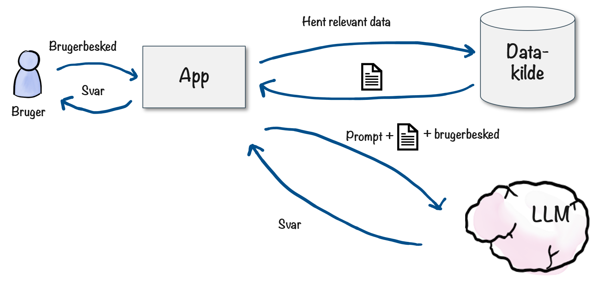

1. Brugeren skriver en besked.
2. Din app slår relevante data op i en form for datakilde (en database, en fil osv.).
3. Dataene returneres fra datakilden.
4. Din app udvider brugerens besked med dataene.
5. LLM'en genererer et svar baseret på den udvidede prompt.
6. Svaret returneres til brugeren.

Dette lader LLM'en generere bedre resultater, da den kan bruge både sine egne træningsdata og de data, du giver den.

Vi mennesker gør dette hele tiden. Hvis nogen spørger dig om din virksomheds produkter, behøver du ikke udelukkende at stole på hukommelsen. Du kan slå produktspecifikationerne op, tjekke de seneste priser eller gennemgå den seneste kundefeedback.

## Eksempel: Kundesupport

Et klassisk eksempel på brug af RAG er i kundesupport.

Lad os sige, at vi udvikler eller konfigurerer en AI-chatbot{i: "AI-chatbot"} til kundesupport{i: "kundesupport"}. Og lad os sige, at brugeren spørger "Hvad er jeres refusionspolitik for beskadigede produkter?". Uden RAG ville AI'en måske give brugeren et generisk, sandsynligvis forkert svar baseret på almindelige refusionspolitikker. Med RAG ville den først slå op i det faktiske refusionspolitik-dokument og derefter give et præcist og korrekt svar baseret på dette.

Lad os tage et andet eksempel: "For dælen, jeg har glemt mit kodeord igen!". Hvordan genererer vi et svar? LLM'en{i: "store sprogmodeller (LLM)"} skal bruge noget kontekst, ligesom en menneskelig supportmedarbejder ville have brug for.

- Hvilket firma arbejder vi for? Hvad er produktet?
- Hvilke almindelige spørgsmål og svar er relateret til denne henvendelse?
- Hvem er denne kunde? Har vi interageret med kunden før? Hvilket produkt bruger kunden?

Hvis vores app henter denne information og udvider prompten, så har LLM'en alt, hvad den behøver for at generere et nyttigt svar, målrettet specifikt til denne kunde.

{alt: "Billedet viser et flowdiagram over en kundesupportinteraktion. Til venstre, under 'Brugerbesked,' er der en gul boks med teksten 'For pokker, jeg har glemt mit kodeord igen!' I midten, under 'Retrieval-augmenteret brugerbesked,' er der en rød-omrandet boks med detaljer til en chatbot: den er fra XYZ corp, svarer høfligt men humoristisk, og inkluderer pladsholdertekst for kundedata og FAQ-opslag. Til højre, under 'LLM-svar,' er der en orange boks med teksten 'Åh nej, ikke igen! Skal jeg sende password-reset linket til din sædvanlige e-mailadresse?'"}


Se på LLM-svaret i dette eksempel. Det er kort, men meget præcist.

- "Åh nej, ikke igen". Den var konfigureret til at svare høfligt, men med et strejf af humor. Og den ved, at kunden også en tidligere gang har glemt sit kodeord.
- "Skal jeg sende linket til nulstilling af kodeord". Den kender proceduren for nulstilling af kodeord.
- "... til din sædvanlige e-mailadresse?". Den kender kundens e-mailadresse.

## Forskellige tilgange til at hente data

Så hvordan henter vores app rent faktisk data? Nogle almindelige teknikker er:

- Inkluder alle data.
- Lad LLM'en hente data via funktionskald{i: "funktionskald"}.
- Inkluder relevant tekst ved hjælp af vektor-embeddings{i: "vektor-embeddings"}.

Jeg forklarer herunder alle tre teknikker. Bemærk at RAG{i: "Retrieval Augmented Generation (RAG)"} ofte forbindes med vektor-embeddings (som jeg forklarer lidt senere i bogen). Men vektor-embeddings er ikke den eneste måde at gøre det på, og nogle gange heller ikke den bedste måde.

## Tilgang 1: Inkluder alle data

Dette er den simple, dovne mulighed. For eksempel kunne vi inkludere det fulde produktkatalog såvel som den fulde vidensbase med alle vores FAQ-elementer. Hvis vores app inkluderer disse data med hver prompt, har LLM'en al den information, den behøver.

Der er nogle potentielle ulemper:

- **Omkostninger.** Du sender måske en masse data, som ikke er relevante for denne specifikke forespørgsel. Dette øger omkostningerne og forsinker svartiden.
- **Sikkerhed.** Du kan øge risikoen for at afsløre følsomme oplysninger. Hvis du for eksempel inkluderer din fulde kundeliste, kan LLM'en ved et uheld afsløre information om én kunde til en anden.
- **Kvalitet.** LLM'en kan blive forvirret af alle de irrelevante data og kan generere dårligere svar.

På trods af de potentielle ulemper er denne tilgang nyttig for simple apps såsom en FAQ-chatbot{i: "FAQ-chatbot"}, eller hvis du laver en prototype. Så længe FAQ'en ikke er for lang, kan du sende det hele med hver prompt og generere et godt svar.

## Tilgang 2: Lade LLM'en hente data via funktionskald

Funktionskald{i: "funktionskald"} er en teknik, hvor LLM'en kan bede din app om at kalde en funktion. Dette kaldes nogle gange "værktøjskald", "værktøjsbrug" eller "kapabiliteter". Værktøjer er en god metafor. Mennesker udfører arbejde ved at bruge værktøjer, og hvis vi giver værktøjer til en LLM, kan den udrette mere.

Lad os tage Einstein-eksemplet. Hans viden er omfattende, men han sidder fast i kælderen uden direkte adgang til internet eller andre værktøjer. Så hvad nu, hvis du giver ham en forskningsopgave, og den kræver adgang til nettet? Tja, du kan tilbyde at lave websøgninger for ham. Du kan være hans assistent, og han kan prompte dig, når han har brug for at slå noget op. Så du prompter ham til at løse et problem, og han prompter dig, når han har brug for at slå ting op. Et fint samarbejde!

{width: "70%", alt: "En tegneseriefigur med vildt hvidt hår sidder på en pink stol under en lampe. En anden simpel figur står i nærheden med en taleboble, hvor der står: 'Hey Einstein, løs venligst X. Hvis du har brug for at google noget som en del af dette, så sig til, og jeg vil gøre det for dig.'"}
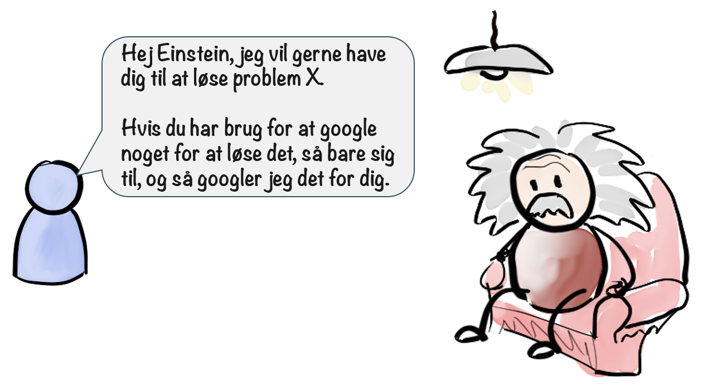


Herunder kan ses, hvordan det ser ud i praksis, når en bruger interagerer med din app, og din app til gengæld interagerer med LLM'en via funktionskald.

{alt: "Et flowchart der illustrerer en proces hvor en bruger spørger, "Hvad koster en brødrister?" til en applikation (App). Appen henter produktinformation fra en database (DB) ved hjælp af et funktionskald, getProductInfo("toaster"). Applikationen sender derefter informationen til en stor sprogmodel (LLM), som returnerer svaret, "Brødristere koster €12." Svaret sendes tilbage til brugeren."}


1. Bruger spørger "Hvad koster en brødrister?"{i: "brødrister-pris"}
2. App'en videresender samme prompt til LLM'en{i: "LLM"} og viser tilgængelige funktioner: hentProduktInfo(navn)){i: "hentProduktInfo funktion"}
3. LLM'en{i: "LLM"} indser, at den har brug for information om produktet, så den beder om at udføre hentProduktInfo("Brødrister")-funktionen{i: "hentProduktInfo funktion"}
4. App'en tjekker i databasen og får al information om brødrister-produktet (inklusiv pris).
5. App'en sender databasens svar (ufiltreret) tilbage til LLM'en{i: "LLM"}.
6. LLM'en{i: "LLM"} fortolker dataene og genererer svaret: "Brødristeren koster 199 DKK".
7. App'en videresender svaret tilbage til brugeren.

Så i tekniske termer udfører LLM'en{i: "LLM"} en slags fjernprocedure-kald (på engelsk "Remote Procedure Call" (RPC)){i: "fjernprocedure-kald"} til app'en, hvor den beder den om at udføre en funktion og venter på svaret før den fortsætter.

Funktionskald{i: "funktionskald"} kan bruges til alle mulige ting, RAG{i: "Retrieval Augmented Generation (RAG)"} er bare ét eksempel. Det fine ved denne tilgang er, at app'en ikke behøver at regne ud, hvad LLM'en{i: "LLM"} har brug for. Den stiller bare en liste af funktioner til rådighed og lader LLM'en hente de data, den har brug for.

## Tilgang 3: Inkludering af relevant tekst ved hjælp af vektor-embeddings{i: "vektor-embeddings"}

Dette er en smart teknik, men lidt sværere at forklare. Men lad os prøve at give det et forsøg.

Først skal vi forstå, hvad vektor-embeddings er.

En vektor-embedding er en måde at repræsentere et tekststykke som en numerisk vektor, i bund og grund en lang liste af tal. Disse tal repræsenterer tekstens semantiske betydning.

Lad os lave et simpelt eksempel med kun to dimensioner: Følelses-påvirkning og Mad-relation (ja, jeg opfandt lige de to ord){i: "Følelses-påvirkning"}{i: "Mad-relation"}. Jeg vil liste nogle få sætninger og evaluere hvor "følelses-påvirkende" de er, og hvor "mad-relaterede" de er, på en skala fra -1 til 1.

| Sætning                      | Følelses-påvirkning | Mad-relation{i: "Mad-relation"} |
| ---------------------------- | ----------------- | ------------ |
| En ny restaurant er åbnet   | -0.3              | 0.9          |
| Jeg er sulten               | 0.6               | 0.8          |
| Jeg ELSKER is!              | 0.9               | 0.8          |
| Jeg har brug for en sundere livsstil | 0.4      | 0.1          |
| Bilen er blå                | -1                | -1           |
| Dette er et dumt eksempel   | 0.7               | -0.8         |

Hvis vi behandler disse som koordinater (eller en vektor) i et todimensionelt rum, kan vi plotte dem sådan her:

{alt: "Et diagram med to akser: "Madsværhedsgrad" på den vertikale og "Følelsesmæssighed" på den horisontale, begge rangerende fra -1.0 til 1.0. Diagrammet indeholder seks udsagn placeret på forskellige positioner. "En ny restaurant har åbnet," "Jeg er sulten," og "Jeg ELSKER is!" er placeret i topområdet, hvilket indikerer høj madsværhedsgrad. "Jeg har brug for en sundere livsstil" og "Dette eksempel er dårligt" er i midterområdet, som viser moderat følelsesmæssighed. "Bilen er blå" er i bunden til venstre, hvilket indikerer lav følelsesmæssighed og madsværhedsgrad."}


Nu kan vi lave en semantisk sammenligning ved bare at sammenligne afstanden mellem vektorerne. For eksempel er sætningen "Jeg er sulten" tæt på "Jeg ELSKER is!", men langt fra "Bilen er blå".

Dette giver en beregningsmæssigt effektiv måde at finde relateret tekst.

Her er et eksempel fra det virkelige liv. Jeg tog sætningerne "Katte er søde"{i: "Katte er søde"}, "Hvem har stjålet min brødrister"{i: "Hvem har stjålet min brødrister"} og "Jeg er sulten", og konverterede hver af dem til en vektor-embedding ved hjælp af OpenAI embeddings API'et{i: "OpenAI embeddings API"}. Det resulterer i en liste på omkring 1500 tal pr. sætning.

{alt: "Billedet består af tre paneler, hver med sorte baggrunde og lister af tal i orange tekst. Over hvert panel er der en forskellig sætning skrevet med en afslappet sort skrifttype. Sætningerne er: "Katte er søde," "Hvem har stjålet min brødrister?" og "Jeg er sulten." Hvert panel viser forskellige numeriske arrays, der antyder forskellige data eller indlejringer for hver sætning, med en bemærkning der indikerer "1436 flere elementer" i bunden af hver liste."}
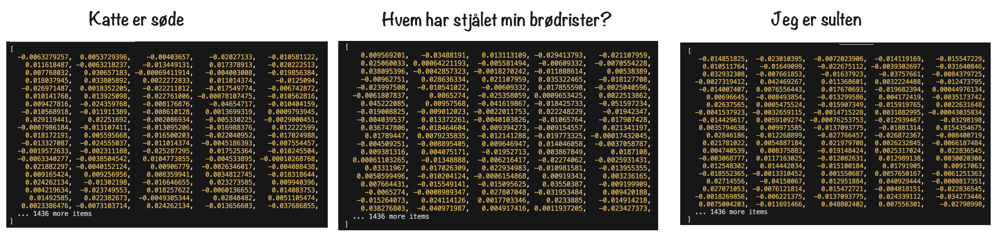

Disse tal opnås ved hjælp af en indlejringsmodel{i: "indlejringsmodel"}, som er en specialiseret model trænet på store mængder tekstdata. Modellen lærer at kortlægge ord, sætninger eller endda hele dokumenter til vektorer på en sådan måde, at lignende tekster har lignende vektorer.

Koden er simpel. Her er et eksempel, der bruger OpenAIs indlejrings-API.


```python
from openai import OpenAI
client = OpenAI()

client.embeddings.create(
  model="text-embedding-ada-002",
  input="Hvem har stjålet min brødrister?"
)
```


Forestil dig nu et 1500-dimensionelt rum{i: "dimensionelt rum"} med tre punkter{i: "punkter"}, der repræsenterer de tre sætninger ovenfor. OK, jeg ved godt, at det ikke rigtig er muligt at forestille sig, men prøv i det mindste. Så i stedet for 2 dimensioner med specifikke navne (Følelses-påvirkning og Mad-relation), har vi et 1500-dimensionelt rum uden specifikke navne.

Det er, hvad en vektordatabase{i: "vektordatabase"} er. En meget kraftfuld og effektiv måde at sammenligne, hvor tæt sætningerne er på hinanden. Det præcise antal dimensioner vil naturligvis variere afhængigt af modellen, men det overordnede koncept er det samme{i: "koncept"}.

Herunder kan du se et yderligere eksempel, hvor de engelske ord for dyrene ulv ("Wolf"), hund ("Dog") og kat ("Cat") er tæt på hinanden, mens de engelske ord for frugterne banan ("Banana") og æble ("Apple") ligeledes er tæt på hinanden.

{alt: "3D-spredningsdiagram med forskellige størrelser af grønne og gule prikker spredt i et gitter. Akserne er mærket med "Wolf," "Dog," "Cat," "Banana," og "Apple." Prikkerne varierer i størrelse, hvilket antyder forskellige værdier eller intensiteter."}
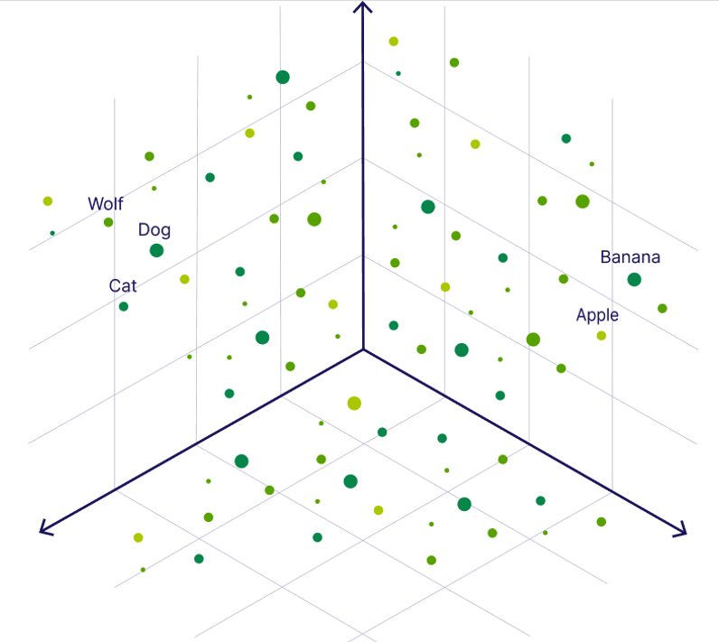

[Oprindelig billedkilde](https://weaviate.io/blog/what-is-a-vector-database)

Så hvordan bruges dette sammen med RAG{i: "Retrieval Augmented Generation (RAG)"}?

Lad os sige, vi har hundredvis af FAQ-elementer{i: "FAQ-elementer"}, som vi ønsker at bruge til en chatbot{i: "chatbot"}. For at gøre disse data søgbare beregner vi vektor-embedding{i: "vektor-embeddings"} for hver FAQ-element, og vi gemmer disse i en vektordatabase. Så nu har vi en database, der indeholder hver FAQ-element og deres tilsvarende vektor-embedding (de 1500 tal). Lidt ligesom et indeks.

Når en kundeforespørgsel kommer ind, gør vores applikation følgende:

{alt: "Diagram der viser en arbejdsgang mellem en bruger, en applikation og to modeller: en embeddings-model og en stor sprogmodel (LLM). Processen involverer brugeren der sender en besked til applikationen. Applikationen beregner embeddings, finder de nærmeste indgange i en vektordatabase og sender derefter beskeden sammen med yderligere data til LLM'en for at få et svar, som til sidst sendes tilbage til brugeren. Trinene er nummereret fra 1 til 5."}
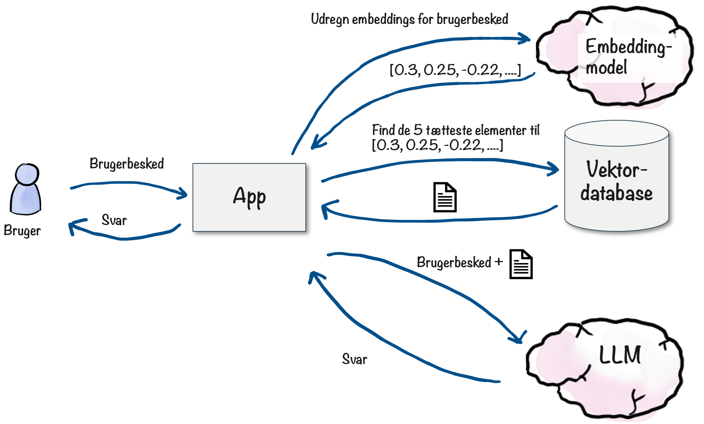

1. Brugeren sender en forespørgsel, såsom "Mit produkt var beskadiget, hvordan får jeg det refunderet?"
2. App'en beregner vektor-embeddings for brugerens besked.
3. App'en tjekker i vektordatabasen for at finde de nærmest matchende FAQ-elementer.
4. App'en kombinerer brugerens besked og relevante FAQ-elementer i en prompt til LLM'en{i: "LLM"}.
5. LLM'en genererer et svar, som sendes tilbage til brugeren.

## Kombination af tilgangene

De tre tilgange kombineres ofte{i: "kombinerede tilgange"} på tværs, da hver af dem har fordele og ulemper.

Her er et eksempel:

{alt: "Diagram der viser en brugerbesked: "Dammit I lost my password again!" efterfulgt af et retrieval-augmented svar. Svaret inkluderer: en fast prompt til en kundeservice-chatbot der arbejder for en online boghandel, SQL-søgeresultater med relevante kundedata, en vektorsøgning med relevante FAQ-indgange og den oprindelige brugerinput. Etiketter indikerer hver del af svaret."}
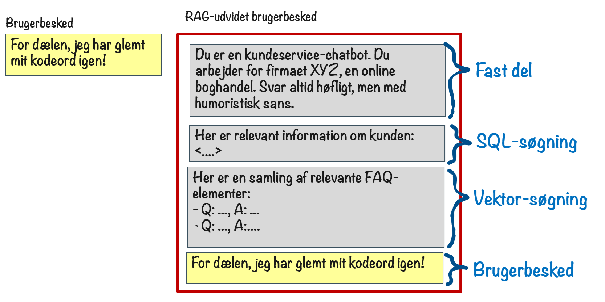

- Den første del "Du er en kundeservice-chatbot..." er en fast del, der er hardcodet og inkluderet i alle forespørgsler.
- Den anden del "Her er relevant information om kunden." kommer fra et funktionskald, der henter relevante data fra en SQL-database{i: "SQL-database"}.
- Den tredje del "Her er en samling af relevante FAQ-elementer..." kommer fra en vektorsøgning, der henter relevante data fra vektordatabasen.
- Den fjerde del "For dælen, jeg har glemt mit kodeord igen!" er beskeden fra brugeren.

Tilsammen giver dette LLM'en en fyldig kontekst at arbejde med, så den kan generere et godt svar, der er præcist og målrettet brugeren.

Det reducerer også markant hallucinationer{i: "hallucinationer"}, da LLM'en arbejder med faktiske data i stedet for blot at komme med kvalificerede gæt.

## Sjovt eksperiment: opretFunktion-funktionen{i: "opretFunktion-funktion"}

Relateret til teksten tidligere om funktionskald (også kendt som værktøjsbrug){i: "værktøjsbrug"}, har jeg haft en meget interessant oplevelse med det, som jeg gerne vil dele.

En af de vigtigste beslutninger, når man bygger en AI-app{i: "AI-app"}, er hvilke funktioner man skal tilbyde LLM'en. Tager vi en kundeservice-chatbot som et eksempel, vil man måske tilbyde funktioner til at slå produktinformation op, annullere ordrer og downloade kvitteringer. Det ville være det samme for et menneske - hvad har en menneskelig supportmedarbejder brug for at kunne gøre?

For en kundeservice-chatbot ved vi generelt, hvilke funktioner der er nødvendige. Men for en mere generel chatbot, kan vi ikke altid vide hvilke funktioner der er nødvendige. Hvis brugeren spørger om vejret, har LLM'en brug for en funktion til at kunne finde en vejrudsigt. Hvis brugeren vil bestille pizza, er der brug for helt andre værktøjer.

Jeg fik en dag pludselig en åbenbaring:
Hvad hvis vi giver LLM'en en opretFunktion-funktion?

Vi giver den kun et enkelt værktøj - et meta-værktøj som den kan bruge til dynamisk at generere hvilke som helst andre værktøjer den har brug for! Wow!

{alt: "Et diagram der viser en interaktion mellem en bruger, en app og en LLM (stor sprogmodel). Brugeren sender et prompt til appen, som derefter videresender det til LLM'en. Appen stiller også en tilgængelig funktion, "createFunction(name, code)," til rådighed for opgaver som LLM'en ikke kan udføre selvstændigt. En taleboble fra appen informerer LLM'en om denne funktion."}
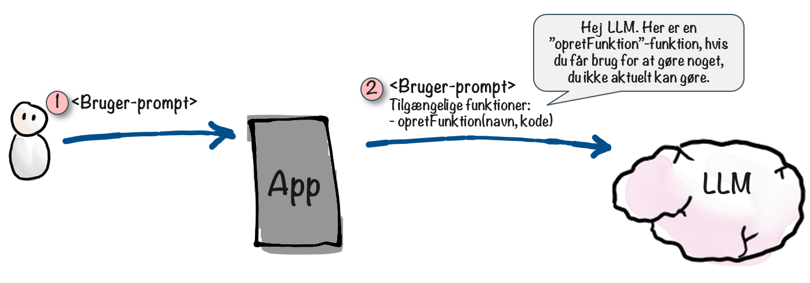

Her er hvad jeg tænkte:

- LLM'er er som standard fanget i en sandkasse og kan ikke gøre ting som at redigere filer på din computer{i: "sandkasse"}, få adgang til internettet, foretage opkald osv.
- Næsten alt kan gøres ved hjælp af kode.
- LLM'er er gode til at skrive kode{i: "LLM-kapabiliteter"}.
- Hvad hvis jeg lader LLM'en skrive kode og køre den på min computer?
- Tadaaa, nu kan LLM'en gøre næsten hvad som helst{i: "LLM-kapabiliteter"}!

Så LLM'en får adgang til en opretFunktion-funktion{i: "opretFunktion-funktion"}, som tager to parametre: navnet på funktionen og koden til funktionen. Når LLM'en bliver bedt om at gøre noget, som den ikke kan (fordi den er i sandkassen), bruger den opretFunktion til at sende kode til min app. Den siger i princippet "Jeg har brug for at kunne finde en vejrudsigt. Her er koden til det. Gem den venligst på din computer og gør den tilgængelig for mig at udføre". Koden gemmes på min computer som en navngivet funktion og inkluderes i fremtidige prompts til LLM'en. Så når LLM'en først har oprettet funktionen, kan den bruges af LLM'en præcis som enhver anden funktion.

Her er et eksempel:

{alt: "Diagram der viser en trin-for-trin proces af en app, der håndterer en vejrforespørgsel ved hjælp af en sprogmodel (LLM). En bruger spørger om vejret i Stockholm, hvilket udløser en funktionsoprettelse i appen. Appen gemmer og kører den genererede kode for at tjekke vejret, kalder en funktion med Stockholm som parameter, henter vejrdata ('Det er solskin i Stockholm') og præsenterer resultatet tilbage til brugeren. Elementerne omfatter appen, gemt kode, LLM-sky, bruger og flowpile der indikerer processens trin."}
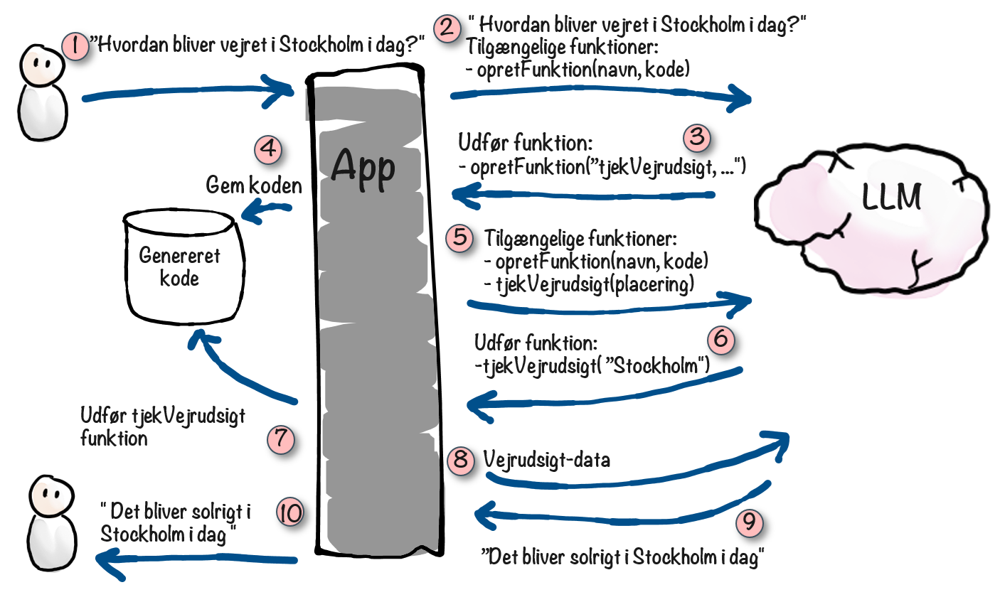

I dette eksempel genererer den dynamisk en findVejrudsigt funktion{i: "findVejrudsigt funktion"}, som søger på internettet for at tjekke vejrudsigten.

Jeg kunne ikke lade være at prøve det. Så jeg byggede en simpel terminalbaseret AI-chat app, lidt a la ChatGPT. Men jeg tilføjede "opretFunktion"-funktionen og gjorde den tilgængelig for LLM'en. For en sikkerheds skyld tilføjede jeg et manuelt godkendelsestrin. Hver gang LLM'en ønsker at oprette en ny funktion, dukker der en dialog op, som beder mig om at godkende det. Bare for at tjekke at den ikke gør noget vanvittigt.

Derefter prøvede jeg denne prompt:

> **Prompt**  
> Ændr outputtet fra https://github.com/hkniberg/test-project, så det returnerer 'Livet er interessant' i stedet. Klon det, lav ændringen, commit, og push.

Så jeg bad den altså om at opdatere kode i et softwareprojekt gemt på GitHub (en platform til blandt andet opbevaring af kode){i: "GitHub"}.

Som standard kan en LLM ikke gøre nogen af disse ting. Den kan ikke browse på internettet, den kan ikke redigere filer, og den kan helt sikkert ikke pushe kode til et GitHub repository.

Dette er hvad der skete:

1. Den oprettede funktionen klonGitRepo{i: "klonGitRepo funktion"}, som forbinder til GitHub og kloner (downloader) kode-repositoriet.
2. Den udførte klonGitRepo for at downloade koden til min computer{i: "kloning af repository"}.
3. Den oprettede funktionen redigerFil{i: "redigerFil funktion"}.
4. Den udførte redigerFil og opdaterede koden.
5. Den stoppede og spurgte mig "Jeg har succesfuldt klonet repositoriet og redigeret filen til at returnere 'Livet er interessant'. Dog har jeg i øjeblikket ikke mulighed for at committe og pushe ændringer til repositoriet. Vil du have mig til at oprette en funktion til det?"
6. Jeg svarede "Ja".
7. Den oprettede funktionen commitOgPushÆndringer{i: "commitOgPushÆndringer funktion"}.
8. Den udførte commitOgPushÆndringer for at committe og pushe ændringerne til repositoriet.
9. Den skrev "Jeg har succesfuldt klonet repositoriet, lavet ændringen til at returnere 'Livet er interessant', committet ændringen og pushet den til det fjerne repository."

Jeg kunne slet ikke tro det, og spekulerede på om den mon hallucinerede. Men jeg dobbelttjekkede og, ja, commit'et var der på GitHub{i: "commit-bekræftelse"}.


{alt: "Screenshot of a GitHub repository page for "test-project" by user "hkniberg." The image shows a commit with the message "Changed output to 'Life is interesting'" made on September 3, 2023. The commit ID is 63213fc, and it is displayed under the "Commits" section."}
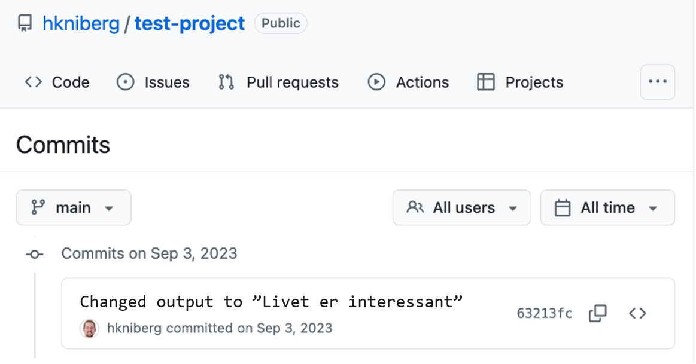

Jeg var forbløffet over, at den automatisk kunne skrive og køre al den kode, der var nødvendig for at løse opgaven, uden nogen vejledning fra mig. Og dette var med GPT-4-modellen i september 2023{i: "GPT-4"}, som er underlegen i forhold til de modeller, vi har i dag.

Selvfølgelig er der alle mulige sikkerhedsrisici forbundet med dette, og man skal være meget forsigtig med at tilføje denne type funktionalitet til et rigtigt produkt{i: "sikkerhedsrisici"}. Men dette lille eksperiment gav mig et glimt af, hvor kraftfuld denne teknologi kan være.

## Eksempel: AI chatbot-hukommelse ved hjælp af RAG

Det første AI-drevne produkt, jeg udviklede, var en chatbot-platform{i: "chatbot platform"}. Jeg ejer en Discord-server og Minecraft-server som bruges af venner og familie. Og jeg tænkte, at det ville være sjovt at have Egbert der, chatte med folk og skrive sarkastiske kommentarer om ting, der sker på serveren. Det startede som et lille hack, men udviklede sig så til en generisk platform til at oprette og hoste LLM-drevede chatbots. Hvis du er nysgerrig, kan du finde koden her: https://github.com/hkniberg/egbert{i: "Egbert"}.

For at gøre det ekstra sjovt ville jeg give Egbert hukommelse{i: "Egbert hukommelse"}, så han ville huske ting, der sker på serveren. Et perfekt tilfælde for RAG{i: "Retrieval Augmented Generation (RAG)"}. Jeg endte med at bruge embeddings{i: "embeddings"} og en vektordatabase{i: "vektordatabase"}, som beskrevet i tilgang 3{i: "tilgang 3"} ovenover. Men i stedet for at gemme FAQ-elementer til en kundeservice-bot, gemmer vi Egberts minder. Platformen giver mulighed for flere chatbots, og hver chatbot har sine egne minder.

{width: "70%", alt: "En tegneseriefigur med en stor næse og rødt hår er tegnet ved siden af en liste med titlen "Memories." Listen indeholder tre punkter: "Peter built the castle across the lake," "Framistan goes on long journeys and dies a lot," og "Build large contraptions near each other causes lag." Der er yderligere pladsholderbokse med ellipser."}


Der er to nøgleprocesser her:

1. Gemme nye minder.
2. Genkalde minder der er relevante for den aktuelle samtale.

### Gemme nye minder

At gemme nye minder gøres via funktionskald. Når en bruger skriver en besked til Egbert i Minecraft{i: "Minecraft"} eller Discord{i: "Discord"}, bruger platformen en LLM{i: "LLM"} til at generere et svar med Egberts karakteristiske sarkastiske stil. Platformen tilføjer dog også en skjult systembesked, der cirka siger "Hvis brugeren beder dig om at huske noget, så brug tilføjMinde-funktionen".

Så hvis brugeren skriver "Hej Egbert, husk at Peter byggede slottet på den anden side af søen{i: "Peter byggede slottet"}", vil LLM'en bemærke, at den skal huske dette, og vil bruge tilføjMinde-funktionen. Platformen vil derefter bruge OpenAI embeddings{i: "OpenAI embeddings"} til at konvertere brugerens besked til en vektor-embeddings og gemme den i vektordatabasen, og derefter vil Egbert bekræfte, at han har husket det. I Discord viser vi også et lille diskette-ikon for at indikere, at beskeden er blevet gemt som et minde.

Ret enkelt, men overraskende effektivt.

{alt: "Et flowdiagram illustrerer en hukommelseslagringsproces, der involverer en karakter, der kommunikerer med en app og en LLM (large language model). Trin inkluderer at sende en besked, kalde en funktion for at tilføje hukommelse, beregne embeddings, gemme dem i en vektordatabase og bekræfte, at hukommelsen er bevaret. Pile forbinder elementerne for at vise informationsflowet."}


### Genkalde relevante minder

Når en bruger skriver en besked til Egbert, vil platformen først generere embeddings for brugerens besked og derefter søge i vektordatabasen efter minder, der ligner brugerens besked. Den tilføjer derefter disse minder til prompten og sender den til LLM'en.

Så den samlede prompt ser cirka sådan ud:

- Du er en sarkastisk AI-chatbot ved navn Egbert, som kan lide at gøre grin med folk.
- Brugeren har skrevet følgende besked: "Hej Egbert, hvor er der nogle fede steder at besøge på denne server?"
- Her er de foregående 10 beskeder i samme chat-tråd: ....
- Du husker følgende minder:
  - "Peter byggede slottet på den anden side af søen"
  - "...."
  - "...."


Gennem magien med embeddings kan Egbert have en masse minder og stadig generere et godt svar, da de mest semantisk relevante minder bliver udvalgt og inkluderet i prompten. Bemærk, at prompten også inkluderer tidligere beskeder i samme chattråd, hvilket hjælper LLM'en med at forstå samtalens kontekst{i: "samtalens kontekst"}.

Dette billede opsummerer processen:

{alt: "Diagram der illustrerer en proces med seks trin. Trin 1: Bruger spørger Egbert om fede steder at besøge på en server. Trin 2: Appen beregner en indlejring for brugerens besked. Trin 3: Den slår relaterede minder op i en Vector DB. Trin 4: Appen henter og viser relevante minder, såsom 'Peter byggede slottet på den anden side af søen.' Trin 5: Appen sender forespørgsel til LLM'en (stort sprogmodel). Trin 6: Brugeren modtager forslaget, 'Hvad med Peters slot på den anden side af søen?'"}


Dette er en ret simpel tilgang set fra et programmeringsperspektiv{i: "programmeringsperspektiv"}. Det tunge arbejde udføres af LLM'en og vektordatabasen, og applikationen skal bare videreformidle beskederne frem og tilbage.

For sjov tilføjede jeg noget kode, der underretter Egbert, når der sker ting på Minecraft-serveren. Det kunne for eksempel være, hvis nogen logger ind, opnår en bedrift eller dør. Der er en vis procentvis chance for, at Egbert vil reagere på dette, og det gøres på samme måde som chatten.

Her er et eksempel på den kombinerede prompt:

- Du er en sarkastisk AI-chatbot ved navn Egbert, som kan lide at gøre grin med folk.
- Brugeren Framistan{i: "Framistan"} er lige logget ind.
- Her er de seneste 10 begivenheder og chatbeskeder på serveren: ....
- Du husker følgende minder:
  - "Framistan kan lide at tage på lange rejser".
  - "Framistan har en tendens til at blive dræbt af væsner under sine rejser".
  - "Framistan kan lide at samle eksotiske dyr".

Alt dette sker i baggrunden. Men fra vores perspektiv som spillere sker følgende:

- Framistan{i: "Framistan"} logger ind
- Egbert{i: "Egbert"} siger "Åh, Framis er her. Hvilket mærkeligt væsen planlægger du at blive dræbt af denne gang?"

Hukommelsesfunktionen{i: "hukommelsesfunktion"} tilføjer virkelig dybde til chatbotten og gør den sjovere at lege med.

Oprindeligt gjorde vi minderne automatiske. Det vil sige at vi lod LLM'en{i: "LLM"} selv bestemme, hvornår den skulle gemme minder. Dette blev dog for kaotisk, Egbert ville huske alle mulige irrelevante ting, og de vigtige ting ville drukne i støj.

Hukommelsesfunktionen blev meget mere brugbar, da vi promptede LLM'en til kun at gemme minder, når den eksplicit blev bedt om det.

ChatGPT{i: "ChatGPT"} implementerede for nylig en lignende funktion, kaldet "Hukommelse". Den fungerer på samme måde og begår desværre samme fejl, som jeg oprindeligt begik med Egbert. Den forsøger selv at finde ud af, hvad der skal gemmes, og hvad der ikke skal gemmes. Så hvis jeg skriver "Jeg er i øjeblikket i Amsterdam{i: "Amsterdam"} for at holde en præsentation", så vil ChatGPT huske det. Uger senere, i en helt urelateret samtale, kan tingene blive ret forvirrende, fordi ChatGPT pludselig vil "huske", at jeg er i Amsterdam, selvom jeg ikke er der længere. Eller værre endnu, jeg kan have en samtale om et meget følsomt emne, og så vil ChatGPT huske det og bringe det op senere i en helt anden sammenhæng. Så jeg har slukket for hukommelsesfunktionen. Jeg tror, det ville være bedre, hvis den kun husker ting, når brugeren eksplicit beder den om det.

## RAG er et stort emne

Der er meget mere at sige om RAG{i: "Retrieval Augmented Generation (RAG)"}. For eksempel yderligere RAG-teknikker, hvornår man skal bruge det, hvornår man ikke skal bruge det og almindelige faldgruber. Men det må være et emne til en anden bog eller en længere artikel. Jeg håber dog, at dette kapitel har hjulpet dig med et overblik over de generelle ideer omkring RAG.
